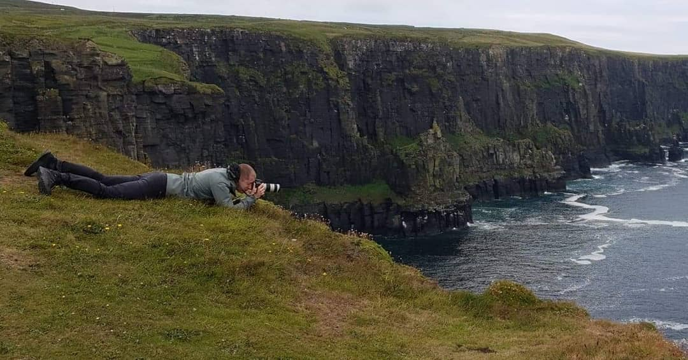

---
hide:
  - navigation
  - toc
tags:
  - Author
  - Contact
---
{ .img-box align=right width="750" }

Hello, I'm Roberd, a seasoned photographer based in Sweden with a passion for digital art. With over 20 years of experience in photography, my journey into the world of digital art began as I started experimenting with various graphic software tools along the way. In 2015, I discovered Blender and was captivated by its versatility and power. It quickly became my go-to tool for satisfying my creative needs, offering endless possibilities for creating complex 3D art and animations.
{ data-search-exclude }

Below, you'll find links to my social media profiles, where I share digital art projects and photography endeavors. Feel free to connect with me to explore more about my work and interests.
{ data-search-exclude }

[:material-instagram: Instagram](https://instagram.com/roberddd/){ .md-button .md-button--social target="_blank" }
[:fontawesome-brands-x-twitter: Twitter](https://x.com/rober_ddd){ .md-button .md-button--social target="_blank" }

[:material-mastodon: Mastodon](https://blenderartists.org/u/roberddd){ .md-button .md-button--social target="_blank" }
[:material-blender-software: BlenderArtists](https://mastodon.social/@roberddd){ .md-button .md-button--social target="_blank" }

[:material-home: Website](https://roberd.net/){ .md-button .md-button--social target="_blank" }

## Other add-ons by me

**BatchGenie**: An add-on designed to simplify and automate common Asset-related tasks.

{ .img-box align=left }

  - [Gumroad](https://roberd.gumroad.com/l/BatchGenie)
  - [SuperHive (BlenderMarket)](https://blendermarket.com/products/batchgenie)
  - [Documentation](https://batchgenie.roberd.net/)