---
hide:
  - toc
---

<!-- ### Biomes

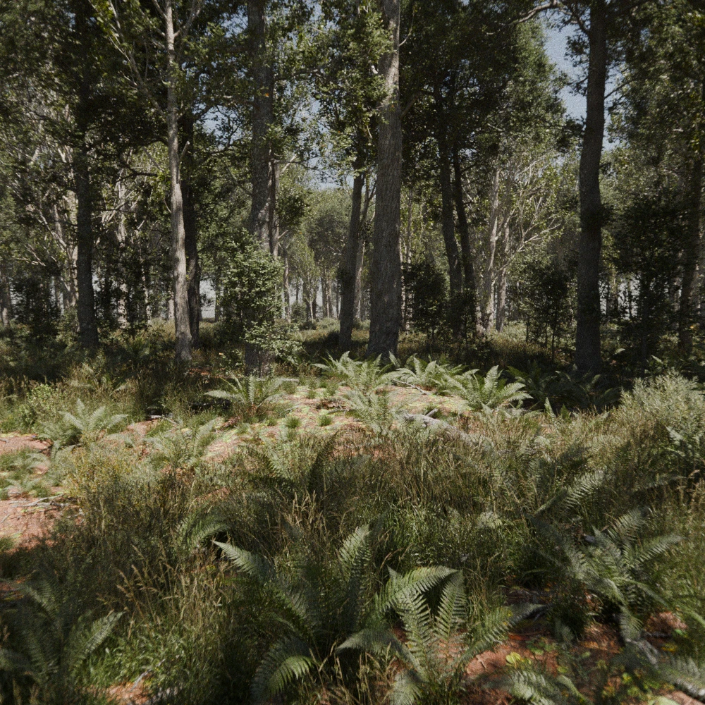 -->

### PlantCatalog

> All 191 High Poly variants of the plant species are available in the 'PlantCatalog' library.

{ .glightbox data-description="1. Adansonia digitata HD" }
[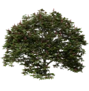](images/plants/PlantCatalog/2._Aesculus_pavia_HD.webp){ .glightbox data-description="2. Aesculus pavia HD" }
[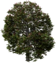](images/plants/PlantCatalog/3._Aesculus_x_carnea_HD.webp){ .glightbox data-description="3. Aesculus x carnea HD" }
[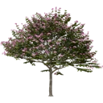](images/plants/PlantCatalog/4._Bauhinia_blakeana_HD_V2.webp){ .glightbox data-description="4. Bauhinia blakeana HD V2" }
[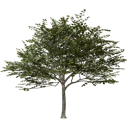](images/plants/PlantCatalog/5._Bauhinia_blakeana_HD.webp){ .glightbox data-description="5. Bauhinia blakeana HD" }
[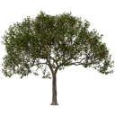](images/plants/PlantCatalog/6._Citrus_x_aurantium_HD.webp){ .glightbox data-description="6. Citrus x aurantium HD" }
[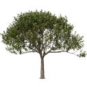](images/plants/PlantCatalog/7._Citrus_x_limon_HD.webp){ .glightbox data-description="7. Citrus x limon HD" }
[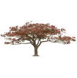](images/plants/PlantCatalog/8._Delonix_regia_HD.webp){ .glightbox data-description="8. Delonix regia HD" }
[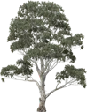](images/plants/PlantCatalog/9._Eucalyptus_camaldulensis_HD.webp){ .glightbox data-description="9. Eucalyptus camaldulensis HD" }
[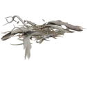](images/plants/PlantCatalog/10._Eucalyptus_leaf_litter_HD.webp){ .glightbox data-description="10. Eucalyptus leaf litter HD" }
[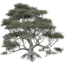](images/plants/PlantCatalog/11._Eucalyptus_pauciflora_HD.webp){ .glightbox data-description="11. Eucalyptus pauciflora HD" }
[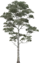](images/plants/PlantCatalog/12._Eucalyptus_viminalis_HD.webp){ .glightbox data-description="12. Eucalyptus viminalis HD" }
[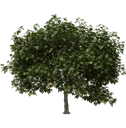](images/plants/PlantCatalog/13._Ficus_carica_HD.webp){ .glightbox data-description="13. Ficus carica HD" }
[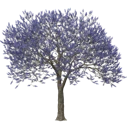](images/plants/PlantCatalog/14._Jacaranda_mimosifolia_HD.webp){ .glightbox data-description="14. Jacaranda mimosifolia HD" }
[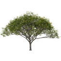](images/plants/PlantCatalog/15._Koelreuteria_bipinnata_HD.webp){ .glightbox data-description="15. Koelreuteria bipinnata HD" }
{ .glightbox data-description="16. Melia azedarach HD" }
[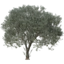](images/plants/PlantCatalog/17._Olea_europaea_HD.webp){ .glightbox data-description="17. Olea europaea HD" }
[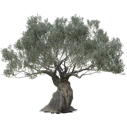](images/plants/PlantCatalog/18._Olea_europaea_ornamental_HD.webp){ .glightbox data-description="18. Olea europaea ornamental HD" }
[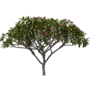](images/plants/PlantCatalog/19._Plumeria_rubra_pink_HD.webp){ .glightbox data-description="19. Plumeria rubra pink HD" }
[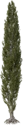](images/plants/PlantCatalog/20._Populus_nigra_'Italica'_HD.webp){ .glightbox data-description="20. Populus nigra 'Italica' HD" }
[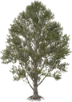](images/plants/PlantCatalog/21._Populus_nigra_HD.webp){ .glightbox data-description="21. Populus nigra HD" }
{ .glightbox data-description="22. Quercus palustris 'Green Pillar' HD" }
[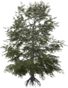](images/plants/PlantCatalog/23._Quercus_palustris_HD.webp){ .glightbox data-description="23. Quercus palustris HD" }
{ .glightbox data-description="24. Quercus robur dead branch HD" }
[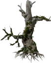](images/plants/PlantCatalog/25._Quercus_robur_dead_colonised_HD.webp){ .glightbox data-description="25. Quercus robur dead colonised HD" }
{ .glightbox data-description="26. Quercus robur dead HD" }
[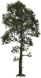](images/plants/PlantCatalog/27._Quercus_robur_forest_colonised_HD.webp){ .glightbox data-description="27. Quercus robur forest colonised HD" }
[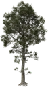](images/plants/PlantCatalog/28._Quercus_robur_forest_HD.webp){ .glightbox data-description="28. Quercus robur forest HD" }
[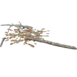](images/plants/PlantCatalog/29._Quercus_robur_leaf_litter_HD.webp){ .glightbox data-description="29. Quercus robur leaf litter HD" }
[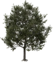](images/plants/PlantCatalog/30._Quercus_robur_lone_HD.webp){ .glightbox data-description="30. Quercus robur lone HD" }
[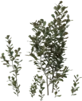](images/plants/PlantCatalog/31._Quercus_robur_seedling_HD.webp){ .glightbox data-description="31. Quercus robur seedling HD" }
[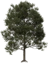](images/plants/PlantCatalog/32._Quercus_robur_urban_HD.webp){ .glightbox data-description="32. Quercus robur urban HD" }
[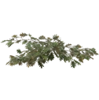](images/plants/PlantCatalog/33._Quercus_rubra_branch_HD.webp){ .glightbox data-description="33. Quercus rubra branch HD" }
[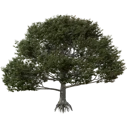](images/plants/PlantCatalog/34._Quercus_rubra_HD.webp){ .glightbox data-description="34. Quercus rubra HD" }
[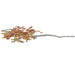](images/plants/PlantCatalog/35._Quercus_rubra_leaf_litter_HD_V2.webp){ .glightbox data-description="35. Quercus rubra leaf litter HD V2" }
[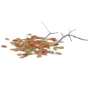](images/plants/PlantCatalog/36._Quercus_rubra_leaf_litter_HD.webp){ .glightbox data-description="36. Quercus rubra leaf litter HD" }
[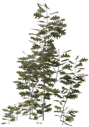](images/plants/PlantCatalog/37._Quercus_rubra_seedlings_HD.webp){ .glightbox data-description="37. Quercus rubra seedlings HD" }
[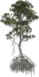](images/plants/PlantCatalog/38._Rhizophora_forest_HD.webp){ .glightbox data-description="38. Rhizophora forest HD" }
{ .glightbox data-description="39. Rhizophora lone HD" }
[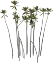](images/plants/PlantCatalog/40._Rhizophora_seedling_HD.webp){ .glightbox data-description="40. Rhizophora seedling HD" }
[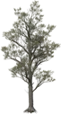](images/plants/PlantCatalog/41._Salix_alba_HD.webp){ .glightbox data-description="41. Salix alba HD" }
[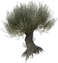](images/plants/PlantCatalog/42._Salix_alba_pollarded_HD.webp){ .glightbox data-description="42. Salix alba pollarded HD" }
[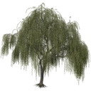](images/plants/PlantCatalog/43._Salix_babylonica_HD.webp){ .glightbox data-description="43. Salix babylonica HD" }
[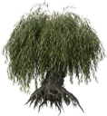](images/plants/PlantCatalog/44._Salix_babylonica_pollarded_HD.webp){ .glightbox data-description="44. Salix babylonica pollarded HD" }
[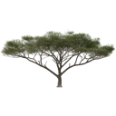](images/plants/PlantCatalog/45._Vachellia_tortilis_HD.webp){ .glightbox data-description="45. Vachellia tortilis HD" }
[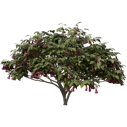](images/plants/PlantCatalog/46._Brugmansia_x_insignis_HD.webp){ .glightbox data-description="46. Brugmansia x insignis HD" }
[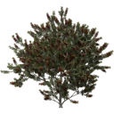](images/plants/PlantCatalog/47._Callistemon_laevis_HD.webp){ .glightbox data-description="47. Callistemon laevis HD" }
[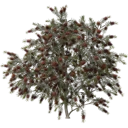](images/plants/PlantCatalog/48._Callistemon_rigidus_HD.webp){ .glightbox data-description="48. Callistemon rigidus HD" }
[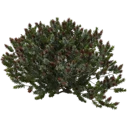](images/plants/PlantCatalog/49._Callistemon_viminalis_'Little_John'_HD.webp){ .glightbox data-description="49. Callistemon viminalis 'Little John' HD" }
[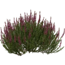](images/plants/PlantCatalog/50._Calluna_vulgaris_dark_pink_HD.webp){ .glightbox data-description="50. Calluna vulgaris dark pink HD" }
{ .glightbox data-description="51. Calluna vulgaris light pink HD" }
[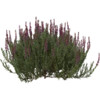](images/plants/PlantCatalog/52._Calluna_vulgaris_silver_HD.webp){ .glightbox data-description="52. Calluna vulgaris silver HD" }
[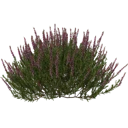](images/plants/PlantCatalog/53._Calluna_vulgaris_white_HD.webp){ .glightbox data-description="53. Calluna vulgaris white HD" }
{ .glightbox data-description="54. Choisya ternata HD" }
[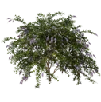](images/plants/PlantCatalog/55._Duranta_repens_HD.webp){ .glightbox data-description="55. Duranta repens HD" }
[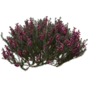](images/plants/PlantCatalog/56._Erica_carnea_dark_pink_HD.webp){ .glightbox data-description="56. Erica carnea dark pink HD" }
[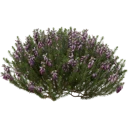](images/plants/PlantCatalog/57._Erica_carnea_light_pink_HD.webp){ .glightbox data-description="57. Erica carnea light pink HD" }
{ .glightbox data-description="58. Erica carnea white HD" }
{ .glightbox data-description="59. Hedera helix 'Erecta' HD" }
{ .glightbox data-description="60. Hibiscus rosa-sinensis HD" }
{ .glightbox data-description="61. Ixora chinensis red HD" }
{ .glightbox data-description="62. Loropetalum chinense var rubrum HD" }
{ .glightbox data-description="63. Lupinus arboreus HD" }
{ .glightbox data-description="64. Malvaviscus penduliflorus HD" }
{ .glightbox data-description="65. Plectranthus scutellarioides 'Fairway Mosaic' HD" }
{ .glightbox data-description="66. Plectranthus scutellarioides 'Fairway Yellow' HD" }
{ .glightbox data-description="67. Plectranthus scutellarioides 'Kong Rose' HD" }
{ .glightbox data-description="68. Plectranthus scutellarioides 'Premium Sun Dark Chocolate' HD" }
{ .glightbox data-description="69. Plectranthus scutellarioides 'Saturn' HD" }
{ .glightbox data-description="70. Plectranthus scutellarioides 'Vulcan' HD V2" }
{ .glightbox data-description="71. Plectranthus scutellarioides 'Vulcan' HD" }
{ .glightbox data-description="72. Plectranthus scutellarioides 'Wizard Jade' HD" }
{ .glightbox data-description="73. Plectranthus scutellarioides 'Wizard Velvet Red' HD" }
{ .glightbox data-description="74. Plectranthus scutellarioides HD" }
{ .glightbox data-description="75. Rhododendron 'Boule de neige' HD" }
{ .glightbox data-description="76. Rhododendron 'Everestianum' HD" }
{ .glightbox data-description="77. Rhododendron 'Nova Zembla' HD" }
{ .glightbox data-description="78. Rhododendron catawbiense HD" }
{ .glightbox data-description="79. Rhododendron ferrugineum HD" }
{ .glightbox data-description="80. Rhododendron maximum HD" }
{ .glightbox data-description="81. Salix elaeagnos HD" }
{ .glightbox data-description="82. Tamarix gallica HD" }
{ .glightbox data-description="83. Vaccinium myrtillus HD" }
{ .glightbox data-description="84. Hedera helix wall climber green HD" }
{ .glightbox data-description="85. Generic pine cone HD" }
{ .glightbox data-description="86. Long-needle pine litter HD" }
{ .glightbox data-description="87. Picea abies 'Maxwellii' HD" }
{ .glightbox data-description="88. Picea abies 'Nidiformis' HD" }
{ .glightbox data-description="89. Picea abies HD" }
{ .glightbox data-description="90. Picea engelmannii HD" }
{ .glightbox data-description="91. Picea mariana 'Ericoides' HD" }
{ .glightbox data-description="92. Picea mariana HD" }
{ .glightbox data-description="93. Picea pungens 'Glauca Globosa' HD" }
{ .glightbox data-description="94. Picea pungens 'Koster' HD" }
{ .glightbox data-description="95. Picea pungens HD" }
{ .glightbox data-description="96. Pinus contorta dead forest HD" }
{ .glightbox data-description="97. Pinus contorta dead lone HD" }
{ .glightbox data-description="98. Pinus contorta var latifolia forest HD" }
{ .glightbox data-description="99. Pinus contorta var latifolia lone HD" }
{ .glightbox data-description="100. Pinus elliottii forest HD" }
{ .glightbox data-description="101. Pinus elliottii lone HD" }
{ .glightbox data-description="102. Pinus jeffreyi forest HD" }
{ .glightbox data-description="103. Pinus jeffreyi juvenile HD" }
{ .glightbox data-description="104. Pinus jeffreyi lone HD" }
{ .glightbox data-description="105. Pinus pinaster forest HD" }
{ .glightbox data-description="106. Pinus pinaster lone HD" }
{ .glightbox data-description="107. Pinus ponderosa branch HD" }
{ .glightbox data-description="108. Pinus ponderosa dead forest HD" }
{ .glightbox data-description="109. Pinus ponderosa dead lone HD" }
{ .glightbox data-description="110. Pinus ponderosa forest HD" }
{ .glightbox data-description="111. Pinus ponderosa juvenile HD" }
{ .glightbox data-description="112. Pinus ponderosa lone HD" }
{ .glightbox data-description="113. Pinus ponderosa uprooted HD" }
{ .glightbox data-description="114. Short-needle pine litter HD" }
{ .glightbox data-description="115. Taxodium distichum forest HD" }
{ .glightbox data-description="116. Taxodium distichum lone HD" }
{ .glightbox data-description="117. Taxodium distichum urban HD" }
{ .glightbox data-description="118. Thuja plicata HD" }
{ .glightbox data-description="119. Tsuga mertensiana HD" }
{ .glightbox data-description="120. Dryopteris filix-mas HD" }
{ .glightbox data-description="121. Polypodium vulgare HD" }
{ .glightbox data-description="122. Cyperus alternifolius HD" }
{ .glightbox data-description="123. Cyperus papyrus HD" }
{ .glightbox data-description="124. Festuca arundinacea HD" }
{ .glightbox data-description="125. Festuca gautieri HD" }
{ .glightbox data-description="126. Festuca glauca HD" }
{ .glightbox data-description="127. Festuca rubra HD" }
{ .glightbox data-description="128. Generic grass lawn HD" }
{ .glightbox data-description="129. Lolium perenne HD" }
{ .glightbox data-description="130. Phalaris arundinacea HD" }
{ .glightbox data-description="131. Phragmites australis HD" }
{ .glightbox data-description="132. Typha latifolia HD" }
{ .glightbox data-description="133. Arachis duranensis HD" }
{ .glightbox data-description="134. Hedera helix ground cover green HD" }
{ .glightbox data-description="135. Boletus edulis HD" }
{ .glightbox data-description="136. Fomitopsis pinicola HD" }
{ .glightbox data-description="137. Adonidia merrillii HD" }
{ .glightbox data-description="138. Archontophoenix alexandrae HD" }
{ .glightbox data-description="139. Butia capitata HD" }
{ .glightbox data-description="140. Chamaerops humilis HD" }
{ .glightbox data-description="141. Cycas revoluta HD" }
{ .glightbox data-description="142. Dypsis lutescens HD" }
{ .glightbox data-description="143. Hyophorbe lagenicaulis HD" }
{ .glightbox data-description="144. Phoenix canariensis HD" }
{ .glightbox data-description="145. Phoenix dactylifera HD" }
{ .glightbox data-description="146. Rhapis excelsa HD" }
{ .glightbox data-description="147. Roystonea regia HD" }
{ .glightbox data-description="148. Trachycarpus fortunei HD" }
{ .glightbox data-description="149. Washingtonia filifera HD" }
{ .glightbox data-description="150. Washingtonia robusta HD V2" }
{ .glightbox data-description="151. Washingtonia robusta HD" }
{ .glightbox data-description="152. Asplenium scolopendrium HD" }
{ .glightbox data-description="153. Bellis perennis HD" }
{ .glightbox data-description="154. Blechnum spicant HD" }
{ .glightbox data-description="155. Canna x generalis orange HD" }
{ .glightbox data-description="156. Chamerion angustifolium HD" }
{ .glightbox data-description="157. Crinum asiaticum HD" }
{ .glightbox data-description="158. Equisetum hyemale HD" }
{ .glightbox data-description="159. Equisetum telmateia HD" }
{ .glightbox data-description="160. Guzmania lingulata fuchsia HD" }
{ .glightbox data-description="161. Guzmania lingulata pink HD" }
{ .glightbox data-description="162. Guzmania lingulata red HD" }
{ .glightbox data-description="163. Guzmania lingulata white HD" }
{ .glightbox data-description="164. Guzmania lingulata yellow HD" }
{ .glightbox data-description="165. Juncus effusus 'Spiralis' HD" }
{ .glightbox data-description="166. Juncus rigidus HD" }
{ .glightbox data-description="167. Lupinus polyphyllus HD" }
{ .glightbox data-description="168. Nelumbo lutea HD" }
{ .glightbox data-description="169. Nelumbo nucifera HD" }
{ .glightbox data-description="170. Nymphaea alba HD" }
{ .glightbox data-description="171. Polytrichum commune HD" }
{ .glightbox data-description="172. Strelitzia juncea HD" }
{ .glightbox data-description="173. Strelitzia reginae HD" }
{ .glightbox data-description="174. Thuidium tamariscinum HD" }
{ .glightbox data-description="175. Tillandsia usneoides HD" }
{ .glightbox data-description="176. Tillandsia utriculata HD" }
{ .glightbox data-description="177. Vinca minor HD" }
{ .glightbox data-description="178. Vriesea carinata HD" }
{ .glightbox data-description="179. Vriesea splendens HD" }
{ .glightbox data-description="180. Zantedeschia aethiopica HD" }
{ .glightbox data-description="181. Beaucarnea recurvata HD" }
{ .glightbox data-description="182. Carnegiea gigantea HD V2" }
{ .glightbox data-description="183. Carnegiea gigantea HD" }
{ .glightbox data-description="184. Cordyline australis HD" }
{ .glightbox data-description="185. Dracaena draco HD" }
{ .glightbox data-description="186. Echinocactus grusonii HD" }
{ .glightbox data-description="187. Euphorbia candelabrum HD" }
{ .glightbox data-description="188. Opuntia ficus-indica HD" }
{ .glightbox data-description="189. Yucca brevifolia HD" }
{ .glightbox data-description="190. Yucca elephantipes HD" }
{ .glightbox data-description="191. Yucca rostrata HD" }

### Presets Example

> All plant species come with numerous presets. Below is an example: all 115 presets for the 'Quercus robur forest HD' plant.

{ .glightbox data-description="2 trunks fall mat 0" }
{ .glightbox data-description="2 trunks fall mat 25" }
{ .glightbox data-description="2 trunks fall mat 50" }
{ .glightbox data-description="2 trunks fall mat 75" }
{ .glightbox data-description="2 trunks fall mat 100" }
{ .glightbox data-description="2 trunks summer mat 0" }
{ .glightbox data-description="2 trunks summer mat 25" }
{ .glightbox data-description="2 trunks summer mat 50" }
{ .glightbox data-description="2 trunks summer mat 75" }
{ .glightbox data-description="2 trunks summer mat 100" }
{ .glightbox data-description="2 trunks winter mat 0" }
{ .glightbox data-description="2 trunks winter mat 25" }
{ .glightbox data-description="2 trunks winter mat 50" }
{ .glightbox data-description="2 trunks winter mat 75" }
{ .glightbox data-description="2 trunks winter mat 100" }
{ .glightbox data-description="Dead 1 mat 0" }
{ .glightbox data-description="Dead 1 mat 25" }
{ .glightbox data-description="Dead 1 mat 50" }
{ .glightbox data-description="Dead 1 mat 75" }
{ .glightbox data-description="Dead 1 mat 100" }
{ .glightbox data-description="Dead 2 mat 0" }
{ .glightbox data-description="Dead 2 mat 25" }
{ .glightbox data-description="Dead 2 mat 50" }
{ .glightbox data-description="Dead 2 mat 75" }
{ .glightbox data-description="Dead 2 mat 100" }
{ .glightbox data-description="Dying 1 fall mat 0" }
{ .glightbox data-description="Dying 1 fall mat 25" }
{ .glightbox data-description="Dying 1 fall mat 50" }
{ .glightbox data-description="Dying 1 fall mat 75" }
{ .glightbox data-description="Dying 1 fall mat 100" }
{ .glightbox data-description="Dying 1 summer mat 0" }
{ .glightbox data-description="Dying 1 summer mat 25" }
{ .glightbox data-description="Dying 1 summer mat 50" }
{ .glightbox data-description="Dying 1 summer mat 75" }
{ .glightbox data-description="Dying 1 summer mat 100" }
{ .glightbox data-description="Dying 1 winter mat 0" }
{ .glightbox data-description="Dying 1 winter mat 25" }
{ .glightbox data-description="Dying 1 winter mat 50" }
{ .glightbox data-description="Dying 1 winter mat 75" }
{ .glightbox data-description="Dying 1 winter mat 100" }
{ .glightbox data-description="Dying 2 fall mat 0" }
{ .glightbox data-description="Dying 2 fall mat 25" }
{ .glightbox data-description="Dying 2 fall mat 50" }
{ .glightbox data-description="Dying 2 fall mat 75" }
{ .glightbox data-description="Dying 2 fall mat 100" }
{ .glightbox data-description="Dying 2 summer mat 0" }
{ .glightbox data-description="Dying 2 summer mat 25" }
{ .glightbox data-description="Dying 2 summer mat 50" }
{ .glightbox data-description="Dying 2 summer mat 75" }
{ .glightbox data-description="Dying 2 summer mat 100" }
{ .glightbox data-description="Dying 2 winter mat 0" }
{ .glightbox data-description="Dying 2 winter mat 25" }
{ .glightbox data-description="Dying 2 winter mat 50" }
{ .glightbox data-description="Dying 2 winter mat 75" }
{ .glightbox data-description="Dying 2 winter mat 100" }
{ .glightbox data-description="HD trunk dead mat 50" }
{ .glightbox data-description="HD trunk dead mat 75" }
{ .glightbox data-description="HD trunk dead mat 100" }
{ .glightbox data-description="HD trunk fall mat 50" }
{ .glightbox data-description="HD trunk fall mat 75" }
{ .glightbox data-description="HD trunk fall mat 100" }
{ .glightbox data-description="HD trunk summer mat 50" }
{ .glightbox data-description="HD trunk summer mat 75" }
{ .glightbox data-description="HD trunk summer mat 100" }
{ .glightbox data-description="HD trunk winter mat 50" }
{ .glightbox data-description="HD trunk winter mat 75" }
{ .glightbox data-description="HD trunk winter mat 100" }
{ .glightbox data-description="Saw cut mat 50" }
{ .glightbox data-description="Saw cut mat 75" }
{ .glightbox data-description="Saw cut mat 100" }
{ .glightbox data-description="Snag 1 dead mat 50" }
{ .glightbox data-description="Snag 1 dead mat 75" }
{ .glightbox data-description="Snag 1 dead mat 100" }
{ .glightbox data-description="Snag 1 fall mat 50" }
{ .glightbox data-description="Snag 1 fall mat 75" }
{ .glightbox data-description="Snag 1 fall mat 100" }
{ .glightbox data-description="Snag 1 summer mat 50" }
{ .glightbox data-description="Snag 1 summer mat 75" }
{ .glightbox data-description="Snag 1 summer mat 100" }
{ .glightbox data-description="Snag 1 winter mat 50" }
{ .glightbox data-description="Snag 1 winter mat 75" }
{ .glightbox data-description="Snag 1 winter mat 100" }
{ .glightbox data-description="Snag 2 mat 50" }
{ .glightbox data-description="Snag 2 mat 75" }
{ .glightbox data-description="Snag 2 mat 100" }
{ .glightbox data-description="Spindle 1 fall mat 0" }
{ .glightbox data-description="Spindle 1 fall mat 25" }
{ .glightbox data-description="Spindle 1 fall mat 50" }
{ .glightbox data-description="Spindle 1 fall mat 75" }
{ .glightbox data-description="Spindle 1 fall mat 100" }
{ .glightbox data-description="Spindle 1 summer mat 0" }
{ .glightbox data-description="Spindle 1 summer mat 25" }
{ .glightbox data-description="Spindle 1 summer mat 50" }
{ .glightbox data-description="Spindle 1 summer mat 75" }
{ .glightbox data-description="Spindle 1 summer mat 100" }
{ .glightbox data-description="Spindle 1 winter mat 0" }
{ .glightbox data-description="Spindle 1 winter mat 25" }
{ .glightbox data-description="Spindle 1 winter mat 50" }
{ .glightbox data-description="Spindle 1 winter mat 75" }
{ .glightbox data-description="Spindle 1 winter mat 100" }
{ .glightbox data-description="Umbrella fall mat 0" }
{ .glightbox data-description="Umbrella fall mat 25" }
{ .glightbox data-description="Umbrella fall mat 50" }
{ .glightbox data-description="Umbrella fall mat 75" }
{ .glightbox data-description="Umbrella fall mat 100" }
{ .glightbox data-description="Umbrella summer mat 0" }
{ .glightbox data-description="Umbrella summer mat 25" }
{ .glightbox data-description="Umbrella summer mat 50" }
{ .glightbox data-description="Umbrella summer mat 75" }
{ .glightbox data-description="Umbrella summer mat 100" }
{ .glightbox data-description="Umbrella winter mat 0" }
{ .glightbox data-description="Umbrella winter mat 25" }
{ .glightbox data-description="Umbrella winter mat 50" }
{ .glightbox data-description="Umbrella winter mat 75" }
{ .glightbox data-description="Umbrella winter mat 100" }