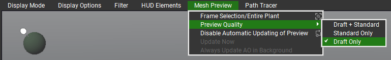

---
tags:
  - Support
---
## Requirements

- Blender 4.2 or newer
- PlantFactory 2024
- Operating System: Windows

## Notes Before Purchasing

!!! warning ""
    Before purchasing, please ensure you fully understand what this addon does and its requirements. This addon relies on third-party software called **PlantFactory** (approximately 1.6 GB) to function. While PlantFactory is free, setting it up requires some additional steps, which are clearly outlined in the sections below. For full functionality, it is also recommended to install the **PlantCatalog** library (approximately 20 GB), which significantly enhances the range of plants available for use but may take some time to download and install.

!!! warning ""
    PF2B does **not** guarantee 100% compatibility with all plants. With over [23,000](plants.md) presets, it is impractical to manually test and verify each one. However, most plants should import correctly without manual intervention.

    If you encounter issues, such as incorrect texture settings or geometry problems, [please reach out](support.md). I will do my best to resolve them by adding plant-specific configurations to the addon.

    **For more details, see the [PF2B: Under the Hood](support/pf2b_under_the_hood.md) page.**

## Installation

=== "Addon"
    To start using PF2B, you need to install the add-on in Blender. Follow these steps:

    1. Download the PF2B add-on zip file from the store you purchased it from.
    { .img-box .on-glb align=right width=31% }
    - Open Blender and go to `Edit > Preferences`.
    - In the Preferences window, navigate to the `Add-ons` tab.
    - Locate the `Add-ons Settings` (:octicons-chevron-down-12: icon) in the top right corner.
    - Click on `Install from Disk` and select the downloaded PF2B zip file.

    !!! info2 "Updates"
        For updates, simply download the updated add-on manually from the store where you purchased it, uninstall the old version and reinstall the new using the same steps outlined in the instructions above.

=== "PlantFactory & Libraries"
    Since the addon relies on the PlantFactory application for importing plants, it must be installed. Additionally, there are free plant libraries that can be installed. While these libraries are optional, they provide a significant portion of the available functionality, and skipping them may limit your experience.

    Follow these steps to install PlantFactory and the necessary libraries:

    1. If you haven’t already installed PlantFactory, download it (approximately 1.6 GB in size) from [Bentley’s official website](https://www.bentley.com/software/e-on-software-free-downloads/){ target="_blank" } and follow the on-screen instructions to complete the installation.
    - The `PlantCatalog` Library can also be downloaded from the same link. It is divided into multiple parts and requires 19.6 GB of space. I highly recommend downloading all parts to access the full plant library.
    - For additional information about PlantFactory, check out Bentley's FAQ section [here](https://www.bentley.com/software/e-on-software-free-downloads/#faq){ target="_blank" }.

    !!! warning ""
        If you install PlantFactory or the libraries in a **non-default location**, you need to adjust the paths in the preferences:

        - `Preferences > General > PlantFactory Location` – Set the path to the PlantFactory application.
        - `Preferences > Plant Library > Libraries` – Set the path to the root folder containing both the PlantCatalog and PlantFactory libraries.

After installing everything above, make sure to **read the sections below**, as they contain important information about required cache files for the addon.

## Finding PF2B and Using the Documentation

PF2B is located in the N-Panel inside the `3D Viewport` under a tab named `PF2B`, as shown in the image below.

{ .img-box align=left }

Every feature includes hover-over tooltips, providing quick and detailed explanations directly within the add-on interface, making it easy to understand functionality without needing to leave the workspace.

Some areas also have an extra :octicons-question-24: icon, which opens a popup with additional information and a link to the relevant section of the documentation for further instructions.

For more comprehensive guidance, you can access the full documentation by clicking the :blender_icon_help:icon in the main panel.

## First time use & Importing cache

{ .img-box .on-glb align=right width=40%  }

To get the most out of the PF2B addon and browse plants directly within the addon, you need to import the thumbnail and presets cache.

1. Download the cache files provided alongside the addon from the store where you purchased it.
- Inside Blender, navigate to the addon preferences by clicking the :blender_icon_preferences: icon in the PF2B panel. Alternatively, go to `Edit > Preferences`, find PF2B under the Add-ons tab.
- In the `Plant Library` tab, click the "**Import Cache**" button.
- Locate and select the downloaded cache file, which should be named `PF2B Cache - Complete Base.pf2b`.
- Once the import is complete, click the 'Verify' button on all caches to ensure everything is properly cached.
- Now you're ready to start using the addon!

*For more details about the cache, see [What is the PF2B cache?](support/faq.md#what-is-the-pf2b-cache).*

## Tips

{ .img-box .on-glb align=right width=20% }

- To ensure a smoother workflow, it’s **recommended** to disable the "**Welcome**" screen that appears at startup in PlantFactory. If left enabled, you’ll need to manually close this window each time you perform an import into Blender. You can disable it easily by clicking "Don’t show again" in the bottom-left corner.

<!--
- For a slight speed boost during imports, you can set the **Mesh Preview** option in PlantFactory to **Draft Only**, as shown in the screenshot below.

    { .img-box }
 -->