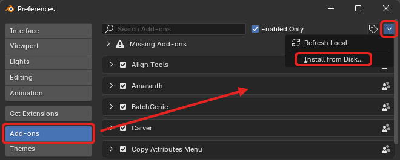
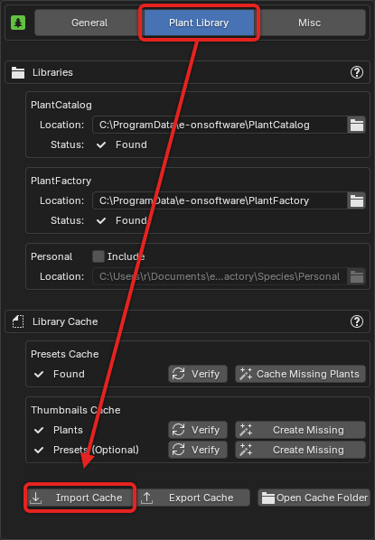

---
tags:
  - Support
---
## Requirements

- Blender 4.5 or newer
- PlantFactory 2024
- Operating System: Windows

!!! info2 ""
    PF2B 1.x (compatible with Blender 4.2+) remains available for download but does not include features from version 2.0 onward.

## Notes Before Purchasing

!!! warning ""
    Before purchasing, please ensure you fully understand what this addon does and its requirements. This addon relies on third-party software called **PlantFactory** (approximately 1.6 GB) to function. While PlantFactory is free, setting it up requires some additional steps, which are clearly outlined in the sections below. For full functionality, it is also recommended to install the **PlantCatalog** library (approximately 20 GB), which significantly enhances the range of plants available for use but may take some time to download and install.

!!! warning ""
    PF2B does **not** guarantee 100% compatibility with all plants. With over [23,000](plants.md) presets, it is not possible to manually test and verify each one. However, compatibility is very high, and approximately 99% of plants should import correctly without manual intervention.

    If you encounter issues, such as incorrect texture settings or geometry problems, [please reach out](support.md). I will do my best to resolve them by adding plant-specific configurations to the addon.

    **For more details, see the [PF2B: Under the Hood](support/pf2b_under_the_hood.md) page.**

## Installation

Since the addon relies on the PlantFactory application for importing plants, it must be installed. Additionally, there are free plant libraries that can be installed. While these libraries are optional, they provide a significant portion of the available functionality, and skipping them may limit your experience.

=== "Addon"
    To install PF2B inside Blender. Follow these steps:

    1. Download the PF2B add-on zip file from the store you purchased it from.
    { .img-box .on-glb align=right width=31% }
    - Open Blender and go to `Edit > Preferences`.
    - In the Preferences window, navigate to the `Add-ons` tab.
    - Locate the `Add-ons Settings` (:octicons-chevron-down-12: icon) in the top right corner.
    - Click on `Install from Disk` and select the downloaded PF2B zip file.

    !!! info2 "Updates"
        To update to a newer version, follow [these instructions](support/faq.md#how-do-i-update-to-a-new-version).

=== "PlantFactory Application"
    Follow these steps to install PlantFactory:

    1. Download PlantFactory (approximately 1.6 GB in size) from [Bentley’s official website](https://www.bentley.com/software/e-on-software-free-downloads/){ target="_blank" }. For additional information about PlantFactory, check out Bentley's FAQ section [here](https://www.bentley.com/software/e-on-software-free-downloads/#faq){ target="_blank" }
    { .img-box .on-glb width=40% }

    - After downloading, you should have a `.zip` file containing the installer.
    { .img-box .on-glb }

    - Extract the contents of the `.zip` file. To do this, right-click on the file and choose "Extract" (or use a third-party program such as 7-Zip if you prefer).

    - After extracting, you should see the installer file named "**Setup (Win).exe**". Run this installer and follow the on-screen instructions to complete the installation.
    { .img-box .on-glb }

        ??? info2 "Detailed Installer Instructions"
            When running the installer, you will be presented with the following steps. Any steps without options can be skipped by simply clicking "Next."

            { .img-box .on-glb }

             

            **Installation Folders**: 
            Here, you can select where to install the **PlantFactory application**. At the bottom (inside the red box), you’ll see the location of the **PlantFactory plant library** (shown as "Content folder" in the screenshot below), which contains the plants that come with the application. And below that, you need to set the installation location for the **"PlantCatalog"** library (explained in the next step on how to install the full library). It is generally recommended to leave these paths as default, but if you need to change them, you can do so here.
            !!! warning "Note"
                **If you choose to change the installation paths for either the application or the libraries**:

                - After installation, you must update the paths in the addon preferences to point to the correct installation locations. See the bottom of these instructions for more details on how to do this.
                - **If you choose to change the installation path for the Libraries**:
                    - **Content folder (PlantFactory library):** The installation destination folder **must be named "Plantfactory"** (case does not matter; both "PlantFactory" and "plantfactory" will work).
                    - **PlantCatalog folder**: The installation destination folder **must be named "Plantcatalog"** (case does not matter; both "PlantCatalog" and "plantcatalog" will work).

            { .img-box .on-glb }

             

            **Plug-ins**: 
            At this stage, you’ll be presented with options to install PlantFactory plug-ins for other 3D software such as 3DS Max, Cinema 4D, Maya, or Unreal Engine. If you use any of these programs, you can select the appropriate options, and the installer will add Eon Software's plug-ins for integration with those applications. Note that Blender is not listed here, as it is handled by the PF2B add-on. Installing or selecting any of these plugins will not affect PF2B, so feel free to choose the options that suit your needs.

            { .img-box .on-glb }

             

            After these steps, there may be a few more "Next" clicks, and then the installation will begin.

    - Once installation is completed, proceed to the next section to install the [PlantCatalog Plant Library](#installation-plantcatalog-plant-library).

    !!! warning ""
        If you install PlantFactory or the libraries in a **non-default location**, you need to adjust the paths in the preferences:

        - `Preferences > General > PlantFactory Location` – Set the path to the PlantFactory application.
        - `Preferences > Plant Library > Libraries` – Set the path to the root folder containing both the PlantCatalog and PlantFactory libraries.

=== "PlantCatalog Plant Library"
    The PlantCatalog is the primary plant library used in PF2B and contains most of the plants. You can read more about the library [here](plants.md#plantcatalog-library) and see this FAQ question: [Do I have to install the entire PlantCatalog library?](support/faq.md#do-i-have-to-install-the-entire-plantcatalog-library). Follow these steps to install the PlantCatalog plant library:

    1. Download the `PlantCatalog` Library files from [Bentley’s official website](https://www.bentley.com/software/e-on-software-free-downloads/){ target="_blank" }. The library is divided into multiple parts, requiring 19.6 GB of space. To ensure full functionality, download all **13 parts** of the library. 
    { .img-box width=40% }

    - After downloading, you should have multiple `.zip` files. Each `.zip` contains an installer for the library. 
    { .img-box }

    - **Extract the contents** of each `.zip` file. Right-click on each `.zip` file and choose "Extract" (or use a third-party program like 7-Zip, if preferred).

    - **Repeat** this extraction process for all 13 `.zip` files. After extracting, you will find the installer file named "**Setup (Win).exe**" in each folder.

    - **Run each installer** individually by double-clicking on the "**Setup (Win).exe**" file and follow the on-screen instructions to complete the installation. You will need to repeat this for each `.zip` file.
    { .img-box }

        ??? info2 "Detailed Installer Instructions"
            When running the installer, you will be presented with the following steps. Any steps without options can be skipped by simply clicking "Next."

            { .img-box }

             

            **Installation Folders**: 
            Here, you can select where to install the **PlantCatalog Library**. It is generally recommended to leave these paths as default, but if you need to change them, you can do so here.
            !!! warning "Note"
                **If you choose to change the installation path**:

                - The installation destination folder **must be named "Plantcatalog"** (case does not matter; both "PlantCatalog" and "plantcatalog" will work).
                - Ensure that **all remaining parts of the library are installed in the same directory** to keep everything properly organized.
                - After installation, you must update the path in the addon preferences to point to the correct installation location. See the bottom of these instructions for more details on how to do this.

            { .img-box }

    - Once installation is completed for all the `.zip` files, proceed to the next section as you are now done with all installation steps.

    !!! warning ""
        If you install PlantFactory or the libraries in a **non-default location**, you need to adjust the paths in the preferences:

        - `Preferences > General > PlantFactory Location` – Set the path to the PlantFactory application.
        - `Preferences > Plant Library > Libraries` – Set the path to the root folder containing both the PlantCatalog and PlantFactory libraries.

After installing everything above, make sure to **read the sections below**, as they contain important information about required cache files for the addon.

## After the Installation

### Finding PF2B and Using the Documentation

PF2B is located in the N-Panel inside the `3D Viewport` under a tab named `PF2B`, as shown in the image below.

{ .img-box align=left }

Every feature includes hover-over tooltips, providing quick and detailed explanations directly within the add-on interface, making it easy to understand functionality without needing to leave the workspace.

Some areas also have an extra :octicons-question-24: icon, which opens a popup with additional information and a link to the relevant section of the documentation for further instructions.

For more comprehensive guidance, you can access the full documentation by clicking the :blender_icon_help:icon in the main panel.

### First time use & Importing cache

{ .img-box .on-glb align=right width=40%  }

To get the most out of the PF2B addon and browse plants directly within the addon, you need to import the thumbnail and presets cache.

1. Download the cache files provided alongside the addon from the store where you purchased it.
- Inside Blender, navigate to the addon preferences by clicking the :blender_icon_preferences: icon in the PF2B panel. Alternatively, go to `Edit > Preferences`, find PF2B under the Add-ons tab.
- In the `Plant Library` tab, click the "**Import Cache**" button.
- Locate and select the downloaded cache file, which should be named `PF2B Cache - Complete Base.pf2b`.
- Once the import is complete, click the 'Verify' button on all caches to ensure everything is properly cached.
- Now you're ready to start using the addon!

*For more details about the cache, see [What is the PF2B cache?](support/faq.md#what-is-the-pf2b-cache).*

### Setting up Biomes & Collections

=== "1. Setting the Blend Storage Path"
    Before using [Biomes & Collections](workflow/biomes_and_collections.md), you must specify a directory where PF2B will store asset files.

    1. Navigate to `PF2B Preferences > Plant Library > Biomes & Collections > Blend Storage`.
    2. Click the folder icon and browse to choose a location for your PF2B asset library.
    3. Confirm your selection.

    !!! info2 ""
        Choose a location with adequate storage space. This directory will contain all imported plants and biome assets.

=== "2. Installing Required Biome Assets"
    If you intend to use the [Biomes](workflow/biomes_and_collections.md) functionality, you must also install the extra asset blend files that are bundled with PF2B since version 2.0.

    The extra assets are in the zip file named `PF2B_biome_other-assets.zip` that is distributed with the add-on.

    1. Browse to the Blend Storage location you set in the previous step.
    2. Extract the contents of the zip file to this location. There should be 2 blend files.
        { .img-box  }

    !!! info2 ""
        These blend files contain additional non-plant assets such as rocks and boulders that are used by the various Biomes. Skipping this step will cause errors when trying to use Biomes that depend on these assets.

=== "3. Setting up an Asset Library Path"
    To get the most out of the [Biomes & Collections](workflow/biomes_and_collections.md) functionality, it is recommended to set up an Asset Library path pointing to the PF2B directory you specified in the Blend Storage setting.

    This step is **optional** but provides important benefits: it allows you to access imported plants with **full categorization** directly in Blender's Asset Browser (see [how this looks in practice](workflow/biomes_and_collections.md#shared-library)).

    !!! info2 ""
        If your PF2B directory is already a subfolder of an existing Asset Library path, the assets will be accessible but **without the PF2B category structure**. To enable the categorized view from the `blender_assets.cats.txt` file, you need to add the PF2B directory as its own Asset Library path.

    **To set up the Asset Library path:**

    { .img-box .on-glb align=right width=40% }

    1. Go to `Preferences > File Paths` and locate the `Asset Libraries` section.
    2. Click the :material-plus:(plus) button to add a new library.
    3. Browse to the same folder you set in `Blend Storage`.
    4. (Optional) Rename the Asset Library to something recognizable, such as "PF2B Assets".
    5. (Recommended) Set the **Import Method** to `Append (Reuse Data)`.

## Tips

{ .img-box .on-glb align=right width=20% }

- To ensure a smoother workflow, it’s **recommended** to disable the "**Welcome**" screen that appears at startup in PlantFactory. If left enabled, you’ll need to manually close this window each time you perform an import into Blender. You can disable it easily by clicking "*Don’t show again*" in the bottom-left corner.