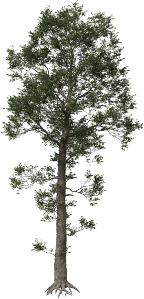

---
tags:
  - Release history
hide:
  - toc
---
{ align=right style="margin-top:0" }
**PF2B** (PlantFactory to Blender) is an addon that enables the direct import of plants created in [PlantFactory](https://www.bentley.com/software/e-on-software-free-downloads/){ target="_blank" } by e-on software into [Blender](https://www.blender.org/){ target="_blank" }. PF2B automates the setup process, allowing you to transfer detailed vegetation assets from PlantFactory to Blender with minimal manual configuration.

With PF2B, you gain access to over **200 plant species** and more than **10,000 unique presets**, with each plant procedurally generated using a customizable seed to guarantee a truly one-of-a-kind specimen every time. Available in both low-poly and high-poly variations to suit different performance and visual fidelity needs, PF2B offers a seamless workflow for bringing rich, realistic vegetation into Blender.

<!-- See the [plants](plants.md) & [Gallery](gallery.md) for more details. -->

<!-- ??? info2 "Detailed Library Info"
    

    ### PlantCatalog Library

    **450 plant species** with a total of **23,193 unique presets**.

    **Categories**

    - **Broadleaf Trees**
    - **Bushes**
    - **Climbers**
    - **Coniferous**
    - **Ferns**
    - **Grass**
    - **Ground Covers**
    - **Mushrooms**
    - **Palms**
    - **Perennials**
    - **Succulents**

    **Detail Levels** 
    Plants in the catalog are also categorized based on their detail level to suit different performance needs:

    - **Full Geometry** – 12 plants
    - **High Detail** – 191 plants
    - **Low Detail** – 182 plants
    - **Real-Time** – 65 plants

    Many species include multiple versions to support both **high-poly** and **low-poly** workflows. If we consider only the **high-poly** versions, the catalog features **191 unique plant species**.

    ---

    ### PlantFactory Library
    Includes **41 plant species** with **22 unique presets**.

    **Categories**

    - **Bushes**
    - **Flowers**
    - **Grasses**
    - **Palms**
    - **Sci-Fi**
    - **Trees**

    
 /Changelog -->

<!-- ## Key Features

- **Direct Import**: Bring PlantFactory-generated plants directly into Blender without complicated export/import steps.
- **Automatic Asset Setup**: PF2B configures imported plant assets with optimized shaders and textures, preserving the intricate details of PlantFactory plants.

 -->

## Where to get the add-on?

You can buy PF2B in the following stores:

[:simple-gumroad:{ .gumroad } Gumroad](https://roberd.gumroad.com/){ .md-button .md-button--stretch }

[:blender_market: BlenderMarket](#){ .md-button .md-button--stretch }

 

*PF2B is a third-party addon and is not an official product of Bentley Systems, E-on Software, or PlantFactory. It is not affiliated with or endorsed by these companies.*{style="color:var(--md-default-fg-color--light)"}