<!-- NOTE TO SELF: When updating plant lists below update landings-page site -->

Both libraries below are free to download. For installation instructions, see [this guide](getting_started.md#installation).

## PlantCatalog Library

The **PlantCatalog** library includes **194** unique plant species across **11** categories, with a total of **10,377** unique presets. When factoring in multiple detail levels, this expands to **450** plants and **23,193** presets.

<!-- #### Overview { style="margin-bottom:-0.75em"} -->

Total number of unique plants by category:

| Category | Plants | Presets
|----------|-----------------|-----------------|
| Broadleaf Trees | 45 | 2637
| Bushes | 38 | 2154
| Climbers | 1 | 35
| Coniferous | 36 | 3202
| Ferns | 2 | 105
| Grass | 11 | 618
| Ground Covers | 3 | 33
| Mushrooms | 3 | 46
| Palms | 15 | 470
| Perennials | 29 | 663
| Succulents | 11 | 414

Most plants are available in multiple detail levels:

- **HD**: High Detail (191 plants)
- **LD**: Low Detail (182 plants)
- **RT**: Real-Time (65 plants)
- **FG**: Full Geometry (12 plants)

### Plant List {#plantcatalog-library-plant-list}

!!! info2 ""
    - **Presets**: Count shown is per detail level. A plant with 20 presets and two detail levels (HD, LD) has 40 total presets (20 for each level).
    - **Polycount**: Range includes all detail levels combined, showing the minimum and maximum across all presets.
=== "Broadleaf Trees"
    | Image | English Name | Latin Name | Detail Levels | Presets | Height (m) | Polycount |
    | ------- | -------------- | ------------ | --------------- | --------- | ------------ | ----------- |
    | [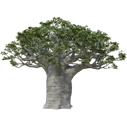](images/plants/PlantCatalog/1._Adansonia_digitata_HD.webp){ .glightbox data-description="Baobab Tree" } | Baobab Tree | Adansonia digitata | HD, LD, RT | 20 | 4.75 - 20.0m | 4.6K - 410K |
    | { .glightbox data-description="Red Buckeye" } | Red Buckeye | Aesculus pavia | HD, LD | 20 | 1.75 - 5.0m | 12K - 180K |
    | { .glightbox data-description="Red Horse Chestnut" } | Red Horse Chestnut | Aesculus x carnea | HD, LD | 30 | 3.5 - 14.0m | 17K - 490K |
    | { .glightbox data-description="Hong Kong Orchid Tree" } | Hong Kong Orchid Tree | Bauhinia blakeana | HD, LD, RT | 40 | 2.75 - 7.5m | 3.4K - 290K |
    | { .glightbox data-description="Hong Kong Orchid Tree" } | Hong Kong Orchid Tree | Bauhinia blakeana V2 | HD, LD | 40 | 2.75 - 7.0m | 13K - 480K |
    | { .glightbox data-description="Bitter Orange" } | Bitter Orange | Citrus x aurantium | HD, LD | 30 | 2.5 - 4.75m | 52K - 780K |
    | { .glightbox data-description="Lemon Tree" } | Lemon Tree | Citrus x limon | HD, LD | 30 | 2.0 - 3.25m | 33K - 370K |
    | { .glightbox data-description="Royal Poinciana (Flamboyant Tree)" } | Royal Poinciana (Flamboyant Tree) | Delonix regia | HD, LD, RT | 40 | 3.0 - 8.5m | 5.3K - 640K |
    | [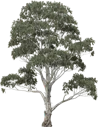](images/plants/PlantCatalog/9._Eucalyptus_camaldulensis_HD.webp){ .glightbox data-description="River Red Gum" } | River Red Gum | Eucalyptus camaldulensis | HD, LD, RT | 40 | 3.5 - 26.0m | 0.91K - 800K |
    | { .glightbox data-description="Eucalyptus Leaf Litter" } | Eucalyptus Leaf Litter | Eucalyptus leaf litter | HD | 24 | 0.03 - 0.6m | 0.36K - 69K |
    | { .glightbox data-description="Snow Gum" } | Snow Gum | Eucalyptus pauciflora | HD, LD, RT | 40 | 1.5 - 11.0m | 4.4K - 950K |
    | [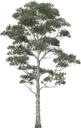](images/plants/PlantCatalog/12._Eucalyptus_viminalis_HD.webp){ .glightbox data-description="Manna Gum" } | Manna Gum | Eucalyptus viminalis | HD, LD, RT | 40 | 4.75 - 50.0m | 2.4K - 980K |
    | { .glightbox data-description="Common Fig Tree" } | Common Fig Tree | Ficus carica | HD | 30 | 2.0 - 4.75m | 12K - 560K |
    | { .glightbox data-description="Blue Jacaranda" } | Blue Jacaranda | Jacaranda mimosifolia | HD, RT | 40 | 2.5 - 10.0m | 1.9K - 570K |
    | { .glightbox data-description="Chinese Flame Tree" } | Chinese Flame Tree | Koelreuteria bipinnata | HD, LD, RT | 20 | 3.75 - 8.0m | 0.66K - 1200K |
    | { .glightbox data-description="Chinaberry Tree" } | Chinaberry Tree | Melia azedarach | HD, LD | 30 | 4.5 - 9.5m | 22K - 640K |
    | { .glightbox data-description="Olive Tree" } | Olive Tree | Olea europaea | HD, LD, RT | 40 | 1.0 - 5.5m | 1.4K - 1100K |
    | { .glightbox data-description="Ornamental Olive Tree" } | Ornamental Olive Tree | Olea europaea ornamental | HD, LD, RT | 12 | 2.25 - 6.0m | 14K - 1700K |
    | { .glightbox data-description="Pink Frangipani" } | Pink Frangipani | Plumeria rubra pink | HD, LD | 50 | 1.5 - 4.5m | 4.2K - 330K |
    | { .glightbox data-description="Black Poplar" } | Black Poplar | Populus nigra | HD, LD | 105 | 2.25 - 29.0m | 13K - 1500K |
    | { .glightbox data-description="Lombardy Poplar" } | Lombardy Poplar | Populus nigra 'Italica' | HD, LD | 75 | 2.0 - 57.0m | 16K - 1800K |
    | [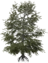](images/plants/PlantCatalog/23._Quercus_palustris_HD.webp){ .glightbox data-description="Pin Oak" } | Pin Oak | Quercus palustris | HD, LD | 118 | 1.25 - 20.0m | 12K - 1300K |
    | [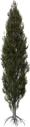](images/plants/PlantCatalog/22._Quercus_palustris_'Green_Pillar'_HD.webp){ .glightbox data-description="Green Pillar Pin Oak" } | Green Pillar Pin Oak | Quercus palustris 'Green Pillar' | HD, LD | 75 | 2.0 - 19.0m | 20K - 1100K |
    | [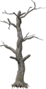](images/plants/PlantCatalog/26._Quercus_robur_dead_HD.webp){ .glightbox data-description="Dead English Oak" } | Dead English Oak | Quercus robur dead | HD, LD, RT | 100 | 0.15 - 14.0m | 0.62K - 260K |
    | { .glightbox data-description="Dead English Oak Branch" } | Dead English Oak Branch | Quercus robur dead branch | HD, LD, RT | 24 | 0.5 - 1.0m | 0.97K - 23K |
    | { .glightbox data-description="Colonised Dead English Oak" } | Colonised Dead English Oak | Quercus robur dead colonised | HD, LD, RT | 85 | 0.3 - 14.0m | 3.5K - 2000K |
    | { .glightbox data-description="English Oak Forest" } | English Oak Forest | Quercus robur forest | HD, LD | 115 | 0.8 - 20.0m | 7.7K - 2300K |
    | [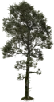](images/plants/PlantCatalog/27._Quercus_robur_forest_colonised_HD.webp){ .glightbox data-description="Colonised English Oak Forest" } | Colonised English Oak Forest | Quercus robur forest colonised | HD, LD | 115 | 0.9 - 20.0m | 15K - 2500K |
    | { .glightbox data-description="English Oak Leaf Litter" } | English Oak Leaf Litter | Quercus robur leaf litter | HD, LD | 58 | 0.01 - 7.5m | 0.00K - 160K |
    | { .glightbox data-description="Lone English Oak" } | Lone English Oak | Quercus robur lone | HD, LD | 95 | 0.8 - 17.0m | 9.5K - 4000K |
    | { .glightbox data-description="English Oak Seedling" } | English Oak Seedling | Quercus robur seedling | HD, LD | 12 | 0.3 - 1.75m | 0.37K - 57K |
    | [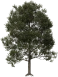](images/plants/PlantCatalog/32._Quercus_robur_urban_HD.webp){ .glightbox data-description="Urban English Oak" } | Urban English Oak | Quercus robur urban | HD, LD | 45 | 3.75 - 14.0m | 39K - 4000K |
    | { .glightbox data-description="Northern Red Oak" } | Northern Red Oak | Quercus rubra | HD, LD, RT | 138 | 1.75 - 25.0m | 9.2K - 1200K |
    | { .glightbox data-description="Northern Red Oak Branch" } | Northern Red Oak Branch | Quercus rubra branch | HD | 3 | 0.8 - 1.0m | 48K - 52K |
    | [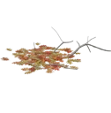](images/plants/PlantCatalog/36._Quercus_rubra_leaf_litter_HD.webp){ .glightbox data-description="Northern Red Oak Leaf Litter" } | Northern Red Oak Leaf Litter | Quercus rubra leaf litter | HD | 36 | 0.03 - 0.5m | 0.01K - 150K |
    | { .glightbox data-description="Northern Red Oak Leaf Litter" } | Northern Red Oak Leaf Litter | Quercus rubra leaf litter V2 | HD | 36 | 0.03 - 0.5m | 0.01K - 160K |
    | { .glightbox data-description="Northern Red Oak Seedlings" } | Northern Red Oak Seedlings | Quercus rubra seedlings | HD | 12 | 0.3 - 2.0m | 0.80K - 50K |
    | { .glightbox data-description="Red Mangrove Forest" } | Red Mangrove Forest | Rhizophora forest | HD, LD | 160 | 4.5 - 17.0m | 16K - 2700K |
    | { .glightbox data-description="Lone Red Mangrove" } | Lone Red Mangrove | Rhizophora lone | HD, LD | 120 | 3.0 - 9.0m | 11K - 3200K |
    | { .glightbox data-description="Red Mangrove Seedling" } | Red Mangrove Seedling | Rhizophora seedling | HD, LD | 18 | 1.5 - 1.75m | 0.36K - 49K |
    | { .glightbox data-description="White Willow" } | White Willow | Salix alba | HD, LD | 206 | 1.25 - 15.0m | 3.1K - 1300K |
    | { .glightbox data-description="Pollarded White Willow" } | Pollarded White Willow | Salix alba pollarded | HD, LD | 63 | 1.25 - 5.0m | 21K - 590K |
    | { .glightbox data-description="Weeping Willow" } | Weeping Willow | Salix babylonica | HD, LD | 129 | 1.25 - 15.0m | 6.6K - 2700K |
    | { .glightbox data-description="Pollarded Weeping Willow" } | Pollarded Weeping Willow | Salix babylonica pollarded | HD, LD | 63 | 1.25 - 4.5m | 21K - 690K |
    | { .glightbox data-description="Umbrella Thorn Acacia" } | Umbrella Thorn Acacia | Vachellia tortilis | HD, LD | 15 | 5.0 - 14.0m | 9.8K - 5500K |

=== "Bushes"
    | Image | English Name | Latin Name | Detail Levels | Presets | Height (m) | Polycount |
    | ------- | -------------- | ------------ | --------------- | --------- | ------------ | ----------- |
    | { .glightbox data-description="Angel's Trumpet" } | Angel's Trumpet | Brugmansia x insignis | HD, LD | 5 | 1.75 - 4.0m | 4.9K - 130K |
    | { .glightbox data-description="Bottle Brush" } | Bottle Brush | Callistemon laevis | HD, LD, RT | 20 | 0.6 - 2.5m | 0.03K - 290K |
    | [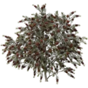](images/plants/PlantCatalog/48._Callistemon_rigidus_HD.webp){ .glightbox data-description="Stiff Bottlebrush" } | Stiff Bottlebrush | Callistemon rigidus | HD, LD, RT | 20 | 0.7 - 2.5m | 0.03K - 230K |
    | { .glightbox data-description="Dwarf Bottlebrush" } | Dwarf Bottlebrush | Callistemon viminalis 'Little John' | HD, LD, RT | 10 | 0.4 - 1.75m | 0.04K - 340K |
    | { .glightbox data-description="Dark Pink Heather" } | Dark Pink Heather | Calluna vulgaris dark pink | HD, LD | 105 | 0.09 - 0.3m | 0.67K - 1300K |
    | { .glightbox data-description="Light Pink Heather" } | Light Pink Heather | Calluna vulgaris light pink | HD, LD | 105 | 0.1 - 0.3m | 0.69K - 1000K |
    | { .glightbox data-description="Silver Heather" } | Silver Heather | Calluna vulgaris silver | HD, LD | 105 | 0.1 - 0.35m | 0.70K - 1400K |
    | { .glightbox data-description="White Heather" } | White Heather | Calluna vulgaris white | HD, LD | 105 | 0.1 - 0.3m | 0.69K - 1100K |
    | { .glightbox data-description="Mexican Orange Blossom" } | Mexican Orange Blossom | Choisya ternata | HD, LD, RT | 10 | 0.5 - 1.75m | 0.10K - 140K |
    | [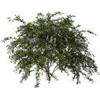](images/plants/PlantCatalog/55._Duranta_repens_HD.webp){ .glightbox data-description="Golden Dewdrop" } | Golden Dewdrop | Duranta repens | HD, LD, RT | 20 | 0.7 - 3.25m | 0.43K - 570K |
    | { .glightbox data-description="Dark Pink Winter Heath" } | Dark Pink Winter Heath | Erica carnea dark pink | HD, LD | 105 | 0.1 - 0.3m | 0.85K - 1200K |
    | { .glightbox data-description="Light Pink Winter Heath" } | Light Pink Winter Heath | Erica carnea light pink | HD, LD | 105 | 0.1 - 0.3m | 0.85K - 1200K |
    | [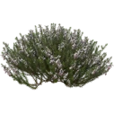](images/plants/PlantCatalog/58._Erica_carnea_white_HD.webp){ .glightbox data-description="White Winter Heath" } | White Winter Heath | Erica carnea white | HD, LD | 105 | 0.1 - 0.3m | 0.85K - 1200K |
    | { .glightbox data-description="Upright English Ivy" } | Upright English Ivy | Hedera helix 'Erecta' | HD, LD | 10 | 0.5 - 1.0m | 6.9K - 80K |
    | { .glightbox data-description="Chinese Hibiscus" } | Chinese Hibiscus | Hibiscus rosa-sinensis | HD, LD, RT | 20 | 1.0 - 3.75m | 0.27K - 230K |
    | { .glightbox data-description="Red Chinese Ixora" } | Red Chinese Ixora | Ixora chinensis red | HD, LD, RT | 10 | 0.6 - 2.25m | 0.78K - 200K |
    | [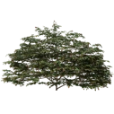](images/plants/PlantCatalog/62._Loropetalum_chinense_var_rubrum_HD.webp){ .glightbox data-description="Chinese Fringe Flower" } | Chinese Fringe Flower | Loropetalum chinense var rubrum | HD, LD, RT | 10 | 0.6 - 3.0m | 0.10K - 270K |
    | { .glightbox data-description="Tree Lupine" } | Tree Lupine | Lupinus arboreus | HD, LD | 25 | 0.6 - 1.75m | 16K - 780K |
    | [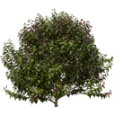](images/plants/PlantCatalog/64._Malvaviscus_penduliflorus_HD.webp){ .glightbox data-description="Turk's Cap" } | Turk's Cap | Malvaviscus penduliflorus | HD, LD, RT | 20 | 1.0 - 3.5m | 0.26K - 320K |
    | { .glightbox data-description="Coleus" } | Coleus | Plectranthus scutellarioides | HD, LD, RT | 40 | 0.3 - 1.5m | 0.12K - 640K |
    | { .glightbox data-description="Fairway Mosaic Coleus" } | Fairway Mosaic Coleus | Plectranthus scutellarioides 'Fairway Mosaic' | HD, LD, RT | 40 | 0.3 - 1.5m | 0.12K - 640K |
    | { .glightbox data-description="Fairway Yellow Coleus" } | Fairway Yellow Coleus | Plectranthus scutellarioides 'Fairway Yellow' | HD, LD, RT | 40 | 0.3 - 1.5m | 0.12K - 640K |
    | { .glightbox data-description="Kong Rose Coleus" } | Kong Rose Coleus | Plectranthus scutellarioides 'Kong Rose' | HD, LD, RT | 40 | 0.3 - 1.5m | 0.12K - 640K |
    | [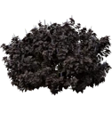](images/plants/PlantCatalog/68._Plectranthus_scutellarioides_'Premium_Sun_Dark_Chocolate'_HD.webp){ .glightbox data-description="Dark Chocolate Coleus" } | Dark Chocolate Coleus | Plectranthus scutellarioides 'Premium Sun Dark Chocolate' | HD, LD, RT | 40 | 0.3 - 1.5m | 0.12K - 640K |
    | { .glightbox data-description="Saturn Coleus" } | Saturn Coleus | Plectranthus scutellarioides 'Saturn' | HD, LD, RT | 40 | 0.3 - 1.5m | 0.12K - 640K |
    | { .glightbox data-description="Vulcan Coleus" } | Vulcan Coleus | Plectranthus scutellarioides 'Vulcan' | HD, LD, RT | 10 | 0.2 - 0.8m | 0.06K - 380K |
    | [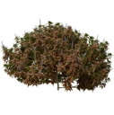](images/plants/PlantCatalog/70._Plectranthus_scutellarioides_'Vulcan'_HD_V2.webp){ .glightbox data-description="Vulcan Coleus" } | Vulcan Coleus | Plectranthus scutellarioides 'Vulcan' V2 | HD, LD, RT | 40 | 0.3 - 1.5m | 0.12K - 640K |
    | { .glightbox data-description="Wizard Jade Coleus" } | Wizard Jade Coleus | Plectranthus scutellarioides 'Wizard Jade' | HD, LD, RT | 40 | 0.3 - 1.5m | 0.12K - 640K |
    | { .glightbox data-description="Wizard Velvet Red Coleus" } | Wizard Velvet Red Coleus | Plectranthus scutellarioides 'Wizard Velvet Red' | HD, LD, RT | 40 | 0.3 - 1.5m | 0.12K - 640K |
    | [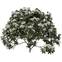](images/plants/PlantCatalog/75._Rhododendron_'Boule_de_neige'_HD.webp){ .glightbox data-description="Boule de Neige Rhododendron" } | Boule de Neige Rhododendron | Rhododendron 'Boule de neige' | HD, LD | 90 | 0.3 - 2.0m | 0.96K - 1300K |
    | { .glightbox data-description="Everestianum Rhododendron" } | Everestianum Rhododendron | Rhododendron 'Everestianum' | HD, LD | 90 | 0.3 - 2.0m | 0.96K - 1300K |
    | { .glightbox data-description="Nova Zembla Rhododendron" } | Nova Zembla Rhododendron | Rhododendron 'Nova Zembla' | HD, LD | 90 | 0.3 - 2.0m | 0.96K - 1300K |
    | [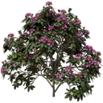](images/plants/PlantCatalog/78._Rhododendron_catawbiense_HD.webp){ .glightbox data-description="Catawba Rhododendron" } | Catawba Rhododendron | Rhododendron catawbiense | HD, LD | 150 | 0.35 - 2.25m | 1.5K - 950K |
    | { .glightbox data-description="Rusty-Leaved Alpenrose" } | Rusty-Leaved Alpenrose | Rhododendron ferrugineum | HD, LD | 125 | 0.15 - 0.9m | 0.23K - 620K |
    | { .glightbox data-description="Great Laurel" } | Great Laurel | Rhododendron maximum | HD, LD | 100 | 0.5 - 3.5m | 3.2K - 1600K |
    | { .glightbox data-description="Elaeagnus Willow" } | Elaeagnus Willow | Salix elaeagnos | HD, LD | 99 | 0.15 - 3.75m | 1.6K - 440K |
    | { .glightbox data-description="French Tamarisk" } | French Tamarisk | Tamarix gallica | HD | 20 | 1.25 - 4.25m | 4.5K - 190K |
    | { .glightbox data-description="Bilberry" } | Bilberry | Vaccinium myrtillus | HD, LD | 105 | 0.04 - 0.5m | 0.09K - 140K |

=== "Climbers"
    | Image | English Name | Latin Name | Detail Levels | Presets | Height (m) | Polycount |
    | ------- | -------------- | ------------ | --------------- | --------- | ------------ | ----------- |
    | { .glightbox data-description="English Ivy" } | English Ivy | Hedera helix wall climber green | HD, LD | 35 | 0.4 - 3.75m | 0.19K - 830K |

=== "Coniferous"
    | Image | English Name | Latin Name | Detail Levels | Presets | Height (m) | Polycount |
    | ------- | -------------- | ------------ | --------------- | --------- | ------------ | ----------- |
    | { .glightbox data-description="Pine Cone" } | Pine Cone | Generic pine cone | HD, LD | 15 | 0.15 - 0.25m | 3.1K - 37K |
    | { .glightbox data-description="Long-needle Pine Litter" } | Long-needle Pine Litter | Long-needle pine litter | HD, LD | 39 | 0.02 - 0.35m | 0.10K - 170K |
    | { .glightbox data-description="Norway Spruce" } | Norway Spruce | Picea abies | HD, LD | 43 | 0.45 - 27.0m | 2.2K - 320K |
    | [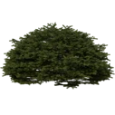](images/plants/PlantCatalog/87._Picea_abies_'Maxwellii'_HD.webp){ .glightbox data-description="Maxwell's Norway Spruce" } | Maxwell's Norway Spruce | Picea abies 'Maxwellii' | HD, LD | 10 | 0.45 - 1.5m | 6.5K - 140K |
    | [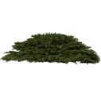](images/plants/PlantCatalog/88._Picea_abies_'Nidiformis'_HD.webp){ .glightbox data-description="Bird's Nest Spruce" } | Bird's Nest Spruce | Picea abies 'Nidiformis' | HD, LD | 10 | 0.3 - 0.9m | 2.3K - 75K |
    | { .glightbox data-description="Engelmann Spruce" } | Engelmann Spruce | Picea engelmannii | HD, LD | 43 | 0.45 - 27.0m | 1.5K - 350K |
    | [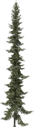](images/plants/PlantCatalog/92._Picea_mariana_HD.webp){ .glightbox data-description="Black Spruce" } | Black Spruce | Picea mariana | HD, LD | 38 | 0.1 - 14.0m | 1.5K - 440K |
    | [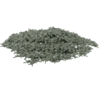](images/plants/PlantCatalog/91._Picea_mariana_'Ericoides'_HD.webp){ .glightbox data-description="Heath-like Black Spruce" } | Heath-like Black Spruce | Picea mariana 'Ericoides' | HD, LD | 10 | 0.15 - 0.35m | 1.1K - 78K |
    | [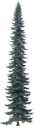](images/plants/PlantCatalog/95._Picea_pungens_HD.webp){ .glightbox data-description="Colorado Blue Spruce" } | Colorado Blue Spruce | Picea pungens | HD, LD | 43 | 0.35 - 19.0m | 2.1K - 350K |
    | { .glightbox data-description="Globe Blue Spruce" } | Globe Blue Spruce | Picea pungens 'Glauca Globosa' | HD, LD | 10 | 0.5 - 1.0m | 3.2K - 63K |
    | [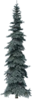](images/plants/PlantCatalog/94._Picea_pungens_'Koster'_HD.webp){ .glightbox data-description="Koster Blue Spruce" } | Koster Blue Spruce | Picea pungens 'Koster' | HD, LD | 43 | 0.2 - 9.5m | 1.5K - 180K |
    | { .glightbox data-description="Dead Lodgepole Pine Forest" } | Dead Lodgepole Pine Forest | Pinus contorta dead forest | HD, LD | 150 | 0.1 - 17.0m | 1.1K - 470K |
    | { .glightbox data-description="Dead Lodgepole Pine" } | Dead Lodgepole Pine | Pinus contorta dead lone | HD, LD | 85 | 0.9 - 17.0m | 1.7K - 440K |
    | { .glightbox data-description="Lodgepole Pine Forest" } | Lodgepole Pine Forest | Pinus contorta var latifolia forest | FG, HD, LD | 135 | 0.15 - 18.0m | 1.5K - 3500K |
    | { .glightbox data-description="Lodgepole Pine" } | Lodgepole Pine | Pinus contorta var latifolia lone | FG, HD, LD | 85 | 2.0 - 18.0m | 4.6K - 3600K |
    | [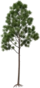](images/plants/PlantCatalog/100._Pinus_elliottii_forest_HD.webp){ .glightbox data-description="Slash Pine Forest" } | Slash Pine Forest | Pinus elliottii forest | FG, HD, LD | 120 | 0.2 - 26.0m | 3.7K - 530K |
    | { .glightbox data-description="Slash Pine" } | Slash Pine | Pinus elliottii lone | FG, HD, LD | 105 | 3.5 - 27.0m | 6.3K - 1000K |
    | { .glightbox data-description="Jeffrey Pine Forest" } | Jeffrey Pine Forest | Pinus jeffreyi forest | FG, HD, LD | 135 | 0.25 - 38.0m | 5.3K - 2100K |
    | { .glightbox data-description="Young Jeffrey Pine" } | Young Jeffrey Pine | Pinus jeffreyi juvenile | FG, HD, LD | 102 | 0.25 - 4.0m | 0.06K - 120K |
    | { .glightbox data-description="Jeffrey Pine" } | Jeffrey Pine | Pinus jeffreyi lone | FG, HD, LD | 105 | 3.75 - 38.0m | 12K - 3100K |
    | [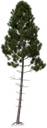](images/plants/PlantCatalog/105._Pinus_pinaster_forest_HD.webp){ .glightbox data-description="Maritime Pine Forest" } | Maritime Pine Forest | Pinus pinaster forest | FG, HD, LD | 135 | 0.2 - 30.0m | 2.1K - 1600K |
    | { .glightbox data-description="Maritime Pine" } | Maritime Pine | Pinus pinaster lone | FG, HD, LD | 125 | 3.0 - 25.0m | 10K - 1500K |
    | { .glightbox data-description="Ponderosa Pine Branch" } | Ponderosa Pine Branch | Pinus ponderosa branch | HD, LD | 80 | 1.25 - 4.0m | 11K - 270K |
    | { .glightbox data-description="Dead Ponderosa Pine Forest" } | Dead Ponderosa Pine Forest | Pinus ponderosa dead forest | HD, LD | 150 | 0.25 - 44.0m | 3.7K - 1200K |
    | { .glightbox data-description="Dead Ponderosa Pine" } | Dead Ponderosa Pine | Pinus ponderosa dead lone | HD, LD | 85 | 1.5 - 43.0m | 4.1K - 900K |
    | { .glightbox data-description="Ponderosa Pine Forest" } | Ponderosa Pine Forest | Pinus ponderosa forest | FG, HD, LD | 135 | 0.25 - 44.0m | 5.7K - 2700K |
    | { .glightbox data-description="Young Ponderosa Pine" } | Young Ponderosa Pine | Pinus ponderosa juvenile | FG, HD, LD | 103 | 0.25 - 4.0m | 0.06K - 120K |
    | [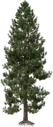](images/plants/PlantCatalog/112._Pinus_ponderosa_lone_HD.webp){ .glightbox data-description="Ponderosa Pine" } | Ponderosa Pine | Pinus ponderosa lone | FG, HD, LD | 105 | 3.75 - 44.0m | 15K - 4000K |
    | { .glightbox data-description="Uprooted Ponderosa Pine" } | Uprooted Ponderosa Pine | Pinus ponderosa uprooted | HD, LD | 245 | 0.1 - 6.5m | 0.56K - 890K |
    |  | Giant Sequoia | Sequoiadendron giganteum | LD, RT | 29 | 1.5 - 78.0m | 0.58K - 220K |
    | { .glightbox data-description="Short-needle Pine Litter" } | Short-needle Pine Litter | Short-needle pine litter | HD, LD | 39 | 0.01 - 0.2m | 0.14K - 180K |
    | { .glightbox data-description="Bald Cypress Forest" } | Bald Cypress Forest | Taxodium distichum forest | HD, LD | 225 | 0.3 - 30.0m | 2.2K - 1800K |
    | { .glightbox data-description="Bald Cypress" } | Bald Cypress | Taxodium distichum lone | HD, LD | 200 | 1.5 - 31.0m | 4.8K - 2500K |
    | { .glightbox data-description="Urban Bald Cypress" } | Urban Bald Cypress | Taxodium distichum urban | HD, LD | 150 | 3.25 - 28.0m | 7.2K - 2300K |
    | { .glightbox data-description="Western Red Cedar" } | Western Red Cedar | Thuja plicata | HD, LD, RT | 27 | 2.25 - 44.0m | 1.2K - 280K |
    | { .glightbox data-description="Mountain Hemlock" } | Mountain Hemlock | Tsuga mertensiana | HD, LD | 43 | 0.35 - 26.0m | 0.96K - 400K |

=== "Ferns"
    | Image | English Name | Latin Name | Detail Levels | Presets | Height (m) | Polycount |
    | ------- | -------------- | ------------ | --------------- | --------- | ------------ | ----------- |
    | { .glightbox data-description="Male Fern" } | Male Fern | Dryopteris filix-mas | HD, LD, RT | 50 | 0.15 - 2.25m | 3.2K - 190K |
    | { .glightbox data-description="Common Polypody" } | Common Polypody | Polypodium vulgare | HD, LD, RT | 55 | 0.2 - 1.25m | 0.08K - 59K |

=== "Grass"
    | Image | English Name | Latin Name | Detail Levels | Presets | Height (m) | Polycount |
    | ------- | -------------- | ------------ | --------------- | --------- | ------------ | ----------- |
    | [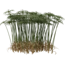](images/plants/PlantCatalog/122._Cyperus_alternifolius_HD.webp){ .glightbox data-description="Umbrella Sedge" } | Umbrella Sedge | Cyperus alternifolius | HD, LD | 60 | 0.9 - 2.75m | 0.93K - 420K |
    | { .glightbox data-description="Papyrus" } | Papyrus | Cyperus papyrus | HD, LD | 60 | 2.5 - 6.0m | 3.8K - 1600K |
    | [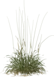](images/plants/PlantCatalog/124._Festuca_arundinacea_HD.webp){ .glightbox data-description="Tall Fescue" } | Tall Fescue | Festuca arundinacea | HD, LD | 55 | 0.25 - 1.25m | 0.33K - 670K |
    | { .glightbox data-description="Bear's Skin Fescue" } | Bear's Skin Fescue | Festuca gautieri | HD, LD | 50 | 0.2 - 0.7m | 1.2K - 180K |
    | { .glightbox data-description="Blue Fescue" } | Blue Fescue | Festuca glauca | HD, LD | 50 | 0.2 - 0.7m | 1.1K - 180K |
    | [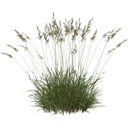](images/plants/PlantCatalog/127._Festuca_rubra_HD.webp){ .glightbox data-description="Red Fescue" } | Red Fescue | Festuca rubra | HD, LD | 56 | 0.15 - 0.8m | 0.25K - 820K |
    | { .glightbox data-description="Lawn Grass" } | Lawn Grass | Generic grass lawn | HD, LD | 48 | 0.05 - 0.6m | 0.16K - 510K |
    | { .glightbox data-description="Perennial Ryegrass" } | Perennial Ryegrass | Lolium perenne | HD, LD | 55 | 0.07 - 0.8m | 0.20K - 710K |
    | { .glightbox data-description="Reed Canary Grass" } | Reed Canary Grass | Phalaris arundinacea | HD, LD | 64 | 0.15 - 2.0m | 0.20K - 93K |
    | [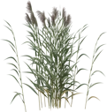](images/plants/PlantCatalog/131._Phragmites_australis_HD.webp){ .glightbox data-description="Common Reed" } | Common Reed | Phragmites australis | HD, LD | 60 | 1.25 - 3.25m | 0.22K - 140K |
    | { .glightbox data-description="Broadleaf Cattail" } | Broadleaf Cattail | Typha latifolia | HD, LD | 60 | 1.25 - 4.0m | 0.49K - 180K |

=== "Ground Covers"
    | Image | English Name | Latin Name | Detail Levels | Presets | Height (m) | Polycount |
    | ------- | -------------- | ------------ | --------------- | --------- | ------------ | ----------- |
    | { .glightbox data-description="Wild Peanut" } | Wild Peanut | Arachis duranensis | HD, LD, RT | 5 | 0.06 - 0.5m | 0.01K - 93K |
    | { .glightbox data-description="English Ivy Ground Cover" } | English Ivy Ground Cover | Hedera helix ground cover green | HD, LD, RT | 25 | 0.01 - 0.2m | 0.02K - 420K |
    | { .glightbox data-description="Common Periwinkle" } | Common Periwinkle | Vinca minor | RT | 3 | 0.5m | 0.01K - 0.08K |

=== "Mushrooms"
    | Image | English Name | Latin Name | Detail Levels | Presets | Height (m) | Polycount |
    | ------- | -------------- | ------------ | --------------- | --------- | ------------ | ----------- |
    | { .glightbox data-description="King Bolete" } | King Bolete | Boletus edulis | HD, LD, RT | 18 | 0.07 - 0.25m | 1.1K - 20K |
    | { .glightbox data-description="Red-Belted Conk" } | Red-Belted Conk | Fomitopsis pinicola | HD, LD, RT | 15 | 0.08 - 0.3m | 0.16K - 14K |
    |  | Oak Lichen | Quercus lichen | RT | 13 | 0.01 - 0.1m | 0.01K - 1.3K |

=== "Palms"
    | Image | English Name | Latin Name | Detail Levels | Presets | Height (m) | Polycount |
    | ------- | -------------- | ------------ | --------------- | --------- | ------------ | ----------- |
    | [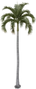](images/plants/PlantCatalog/137._Adonidia_merrillii_HD.webp){ .glightbox data-description="Christmas Palm" } | Christmas Palm | Adonidia merrillii | HD, LD | 35 | 1.0 - 6.0m | 16K - 500K |
    | { .glightbox data-description="Alexandra Palm" } | Alexandra Palm | Archontophoenix alexandrae | HD, LD, RT | 30 | 1.75 - 11.0m | 1.8K - 87K |
    | [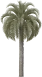](images/plants/PlantCatalog/139._Butia_capitata_HD.webp){ .glightbox data-description="Pindo Palm" } | Pindo Palm | Butia capitata | HD, LD, RT | 15 | 1.25 - 7.5m | 1.5K - 120K |
    | { .glightbox data-description="European Fan Palm" } | European Fan Palm | Chamaerops humilis | HD, LD, RT | 30 | 0.45 - 3.0m | 0.83K - 130K |
    | { .glightbox data-description="Sago Palm" } | Sago Palm | Cycas revoluta | HD, LD, RT | 40 | 0.3 - 3.25m | 1.5K - 670K |
    | { .glightbox data-description="Areca Palm" } | Areca Palm | Dypsis lutescens | HD, LD | 62 | 1.0 - 7.0m | 8.7K - 1600K |
    | { .glightbox data-description="Bottle Palm" } | Bottle Palm | Hyophorbe lagenicaulis | HD, LD, RT | 15 | 1.5 - 6.5m | 4.2K - 52K |
    | { .glightbox data-description="Canary Island Date Palm" } | Canary Island Date Palm | Phoenix canariensis | HD, LD, RT | 40 | 2.25 - 16.0m | 3.5K - 620K |
    | { .glightbox data-description="Date Palm" } | Date Palm | Phoenix dactylifera | HD, LD, RT | 78 | 0.3 - 19.0m | 0.63K - 2200K |
    | { .glightbox data-description="Lady Palm" } | Lady Palm | Rhapis excelsa | HD, LD, RT | 30 | 0.6 - 2.5m | 0.38K - 160K |
    | { .glightbox data-description="Royal Palm" } | Royal Palm | Roystonea regia | HD, LD | 25 | 6.0 - 25.0m | 77K - 280K |
    | [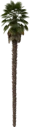](images/plants/PlantCatalog/148._Trachycarpus_fortunei_HD.webp){ .glightbox data-description="Windmill Palm" } | Windmill Palm | Trachycarpus fortunei | HD, LD, RT | 25 | 1.25 - 9.5m | 1.4K - 150K |
    | { .glightbox data-description="California Fan Palm" } | California Fan Palm | Washingtonia filifera | HD, LD, RT | 25 | 3.5 - 15.0m | 3.5K - 150K |
    | [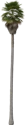](images/plants/PlantCatalog/151._Washingtonia_robusta_HD.webp){ .glightbox data-description="Mexican Fan Palm" } | Mexican Fan Palm | Washingtonia robusta | HD, LD, RT | 10 | 3.25 - 21.0m | 3.6K - 220K |
    | { .glightbox data-description="Mexican Fan Palm" } | Mexican Fan Palm | Washingtonia robusta V2 | HD, LD | 10 | 3.25 - 20.0m | 44K - 240K |

=== "Perennials"
    | Image | English Name | Latin Name | Detail Levels | Presets | Height (m) | Polycount |
    | ------- | -------------- | ------------ | --------------- | --------- | ------------ | ----------- |
    | { .glightbox data-description="Hart's Tongue Fern" } | Hart's Tongue Fern | Asplenium scolopendrium | HD, LD | 21 | 0.4 - 1.75m | 4.6K - 250K |
    | { .glightbox data-description="Common Daisy" } | Common Daisy | Bellis perennis | HD, LD, RT | 12 | 0.03 - 0.15m | 0.06K - 22K |
    | { .glightbox data-description="Deer Fern" } | Deer Fern | Blechnum spicant | HD, LD | 21 | 0.35 - 0.9m | 1.5K - 63K |
    | { .glightbox data-description="Orange Canna Lily" } | Orange Canna Lily | Canna x generalis orange | HD, LD, RT | 12 | 0.3 - 0.8m | 0.33K - 45K |
    | [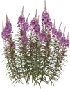](images/plants/PlantCatalog/156._Chamerion_angustifolium_HD.webp){ .glightbox data-description="Fireweed" } | Fireweed | Chamerion angustifolium | HD, LD | 21 | 0.4 - 2.0m | 0.79K - 610K |
    | [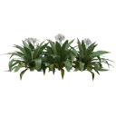](images/plants/PlantCatalog/157._Crinum_asiaticum_HD.webp){ .glightbox data-description="Giant Crinum Lily" } | Giant Crinum Lily | Crinum asiaticum | HD, LD, RT | 8 | 1.25 - 1.75m | 1.8K - 89K |
    | [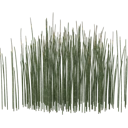](images/plants/PlantCatalog/158._Equisetum_hyemale_HD.webp){ .glightbox data-description="Horsetail" } | Horsetail | Equisetum hyemale | HD, LD | 60 | 0.25 - 1.25m | 0.09K - 270K |
    | { .glightbox data-description="Great Horsetail" } | Great Horsetail | Equisetum telmateia | HD, LD | 55 | 0.35 - 1.75m | 3.7K - 970K |
    | { .glightbox data-description="Fuchsia Guzmania" } | Fuchsia Guzmania | Guzmania lingulata fuchsia | HD, LD | 32 | 0.15 - 0.8m | 7.8K - 29K |
    | { .glightbox data-description="Pink Guzmania" } | Pink Guzmania | Guzmania lingulata pink | HD, LD | 32 | 0.15 - 0.8m | 7.8K - 29K |
    | { .glightbox data-description="Red Guzmania" } | Red Guzmania | Guzmania lingulata red | HD, LD | 32 | 0.15 - 0.8m | 7.8K - 29K |
    | { .glightbox data-description="White Guzmania" } | White Guzmania | Guzmania lingulata white | HD, LD | 32 | 0.15 - 0.8m | 7.8K - 29K |
    | [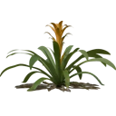](images/plants/PlantCatalog/164._Guzmania_lingulata_yellow_HD.webp){ .glightbox data-description="Yellow Guzmania" } | Yellow Guzmania | Guzmania lingulata yellow | HD, LD | 32 | 0.15 - 0.8m | 7.8K - 29K |
    | [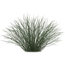](images/plants/PlantCatalog/165._Juncus_effusus_'Spiralis'_HD.webp){ .glightbox data-description="Spiral Rush" } | Spiral Rush | Juncus effusus 'Spiralis' | HD | 4 | 0.5 - 0.6m | 28K - 61K |
    | { .glightbox data-description="Stiff Rush" } | Stiff Rush | Juncus rigidus | HD | 6 | 1.0m | 20K - 40K |
    | { .glightbox data-description="Bigleaf Lupine" } | Bigleaf Lupine | Lupinus polyphyllus | HD, LD | 18 | 0.35 - 1.25m | 1K - 250K |
    | { .glightbox data-description="American Lotus" } | American Lotus | Nelumbo lutea | HD, LD | 32 | 1.0 - 2.0m | 0.65K - 190K |
    | { .glightbox data-description="Sacred Lotus" } | Sacred Lotus | Nelumbo nucifera | HD, LD | 32 | 1.0 - 2.0m | 0.65K - 190K |
    | { .glightbox data-description="White Water Lily" } | White Water Lily | Nymphaea alba | HD, LD | 27 | 0.8 - 1.0m | 0.13K - 230K |
    | [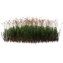](images/plants/PlantCatalog/171._Polytrichum_commune_HD.webp){ .glightbox data-description="Common Haircap Moss" } | Common Haircap Moss | Polytrichum commune | HD, LD, RT | 20 | 0.09 - 0.7m | 0.07K - 940K |
    | { .glightbox data-description="River Lily" } | River Lily | Strelitzia juncea | HD, LD, RT | 10 | 1.5 - 1.75m | 0.20K - 87K |
    | { .glightbox data-description="Bird of Paradise" } | Bird of Paradise | Strelitzia reginae | HD, LD, RT | 10 | 1.0 - 1.5m | 0.14K - 110K |
    | { .glightbox data-description="Tree Moss" } | Tree Moss | Thuidium tamariscinum | HD, LD | 8 | 0.03 - 0.35m | 0.01K - 85K |
    | { .glightbox data-description="Spanish Moss" } | Spanish Moss | Tillandsia usneoides | HD, LD, RT | 10 | 0.5 - 3.0m | 0.22K - 870K |
    | { .glightbox data-description="Ball Moss" } | Ball Moss | Tillandsia utriculata | HD, LD | 20 | 0.35 - 1.75m | 2.4K - 18K |
    | { .glightbox data-description="Lesser Periwinkle" } | Lesser Periwinkle | Vinca minor | HD, LD | 12 | 0.1 - 0.25m | 0.14K - 18K |
    | [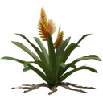](images/plants/PlantCatalog/178._Vriesea_carinata_HD.webp){ .glightbox data-description="Vriesea Carinata" } | Vriesea Carinata | Vriesea carinata | HD, LD | 36 | 0.25 - 0.7m | 13K - 71K |
    | [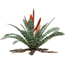](images/plants/PlantCatalog/179._Vriesea_splendens_HD.webp){ .glightbox data-description="Vriesea Splendens" } | Vriesea Splendens | Vriesea splendens | HD, LD | 36 | 0.5 - 1.0m | 13K - 60K |
    | [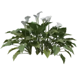](images/plants/PlantCatalog/180._Zantedeschia_aethiopica_HD.webp){ .glightbox data-description="Calla Lily" } | Calla Lily | Zantedeschia aethiopica | HD, LD, RT | 12 | 0.5 - 0.9m | 0.82K - 69K |

=== "Succulents"
    | Image | English Name | Latin Name | Detail Levels | Presets | Height (m) | Polycount |
    | ------- | -------------- | ------------ | --------------- | --------- | ------------ | ----------- |
    | { .glightbox data-description="Ponytail Palm" } | Ponytail Palm | Beaucarnea recurvata | HD, LD | 40 | 0.7 - 6.5m | 3.2K - 1500K |
    | { .glightbox data-description="Saguaro Cactus" } | Saguaro Cactus | Carnegiea gigantea | HD, LD | 30 | 0.9 - 7.5m | 1K - 140K |
    | { .glightbox data-description="Saguaro Cactus" } | Saguaro Cactus | Carnegiea gigantea V2 | HD, LD | 30 | 0.9 - 8.5m | 1.1K - 150K |
    | { .glightbox data-description="Cabbage Tree" } | Cabbage Tree | Cordyline australis | HD, LD | 50 | 0.6 - 6.5m | 1.6K - 630K |
    | { .glightbox data-description="Dragon Tree" } | Dragon Tree | Dracaena draco | HD, LD | 50 | 0.7 - 6.0m | 1.1K - 3900K |
    | { .glightbox data-description="Golden Barrel Cactus" } | Golden Barrel Cactus | Echinocactus grusonii | HD, LD, RT | 30 | 0.2 - 0.6m | 2.4K - 230K |
    | { .glightbox data-description="Candelabra Euphorbia" } | Candelabra Euphorbia | Euphorbia candelabrum | HD, LD, RT | 40 | 0.8 - 4.5m | 1.2K - 1700K |
    | [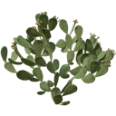](images/plants/PlantCatalog/188._Opuntia_ficus-indica_HD.webp){ .glightbox data-description="Prickly Pear Cactus" } | Prickly Pear Cactus | Opuntia ficus-indica | HD, LD, RT | 54 | 0.4 - 2.25m | 0.46K - 860K |
    | { .glightbox data-description="Joshua Tree" } | Joshua Tree | Yucca brevifolia | HD, LD | 30 | 0.9 - 6.0m | 2.1K - 560K |
    | { .glightbox data-description="Spineless Yucca" } | Spineless Yucca | Yucca elephantipes | HD, LD | 30 | 1.0 - 6.0m | 2.5K - 440K |
    | [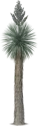](images/plants/PlantCatalog/191._Yucca_rostrata_HD.webp){ .glightbox data-description="Beaked Yucca" } | Beaked Yucca | Yucca rostrata | HD, LD | 30 | 0.7 - 4.5m | 6.9K - 150K |

---

## PlantFactory Library

Includes **41** plant species with **22** unique presets, most of which are in Low Poly detail level, making them suitable for large-scale scenes or performance-sensitive applications.

| Category | Plants | Presets
|----------|-----------------|-----------------|
| Bushes| 1 | 0
| Flowers | 12 | 18
| Grasses | 3 | 4
| Palms | 4 | 0
| Sci-Fi | 2 | 0
| Trees | 19 | 0

While the library includes some non-plant objects, PF2B filters them out.

### Plant List {#plantfactory-library-plant-list}

=== "Bushes"
    | English Name | Latin Name |
    |-------------|------------|
    | Red Currant | *Ribes rubrum* |

=== "Flowers"
    | English Name | Latin Name |
    |-------------|------------|
    | Asian Lily | *Lilium asiaticum* |
    | Common Yarrow | *Achillea millefolium* |
    | Common Primrose | *Primula vulgaris* |
    | Crocus | *Crocus spp.* |
    | Dandelion | *Taraxacum officinale* |
    | Hydrangea "Red" | *Hydrangea paniculata* |
    | Lily of the Valley | *Convallaria majalis* |
    | Oxeye Daisy | *Leucanthemum vulgare* |
    | Red Clover | *Trifolium pratense* |
    | Snowdrop | *Galanthus nivalis* |
    | Sunflower | *Helianthus annuus* |
    | Marigold | *Tagetes spp.* |

=== "Grasses"
    | English Name | Latin Name |
    |-------------|------------|
    | Grass |  |
    | Curly Dock | *Rumex crispus* |
    | Broad-leaved Dock | *Rumex longifolius* |

=== "Palms"
    | English Name | Latin Name |
    |-------------|------------|
    | Coconut Palm "Straight Long Bark" | *Cocos nucifera* |
    | Date Palm | *Phoenix dactylifera* |
    | Date Palm "HD" | *Phoenix dactylifera* |
    | Mexican Fan Palm "Young" | *Washingtonia robusta* |

=== "Sci-Fi"
    | English Name | Latin Name |
    |-------------|------------|
    | Pineapple Plant |  |
    | Star Plant |  |

=== "Trees"
    | English Name | Latin Name |
    |-------------|------------|
    | Acacia Dry "Green Mature" | *Acacia spp.* |
    | Acacia Huge "Old HD" | *Acacia spp.* |
    | Sugar Maple | *Acer saccharum* |
    | Banana Plant | *Musa spp.* |
    | Common Hazel | *Corylus avellana* |
    | Crack Willow | *Salix fragilis* |
    | English Oak | *Quercus robur* |
    | Ficus Tree | *Ficus spp.* |
    | Mediterranean Cypress | *Cupressus sempervirens* |
    | London Plane | *Platanus  acerifolia* |
    | London Plane "Season" | *Platanus  acerifolia* |
    | Northern Red Oak "Mature" | *Quercus rubra* |
    | Northern Red Oak "Old" | *Quercus rubra* |
    | Northern Red Oak "Young" | *Quercus rubra* |
    | Sassafras | *Sassafras albidum* |
    | Scots Pine "Mature" | *Pinus sylvestris* |
    | White Ash | *Fraxinus americana* |
    | White Ash "Season" | *Fraxinus americana* |
    | White Fir "Mature HD" | *Abies concolor* |

 <!-- /compact-table -->

 <!-- /Library -->