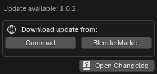

{ .img-box align=left }

## Version Check

- **Check Version Status**: Checks if a newer version of the add-on is available. If a newer version is found, a download link to the latest version on BlenderMarket and Gumroad is provided. { .img-box }
!!! info2 ""
    Note: PF2B does not download or install updates automatically and requires "**Allow Online Access**" to be enabled under `Edit > Preferences > System > Network`.

## Interface

- **Confirm on Import**:
    - When importing more than 1
    - When importing more than 10
    - Always
    - Never
- **Plant Thumbnail Size**: Adjust the size of the plant & preset thumbnails in the main Panel. This does not affect the thumbnail size in the Gallery view as it has its own setting directly available when browsing.
- **Use Preset Thumbnails**: Enable to display presets with thumbnails. Disable this option to show presets as a simple list.
- **Hide 'Browse via PlantFactory' mode**: If you only plan to use the [Browse via Blender](../workflow/browse_via_blender.md) mode, you can enable this to hide the mode selection at the top and declutter the interface.

## PlantFactory Location

 The location of the PlantFactory application, typically found at `C:\Program Files\e-on software\PlantFactory\Application`.

