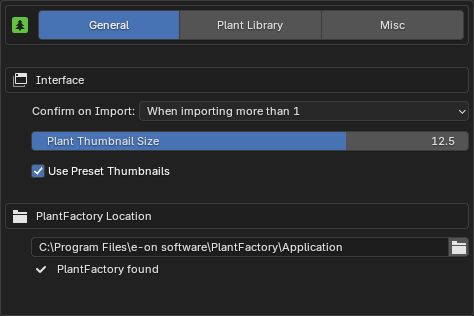

{ .img-box align=left }

## Interface

- **Confirm on Import**:
    - When importing more than 1
    - When importing more than 10
    - Always
    - Never
- **Plant Thumbnail Size**: Adjust the size of the plant & preset thumbnails in the main Panel. This does not affect the thumbnail size in the Gallery view as it has its own setting directly available when browsing.
- **Use Preset Thumbnails**: Enable to display presets with thumbnails. Disable this option to show presets as a simple list.

## PlantFactory Location

 The location of the PlantFactory application, typically found at `C:\Program Files\e-on software\PlantFactory\Application`.

