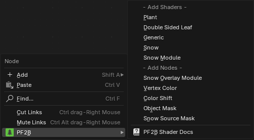

{ .img-box align=left }

## Version Check

- **Check Version Status**: Checks if a newer version of the add-on is available. If a newer version is found, a download link to the latest version on SuperHive (BlenderMarket) and Gumroad is provided. { .img-box }

    !!! info2 ""
        Note: PF2B does not download or install updates automatically and requires "**Allow Online Access**" to be enabled under `Edit > Preferences > System > Network`.

- Open Changelog: Opens [Changelog](../changelog.md).

## Import Behavior

- **Confirm on Import**: Determines when to show a confirmation prompt before importing multiple items.
    - When importing more than 1
    - When importing more than 10
    - Always
    - Never

## Interface

### Main Interface

- **Plant Thumbnail Size**: Adjust the size of the plant & preset thumbnails in the main Panel. This does not affect the thumbnail size in the Gallery view as it has its own setting directly available when browsing.
- **Use Preset Thumbnails**: Enable to display presets with thumbnails. Disable this option to show presets as a simple list.
- **Hide 'Browse via PlantFactory' mode**: If you only plan to use the [Browse via Blender](../workflow/browse_via_blender.md) mode, you can enable this to hide the mode selection at the top and declutter the interface.

### Plant Gallery Browser

- **Popup size**: Maximum width/height of the Plant Gallery browser as percentage of screen width.
- **Fill Rows First**: Fill row by row, instead of column by column.

### Biome & Collections Browser

- **Default Window Width**: Sets the initial width of the browser window. The window can still be resized manually after opening.

### Plant Details Utility

- **Display in Imperial Units**: Show dimensions in feet/inches instead of metric units. This affects [Utilities > Plant Details](../workflow/utilities.md#plant-details).

### Shader Editor

- **Add Right-Click Menu**: Adds PF2B to the right-click menu inside the Shader Editor, where you can access utilities such as adding node groups and shaders. [More info](../workflow/material_settings.md#shader-editor-right-click-menu)
    { .img-box  }

## PlantFactory Application Location

The installation path of the PlantFactory application. This path should point directly to the folder containing `PlantFactory.exe`, which is typically located at: `C:\Program Files\e-on software\PlantFactory\Application`.

