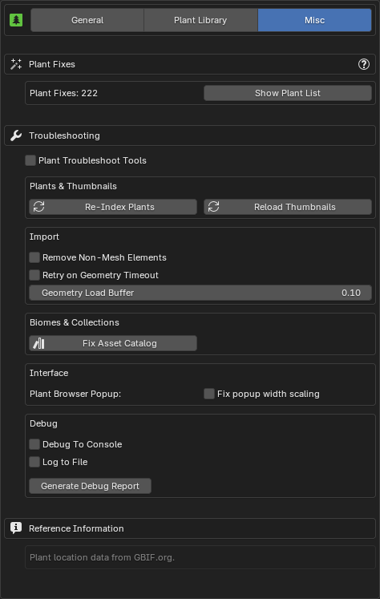

{ .img-box align=left }

## Troubleshooting

- **Re-Index Plants**: Re-indexes plants by checking what plants are available in your library. Use this to update your plant list if any new plants are missing.
- **Reload Thumbnails**: Reload all thumbnails visible in the interface, useful if thumbnails are not displaying correctly.
- **Remove Non-Mesh Elements**: This is useful for cleaning up imported plant assets that may have unnecessary elements like empties or other non-mesh objects attached.

- **Geometry Load Buffer**: Adds extra time (in seconds) before exporting to allow PlantFactory to fully load the geometry. This helps prevent the "*[Are you sure you want to abort the export?](../support/faq.md#i-receive-a-are-you-sure-you-want-to-abort-the-export-popup-during-import)*" popup that may appear if the geometry isn't fully loaded before the export starts. This setting affects only the [Browse via Blender](../workflow/browse_via_blender.md) mode and while importing one plant at a time without the queue functionality. Type in a custom value to go below or above the minimum or maximum value

- **Bridge Socket Port**: The port used by the  `PF2B Bridge` to manage the internal connection between Blender and PlantFactory.
- **Debug**:
    - **Debug To Console**: Outputs debug information to the console, useful for troubleshooting. To view the console, go to `Window > Toggle System Console`.

        !!! warning "Performance Note"
            This should only be enabled if you need to troubleshoot, as it may have a slight performance hit.

    - **Log to File**: When enabled, all debug information and error messages are saved to a log file for easier troubleshooting and analysis. Useful for tracking issues.