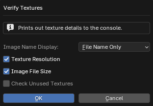
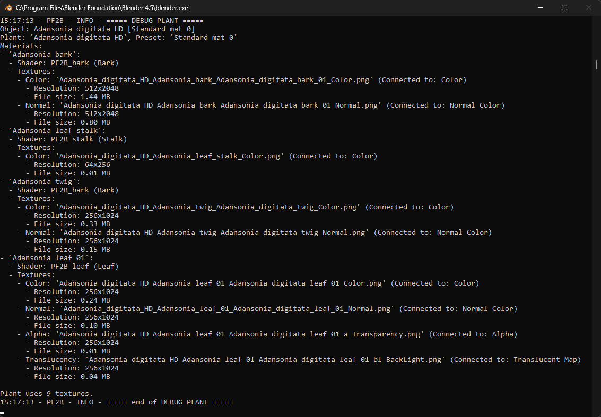

{ .img-box align=left }

## Plant Fixes

The '**Plant Fixes System**' automatically corrects issues when importing plants from PlantFactory into Blender. If materials, textures, or geometry are incorrectly configured or missing, the system applies known fixes for better compatibility. These fixes are stored in a database and applied automatically during import after the automatic setup.

Read more about it under the [PF2B: Under the Hood](../support/pf2b_under_the_hood.md) page.

!!! info2 ""
    If you find a plant that isn't importing correctly, report it so it can be added to the database. The more reports are submitted, the better the system becomes over time!

- **Show Plant List**: This displays a popup with all plants in the database that have fixes applied, along with details of the fixes for each plant. This feature is for informational purposes only.

    { .img-box .on-glb width=45% }

## Troubleshooting

#### General

- **Plant Troubleshoot Tools**: Adds tools to help troubleshoot certain plant issues. Currently only one tool is added: **Verify Textures** and is found in the [Post Processing](../workflow/post_processing.md) panel.
    { .img-box }

    - **Verify Textures**: Prints out texture details to the console. Opens a popup for additional options.
        - :blender_icon_console:: Opens the console.

        { .img-box }

        !!! inline abstract "Verify Textures Example"
            { .img-box .on-glb }

#### Plants & Thumbnails

- :blender_icon_file_refresh: **Re-Index Plants**: Re-indexes plants by checking what plants are available in your library. Use this to update your plant list if any new plants are missing.
- :blender_icon_file_refresh: **Reload Thumbnails**: Reload all thumbnails visible in the interface, useful if thumbnails are not displaying correctly.

#### Import

- **Remove Non-Mesh Elements**: This is useful for cleaning up imported plant assets that may have unnecessary elements like empties or other non-mesh objects attached. When wind import is enabled, armatures are preserved to retain wind animation data.
- **Retry on Geometry Timeout**: Retries geometry evaluation once if PlantFactory times out while building geometry. This can occur when a plant becomes stuck in the geometry-loading phase (for example, no progress or an 'Outdated preview' state). PlantFactory typically aborts geometry evaluation after ~10 minutes.
 This option performs an additional attempt after such a timeout. It is not a guaranteed fix, as geometry stalls often appear to occur when PlantFactory has been running in the background or out of focus for an extended time. Use as a fallback rather than a primary solution.
- **Geometry Load Buffer**: Adds extra time (in seconds) before exporting to allow PlantFactory to fully load the geometry. This helps prevent the "*[Are you sure you want to abort the export?](../support/faq.md#i-receive-a-are-you-sure-you-want-to-abort-the-export-popup-during-import)*" popup that may appear if the geometry isn't fully loaded before the export starts. In some cases, slightly increasing this value may also help when importing custom plants where no import occurs and no error is reported.

    !!! info2 ""
        This setting affects only the [Browse via Blender](../workflow/browse_via_blender.md) mode and while importing **one** plant at a time without the queue functionality.

#### Biomes & Collections

- :blender_icon_asset_manager: **Fix Asset Catalog**: Creates or updates the `blender_assets.cats.txt` file for the PF2B asset library. This will restore any missing categories under '**PF2B**' (managed by addon - do not edit manually). All user-created categories under '**PF2B_Custom**' are preserved and safe to edit. For further details see [Biomes & Collections Overview](../workflow/biomes_and_collections.md).

#### Interface
- **Plant Browser Popup**:
    - **Fix popup width scaling**: Try to fix sizing issues in the 'Plant Gallery Browser' popup when using a resolution scale other than 1.0. This only affects the popup's width, not the scaling of its content.

#### Debug

- **Debug To Console**: Outputs debug information to the console, useful for troubleshooting. To view the console, go to `Window > Toggle System Console`.

    !!! warning "Performance Note"
        This should only be enabled if you need to troubleshoot, as it may have a slight performance hit.

- **Log to File**: When enabled, all debug information and error messages are saved to a log file for easier troubleshooting and analysis. Useful for tracking issues.