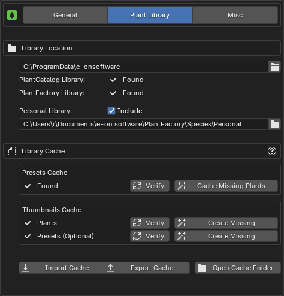
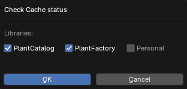
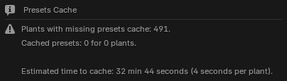
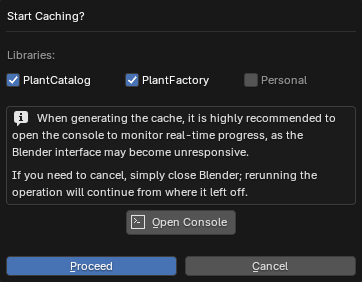
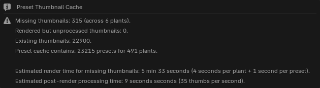
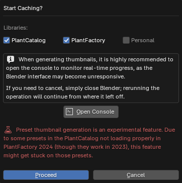

{ .img-box align=left }

## Library Location

This is the location of the PlantLibrary root folder, which should contain both PlantFactory and PlantCatalog folders. The interface will indicate whether the PlantCatalog, PlantFactory, or both libraries are found.

- **Personal Library**: Enable this option if you have custom plants to include, and select the folder containing them. This folder can contain subfolders to organize the plants into categories.

## Library Cache

To use the [Browse via Blender](../workflow/browse_via_blender.md) mode, a cache must be generated.  See the [First time use & Importing cache](../getting_started.md#first-time-use-importing-cache) for instructions.

The **Presets Cache** and **Plant Thumbnails Cache** are required, while the **Preset Thumbnails Cache** is optional. If not generated, presets will be displayed as a list instead of thumbnails.

!!! info2 ""
    Generally, you won't need to adjust these settings if you're only using the built-in plants and libraries from PlantFactory. These settings are only necessary if you want to expand your library with custom plants.

#### Presets Cache

- **Verify**: Checks if all presets in your Plant Library are cached and provides an estimate of the time required to generate any missing presets. Shows a popup where you can specify which libraries to check.

    { .img-box }

    ??? abstract "Examples"
        Here are a few examples of different states: first, with a full cache and no missing thumbnails, then with a few missing thumbnails, and finally with no cache at all.

        { .img-box align=left }
        { .img-box align=left }
        { .img-box align=left }

- **Cache Missing Plants**: Will show a prompt to select which libraries to target and then launches PlantFactory to check your plants and cache any missing presets.

    { .img-box  }

#### Thumbnails Cache

=== "Plants"
    - **Verify**: Checks the thumbnails cache for any missing plant thumbnails and provides an estimate of the time required to generate them.  Shows a popup where you can specify which libraries to check.

        { .img-box }

        ??? abstract "Examples"
            Here are a few examples of different states: first, with a full cache and no missing thumbnails, then with a few missing thumbnails, and finally with no cache at all.

            { .img-box align=left }
            { .img-box align=left }
            { .img-box align=left }

    - **Create Missing**: Generates thumbnails for all missing items. Generating thumbnails involves PlantFactory rendering each plant or preset individually and saving the results as thumbnail images. Preset thumbnails also include details like plant height and polygon count.

        { .img-box  }

=== "Presets (Optional)"
    - **Verify**: Checks the thumbnails cache for any missing preset thumbnails and provides an estimate of the time required to generate them.  Shows a popup where you can specify which libraries to check.

        { .img-box }

        ??? abstract "Examples"
            Here are a few examples of different states: first, with a full cache and no missing thumbnails, then with a few missing thumbnails, and finally with no cache at all.

            { .img-box align=left }
            { .img-box align=left }
            { .img-box align=left }

    - **Create Missing**: Generates thumbnails for all missing items. Generating thumbnails involves PlantFactory rendering each plant or preset individually and saving the results as thumbnail images. Preset thumbnails also include details like plant height and polygon count.

        { .img-box  }

#### Import / Export Cache

To avoid rebuilding the entire cache, you can import or export an existing cache.

- **Import Cache**: Imports a `.pf2b` cache file.
- **Export Cache**: Exports a `.pf2b` cache file.
- **Open Cache Folder**: Opens the folder containing the cache files for manual management.

