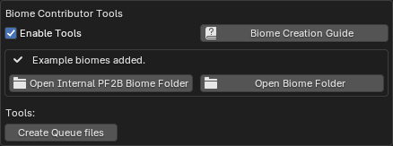

# Plant Library

{ .img-box align=left }

## Libraries

Here you can adjust the locations of your plant libraries. These usually don’t need to be changed if you’ve installed everything in the default location, but you can adjust them if needed. The interface will indicate if the libraries are found.

- **PlantCatalog**: The location of the [PlantCatalog library](../plants.md#plantcatalog-library) folder, which should contain categorized subfolders for each plant type. Within these subfolders, you should find the actual `.tpf` plant files. Read more [here](../getting_started.md#installation-plantcatalog-plant-library) about how to install this library.
- **PlantFactory**: The location of the [PlantFactory library](../plants.md#plantfactory-library) folder, which should contain multiple subfolders, including the `Species` folder that holds the actual `.tpf` plant files. This library contains the plants that ship with the PlantFactory application itself.
- **Personal**: Enable this option if you have custom plants to include, and select the folder containing them. This folder can contain subfolders to organize the plants into categories.

    !!! info2 ""
        When using the `Personal Library` to access your own plants, make sure to create the [Library Cache](#library-cache) for your Personal Library before your custom plants become visible in PF2B.

    !!! info2 ""
        Only plants that are saved in `.tpf` file format are handled, so if you have plants that you have saved in the default PlantFactory `.tpfp` format, please save them inside PlantFactory as a `.tpf` file by going to `File > Export > Export as Species`.

!!! warning "Note on folders"
    The library folders must be named `PlantCatalog`, `PlantFactory` and `Personal` respectively. Case does not matter.

## Library Cache

To use the [Browse via Blender](../workflow/browse_via_blender.md) mode, a cache must be generated. See [First time use & Importing cache](../getting_started.md#first-time-use-importing-cache) for instructions, and refer to [What is the PF2B cache?](../support/faq.md#what-is-the-pf2b-cache) in the FAQ for more details.

The **Presets Cache** and **Plant Thumbnails Cache** are required, while the **Preset Thumbnails Cache** is optional. If not generated, presets will be displayed as a list instead of thumbnails.

!!! info2 ""
    Generally, you won't need to adjust these settings if you're only using the built-in plants and libraries from PlantFactory. These settings are only necessary if you want to expand your library with custom plants.

#### Presets Cache

- :blender_icon_file_refresh: **Verify**: Checks if all presets in your Plant Library are cached and provides an estimate of the time required to generate any missing presets. Shows a popup where you can specify which libraries to check.

    { .img-box }

    ??? abstract "Examples"
        Here are a few examples of different states: first, with a full cache and no missing thumbnails, then with a few missing thumbnails, and finally with no cache at all.

        { .img-box align=left }
        { .img-box align=left }
        { .img-box align=left }

- :blender_icon_shaderfx: **Cache Missing Plants**: Will show a prompt to select which libraries to target and then launches PlantFactory to check your plants and cache any missing presets.

    { .img-box  }

#### Thumbnails Cache

=== "Plants"
    - :blender_icon_file_refresh: **Verify**: Checks the thumbnails cache for any missing plant thumbnails and provides an estimate of the time required to generate them.  Shows a popup where you can specify which libraries to check.

        { .img-box }

        ??? abstract "Examples"
            Here are a few examples of different states: first, with a full cache and no missing thumbnails, then with a few missing thumbnails, and finally with no cache at all.

            { .img-box align=left }
            { .img-box align=left }
            { .img-box align=left }

    - :blender_icon_shaderfx: **Create Missing**: Generates thumbnails for all missing items. Generating thumbnails involves PlantFactory rendering each plant or preset individually and saving the results as thumbnail images. Preset thumbnails also include details like plant height and polygon count.

        { .img-box  }

=== "Presets (Optional)"
    - :blender_icon_file_refresh: **Verify**: Checks the thumbnails cache for any missing preset thumbnails and provides an estimate of the time required to generate them.  Shows a popup where you can specify which libraries to check.

        { .img-box }

        ??? abstract "Examples"
            Here are a few examples of different states: first, with a full cache and no missing thumbnails, then with a few missing thumbnails, and finally with no cache at all.

            { .img-box align=left }
            { .img-box align=left }
            { .img-box align=left }

    - :blender_icon_shaderfx: **Create Missing**: Generates thumbnails for all missing items. Generating thumbnails involves PlantFactory rendering each plant or preset individually and saving the results as thumbnail images. Preset thumbnails also include details like plant height and polygon count.

        { .img-box  }

#### Import / Export Cache

To avoid rebuilding the entire cache, you can import or export an existing cache.

- :blender_icon_import: **Import Cache**: Imports a `.pf2b` cache file.
- :blender_icon_export: **Export Cache**: Exports a `.pf2b` cache file.
- :material-folder-open: **Open Cache Folder**: Opens the folder containing the cache files for manual management.

## Biomes & Collections

### Blend Storage

Specifies the location for storing exported plant `.blend` files so that Biome-Reader or Geo-Scatter can find them. These files can usually be stored in any of the Asset Library locations set in Blender preferences.
!!! info2 ""
    When you build a biome or import a collection, a `blender_assets.cats.txt` file is automatically created in this location. For further details see [Biomes & Collections Overview](../workflow/biomes_and_collections.md).

- **Enable Blend File Compression**: Enables compression for generated .blend files, reducing storage size at the cost of slower write and read performance.
- **Keep .blend1 Files**: Blender automatically creates `.blend1` backup files whenever data is stored in biome blend files. These backups are not used by PF2B and can take up significant space in large libraries. Enable this option if you wish to keep them. *These '.blend1' files are only generated when using the 'Plant Storer' utility, and are not created when storing plants via Biomes or the Collections features.*

### Scatter add-on

Displays a verification of whether Geo-Scatter or Biome-Reader is installed, and provides links if they are not found. You can read more about these add-ons in the [biomes overview](../workflow/biomes_and_collections.md#biomes)

- **PF2B Scatter-Library Location**: Only change this setting if you have modified the `Scatter-Library Location` in the Geo-Scatter or Biome-Reader add-on. Otherwise, leave it unchanged. If you did change the location, this path must point to a subfolder within the add-on’s selected path, and that subfolder must be named `PF2B`.

### Biome Contributor Tools

Enable this mode if you want to contribute new biomes to PF2B. It provides additional options such as:

- Links to [specific documentation](../support/create_your_own_biome.md) for creating your own biomes to distribute with PF2B.
- Adding example biomes to the biome collection.
- Shortcut to the biome folders.
- Tool(s) to assist with Biome creation.

{ .img-box }

