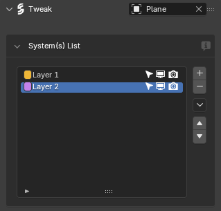
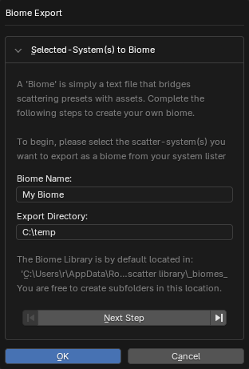
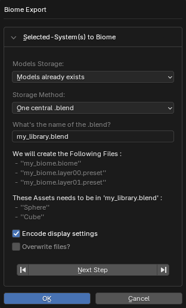
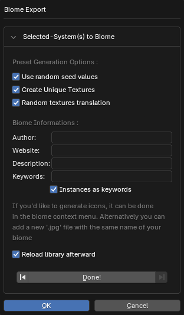
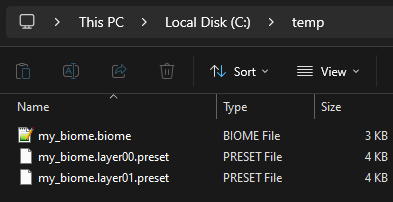
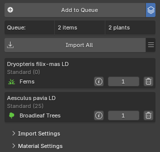
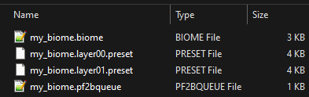
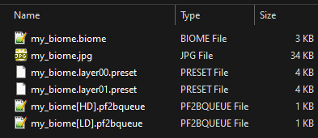

If you want to contribute [biomes](../workflow/biomes.md) to PF2B, here is some important information and a set of guidelines to follow.


## Guidelines: PF2B

### Plant Selection

- Only plants from the [PlantCatalog Library](../plants.md#plantcatalog-library) are supported.

- You are free to build your biome using **HD**, **LD**, or **RT** plants, or a mix of all three. However, try to lean toward one detail level so that an opposite version can later be created with a higher or lower poly count.

- [Import overrides](../workflow/browse_via_blender.md#import-overrides) are not supported. Please use only the existing presets.


!!! info2 "Other Objects"
    You can include additional **non-PF2B objects** such as rocks or other environmental elements. These can be included from **Polyhaven.com** or other **CC0** asset sources.

    For each detail level, these assets are stored in dedicated blend files provided with the add-on:

    - `pf2b-biome_Other[HD].blend` for HD assets (typically using 4K textures)
    - `pf2b-biome_Other[LD].blend` for LD assets (typically using 2K textures)

    To include these assets in your biome:

    1. Add your objects to the appropriate **Other** blend file (`pf2b-biome_Other[HD].blend` or `pf2b-biome_Other[LD].blend`). These files are located in the folder defined under `Preferences > Plant Library > Biomes & Collections > Blend Storage`.
    2. In your biome, place instances of these objects on a separate layer named according to the asset type and detail level, for example:
        - `Rocks [HD]`
        - `Rocks [LD]`
    3. PF will automatically detect these layers and link them to the correct asset file for that detail level during the build.

    **Currently supported non-PF2B layer names:** `Rocks`


---


### Plant Detail Levels

<h4 style="margin-bottom:-1.25em">❌ Not Allowed</h4>

- **Same Plant, Different Detail Levels**:<br>A biome **must not** mix multiple detail levels (e.g., RT, LD, HD) of the **same plant**.

    ??? warning "Why?"
        - In some cases (same preset), this won't work at all because the build process will fail when PF2B tries to match the plant definitions.
        - In other cases (different presets), it will technically import, but causes **material merging issues**. For example, if the Low Detail version uses a leaf material called `XXX` and the High Detail version also uses `XXX` (but with higher texture resolution), PF2B will merge them into a single material during import. As a result, both variants will use whichever material was imported first. Since the UV maps for the Low Detail and High Detail versions of the leaves are often different, the textures will be mapped incorrectly, making the leaves look wrong.


<h4 style="margin-bottom:-0.75em">✅ Allowed</h4>

- **Mixing Different Plants**:<br>It is encouraged to mix different detail levels across **different plants** within a biome.
    - Even in a "Low Detail" biome, not every plant needs to be from the "LD" category, just the majority.
    - The same applies to "High Detail" biomes.


---


### Plant Naming

When creating the biome with PF2B plants always use the following settings for plant naming:

- **English Name**
- **Preset**
- **Detail Level**
- Enable **User Group Wrapper** and select **Brackets `[]`** as wrappers and **pipe `|`** as the divider.
- Enable **Add Spaces Between Elements**

If you follow the above steps, the result should look like this: `PlantName [Preset|Detail-Level]`, example: `Reed Canary Grass [Wild H100 S20|HD]`.

!!! info2 ""
    If you accidentally imported plants with the wrong naming scheme and don't want to re-import them just to change the names, use the [Plant Renamer](../workflow/utilities.md#plant-renamer) utility.


---


## Guidelines: Geo-Scatter

As the artist, you can decide how to build the biome and configure its settings.
As a general guideline, the following settings should be adjusted for each layer:

- **Density**
- **Rotation**
    - Align Normal
    - Random Rotation
- **Scale**
    - Default Scale
    - Random Scale
- **Pattern**
- **Display**: Set up the display solution.


## Creating the Biome

After you have finished creating your biome inside Blender using Geo-Scatter, follow the instructions below.


=== "Geo-Scatter Export"

    1. **Export the biome from Geo-Scatter**:

        { .img-box align=left }

        For example, via the `System(s) List` using the :octicons-chevron-down-12: icon.
        **Important:** Make sure to select **all of the layers**.

        <div style="clear:both"></div>


    - **Choose a name and note the save location**

        <!-- You will need to move the exported files afterward. -->

        { .img-box }


    - **Set the storage options**

        { .img-box align=left }

        - Under **Models Storage**, select `Models already exists`.
        - For **Storage Method**, choose `One central .blend`.
        - The **What's the name of the .blend?** field can be left as is; PF2B will overwrite it when building the biome.
        - Enable **Encode display settings**

        <div style="clear:both"></div>


    - **Biome Options**

        { .img-box align=left }

        - **Preset Generation Options**: Tick **all** the available options.
        - Fill in the **Biome Informations** section with your details.
            - The `Instances as keywords` option is optional.

        <div style="clear:both"></div>


    - **Verify exported files**

        After the export, you should have a structure similar to this:

        { .img-box }

    !!! info2 ""
        Now continue with the [Creation of Queue files](#creating-the-biome-creation-of-queue-files)


=== "Creation of Queue files"

    1. **Create Queue files**

        Select whether to automatically generate these files or create them manually for finer control.

        === "Automatic creation"
            Use the **[Create Queue files](../preferences/plant_library.md#biome-contributor-tools)** tool inside `Preferences > Plant Library > Biomes & Collections > Biome Contributor Tools`. This tool lets you select a `.biome` file and generate one or more `.pf2bqueue` files.

            !!! info2 "Note"
                This tool creates new files; it does not modify the original `.biome` file.

            <h5>Tool options</h5>

            - **Create**:
                - **HD & LD variants**:<br>
                Generates two queue files from your Biome: one for HD and one for LD. All plants in the Biome will be adjusted so their detail level matches the selected file (HD or LD). This lets you quickly create both variants without manually duplicating or editing the files. Use the `Lock RT Detail Level` setting to keep RT detail-level plants unchanged, preventing them from being replaced by LD or HD versions.
                - **Keep as is**:<br>
                Keeps the exact detail levels defined in your Biome file when creating the queue file. This is useful if your Biome contains a mix of detail levels and you want precise control. After saving the queue, you will need to manually create additional detail-level files by duplicating and adjusting the generated file. When selecting this option, you must specify whether the source biome file is HD or LD.


            <h4>Choosing your workflow:</h4>

            - If you want your biomes strictly as either HD or LD, choose **Create HD & LD variants**.

            - If you have mixed detail levels and want granular control, select **Keep as is**. The next section, **Creating additional queue files for different detail levels**, explains how to handle mixed-detail biomes.

            - If you choose **HD & LD variants**, you can skip the additional queue files section.


        === "Manual creation"
            If you used the [queue](../workflow/browse_via_blender.md#queue) feature when creating the biome and still have the plants in your queue, you can export them as a `.pf2bqueue` file via the :material-menu: menu by selecting **Save Queue**.

            { .img-box align=left }

            Save the queue file to the same directory as your biome and name it the same as your biome, for example: `my_biome.pf2bqueue`.

            !!! info2 ""
                If you did not use the queue system, select all plants in your scene used by the biome, then use the same :material-menu: menu and choose **Add Selected to Queue**. After that, use **Save Queue** to generate the file.

            <div style="clear:both"></div>

            Now your biome folder will look something like:

            { .img-box }


    - **Creating additional queue files for different detail levels**

        !!! warning "Note"
            This section is only relevant if you used **Keep as is** in automatic creation or the **Manual creation** workflow.

        ??? abstract "Instructions"
            PF2B looks for two queue files in a biome folder: one for HD (High Detail) and one for LD (Low Detail). These files are expected to follow this naming convention:

            - `my_biome[HD].pf2bqueue`
            - `my_biome[LD].pf2bqueue`

            !!! info2 "Tip"
                A queue file labeled as LD or HD does not need to contain only plants of that detail level. As a rule of thumb, the majority of plants should match the file’s detail level, but mixing different detail levels across individual plants is encouraged.

            - If you exported the queue manually and the file name does not include the detail level, rename it to indicate the detail level of the plants it contains. For example, if the file contains mostly **LD** plants: `my_biome.pf2bqueue` → `my_biome[LD].pf2bqueue`.

            - To create the **HD** version, copy the LD queue file and rename it: `my_biome[HD].pf2bqueue`.

                Then, open the file in a text editor and update the `plant_name`, `plant_detail`, and `plant_path` values by replacing **LD** with **HD** as needed. You are encouraged to adjust and mix detail levels across plants to suit your biome, creating a custom balance of HD and LD plants. If you do not need mixed detail levels and prefer a strict HD or LD variant, it is recommended to use the **automatic workflow** instead.

                Example LD and HD queue files for reference; you can adjust detail levels as needed:

                === "LD"
                    ``` json
                    [
                        {
                            "main_category": "PlantCatalog",
                            "plant_name": "Aesculus pavia LD",
                            "plant_type": "Broadleaf Trees",
                            "plant_detail": "LD",
                            "plant_path": "PlantCatalog\\Broadleaf Trees\\Aesculus pavia LD.tpf",
                            "preset_name": "Standard mat 25",
                            "preset_display_name": "Standard (25)",
                            "preset_number": 1,
                            "quantity": 1
                        },
                        {
                            "main_category": "PlantCatalog",
                            "plant_name": "Dryopteris filix-mas LD",
                            "plant_type": "Ferns",
                            "plant_detail": "LD",
                            "plant_path": "PlantCatalog\\Ferns\\Dryopteris filix-mas LD.tpf",
                            "preset_name": "Standard mat 0",
                            "preset_display_name": "Standard (0)",
                            "preset_number": 0,
                            "quantity": 1
                        }
                    ]
                    ```

                === "HD"
                    ``` json
                    [
                        {
                            "main_category": "PlantCatalog",
                            "plant_name": "Aesculus pavia HD",
                            "plant_type": "Broadleaf Trees",
                            "plant_detail": "HD",
                            "plant_path": "PlantCatalog\\Broadleaf Trees\\Aesculus pavia HD.tpf",
                            "preset_name": "Standard mat 25",
                            "preset_display_name": "Standard (25)",
                            "preset_number": 1,
                            "quantity": 1
                        },
                        {
                            "main_category": "PlantCatalog",
                            "plant_name": "Dryopteris filix-mas HD",
                            "plant_type": "Ferns",
                            "plant_detail": "HD",
                            "plant_path": "PlantCatalog\\Ferns\\Dryopteris filix-mas HD.tpf",
                            "preset_name": "Standard mat 0",
                            "preset_display_name": "Standard (0)",
                            "preset_number": 0,
                            "quantity": 1
                        }
                    ]
                    ```
    - **Queue files ready**

        So now you should have both `my_biome[LD].pf2bqueue` and `my_biome[HD].pf2bqueue` in the folder.

        !!! info2 ""
            Now continue with the [Finishing Touches](#creating-the-biome-finishing-touches)


=== "Finishing Touches"

    1. Render an image for the biome and place it inside the biome folder.

        - **File format:** jpg
        - **Suggested image size:** 500x500 pixels
        - **File name:** same as your biome, e.g., `my_biome.jpg`

        The image below shows the final biome folder structure, including the rendered image and queue files, as they should appear.

        { .img-box }


    - **Testing the biome**

        To test your biome in PF2B:

        - Create a new folder in the following path: `%USERPROFILE%\AppData\Roaming\Blender Foundation\Blender\4.5\extensions\user_default\pf2b\biomes`

            !!! info2 "Tip"
                You can quickly open this folder by going to `PF2B Preferences > Plant Library > Biomes` and enabling the `Biome Contributor Tools`, which **will display** additional buttons such as **Open Internal PF2B Biome Folder**.


        - The root folder contains biome categories, such as `coniferous`.
            - You can place your biome in an existing category or create a new one.
            - The folder for your biome **must be named exactly the same as your biome**, e.g., `my_biome`.


        This will allow PF2B to recognize and load your custom biome properly. Once it's detected, you can try the **[Build Biome](../workflow/biomes.md#building-a-biome)** button, and afterwards go to `Geo-Scatter > Biome Scatter > Open Biomes` to test the biome in action.


### Understanding Biome Builds

PF2B uses the `.pf2bqueue` file as the **Master Record**, so to speak. It dictates which plants are exported into the biome.

During the build process, PF2B uses the **plant name** and **preset name** to cross-check which plants should go inside the biome. This means you can switch plant detail levels in the queue file without needing to manually create multiple biome versions. A single biome file is sufficient.
<br>For example, even if you build your biome with `[LD]` plants, you can easily switch the detail levels as shown above, and it will still work. PF2B automatically modifies all of the necessary fields inside the `.biome` file during the build so that everything works correctly.

However, please note that you cannot change the plants or presets themselves, only the detail levels!

??? info2 "More Details"
    Here's an example of what happens to the `.biome` file during processing:

    **Raw output** directly from Geo-Scatter after exporting a biome (different example than shown in the guide above):

    *This block represents one layer inside the `.biome` file*

    ``` json
    "asset_file": "my_library",
    "instances": [
        "Hong Kong Orchid Tree [Standard mat 0|HD]",
        "Dead Lodgepole Pine [Standard 1a mat 0|HD]",
        "Mountain Hemlock [Standard mat 0|HD]"
    ]
    ```

    During **Build Biome**, PF2B transforms this into:

    ``` json
    "asset_file": "INSTANCES_DEFINED",
    "instances": [
        [
            "Hong Kong Orchid Tree [Standard mat 0|LD]",
            "pf2b-biome_Broadleaf_Trees[LD]"
        ],
        [
            "Dead Lodgepole Pine [Standard 1a mat 0|LD]",
            "pf2b-biome_Coniferous[LD]"
        ],
        [
            "Mountain Hemlock [Standard mat 0|HD]",
            "pf2b-biome_Coniferous[HD]"
        ]
    ]
    ```

    PF2B automatically:

    - Identifies the plant type
    - Points it to the correct `.blend` file
    - Adjusts detail levels where necessary
