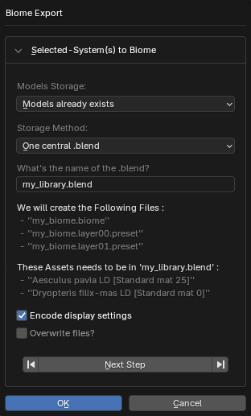

!!! warning ""
    Biomes feature is not yet released. Coming soon...


If you want to contribute biomes to PF2B, here is some important information and a set of guidelines to follow.


## Guidelines

### Plant Naming

When creating the biome with PF2B plants always use the following settings for plant naming:

- **English Name**
- **Preset**
- **Detail Level**
- Enable **Add Spaces Between Elements**
- Use **Brackets `[]`** as wrappers

If you follow the above steps, the result should look like this: `PlantName [Preset] [Detail-Levl]`, example: `Reed Canary Grass [Wild H100 S20] [HD]`.


### Plant Detail

1. **Same Plant, Same Preset**:

    A biome **cannot** contain multiple detail levels (e.g., RT, LD, HD) of the **same plant** if they use the **same preset**.

- **Same Plant, Different Presets**:

    A biome **can** contain multiple detail levels of the same plant if they use **different presets**, **but this is highly discouraged**.

    !!! warning ""
        This often causes **material merging issues**. For example, if the Low Detail version uses a leaf material called `XXX` and the High Poly version also uses `XXX` (but with higher texture resolution), PF2B will merge them into a single material during import. As a result, both variants will use whichever material was imported first. Since the UV maps for the Low Detail and High Detail versions of the leaves are often different, the textures will be mapped incorrectly, making the leaves look wrong.

        Because of this, it is **not recommended** to use different detail levels of the same plant within the same biome.

- **Mixing Different Plants**:

    It **is encouraged** to mix different detail levels across **different plants** within a biome.

    - Even in a "Low Detail" biome, not every plant needs to be from the "LD" category, just the majority.
    - The same applies to "High Detail" biomes.

- **Layer Limitation**:

    Each Geo-Scatter layer can only contain plants from **one category** and **one detail level** (e.g., Broadleaf Trees, HD).

    - This is because plants are stored in categorized blend files, such as: `pf2b-biome_Broadleaf_Trees[HD].blend`, and each layer references one such file.


#### Summary

- ✅ Do: mix different plants with different detail levels.
- ❌ Don’t: mix different detail levels of the **same plant** in a biome (risk of material merge + UV mismatches).
- Remember: each Geo-Scatter layer can only contain **one plant category** and **one detail level**.


## Creating the Biome

After you have finished creating your biome inside Blender using Geo-Scatter, follow the instructions below.


=== "Geo-Scatter Export"

    1. **Export the biome from Geo-Scatter**:

        For example, via the `System(s) List` using the :octicons-chevron-down-12: icon.
        **Important:** Make sure to select **all of the layers**.

        { .img-box }


    - **Choose a name and note the save location**

        <!-- You will need to move the exported files afterward. -->

        { .img-box }


    - **Set the storage options**
        - Under **Models Storage**, select `Models already exists`.
        - For **Storage Method**, choose `One central .blend`.
        - The **What's the name of the .blend?** field can be left as is; PF2B will overwrite it when building the biome.

        { .img-box }


    - **Biome Options**
        - **Preset Generation Options**: Tick **all** the available options.
        - Fill in the **Biome Informations** section with your details.
        - The `Instances as keywords` option is optional.

        { .img-box }


    - **Verify exported files**

        After the export, you should have a structure similar to this:

        { .img-box }

    !!! info2 ""
        Now continue with the [Creation of Queue files](#creating-the-biome-creation-of-queue-files)


=== "Creation of Queue files"
    1. **Exporting your queue**

        If you used the [queue](../workflow/browse_via_blender.md#queue) feature when creating the biome and still have the plants in your queue, you can export them as a `.pf2bqueue` file via the :material-menu: menu by selecting **Save Queue**.

        { .img-box }

        !!! info2 ""
            If you did not use the queue system, select all the plants in your scene that are used by the biome, then use the same :material-menu: menu and choose **Add Selected to Queue**. After that, use **Save Queue** to generate the file.


    - **Place the queue file**

        Move the queue file to the same directory as your biome and name it the same as your biome, for example: `my_biome.pf2bqueue`.

        { .img-box }


    - **Creating additional queue files for different detail levels**

        PF2B currently looks for LD (Low Detail) and HD (High Detail) versions of your biome.

        - If you only built the biome with **LD** plants, rename the original queue file to include the detail level in brackets: `my_biome.pf2bqueue` → `my_biome[LD].pf2bqueue`

        - To create the **HD** version, copy the LD queue file and rename it: `my_biome[HD].pf2bqueue`.

            Then, manually edit the file in a text editor: update `plant_name`, `plant_detail_filter`, and `plant_path` values by replacing **LD** with **HD**. It should look similar to this:


            === "LD"
                ``` json
                [
                    {
                        "main_category": "PlantCatalog",
                        "plant_name": "Aesculus pavia LD",
                        "plant_type": "Broadleaf Trees",
                        "plant_detail": "LD",
                        "plant_path": "PlantCatalog\\Broadleaf Trees\\Aesculus pavia LD.tpf",
                        "preset_name": "Standard mat 25",
                        "preset_display_name": "Standard (25)",
                        "preset_number": 1,
                        "quantity": 1
                    },
                    {
                        "main_category": "PlantCatalog",
                        "plant_name": "Dryopteris filix-mas LD",
                        "plant_type": "Ferns",
                        "plant_detail": "LD",
                        "plant_path": "PlantCatalog\\Ferns\\Dryopteris filix-mas LD.tpf",
                        "preset_name": "Standard mat 0",
                        "preset_display_name": "Standard (0)",
                        "preset_number": 0,
                        "quantity": 1
                    }
                ]
                ```

            === "HD"
                ``` json
                [
                    {
                        "main_category": "PlantCatalog",
                        "plant_name": "Aesculus pavia HD",
                        "plant_type": "Broadleaf Trees",
                        "plant_detail": "HD",
                        "plant_path": "PlantCatalog\\Broadleaf Trees\\Aesculus pavia HD.tpf",
                        "preset_name": "Standard mat 25",
                        "preset_display_name": "Standard (25)",
                        "preset_number": 1,
                        "quantity": 1
                    },
                    {
                        "main_category": "PlantCatalog",
                        "plant_name": "Dryopteris filix-mas HD",
                        "plant_type": "Ferns",
                        "plant_detail": "HD",
                        "plant_path": "PlantCatalog\\Ferns\\Dryopteris filix-mas HD.tpf",
                        "preset_name": "Standard mat 0",
                        "preset_display_name": "Standard (0)",
                        "preset_number": 0,
                        "quantity": 1
                    }
                ]
                ```

        So now you should have both `my_biome[LD].pf2bqueue` and `my_biome[HD].pf2bqueue` in the folder.

        !!! info2 "Details"
            PF2B uses the `.pf2bqueue` file as the **Master Record**, so to speak. It dictates which plants are exported into the biome.

            During the build process, PF2B uses the **plant name** and **preset name** to cross-check which plants should go inside the biome. This means you can switch plant detail levels in the queue file without needing to manually create multiple biomes for different detail levels.
            <br>For example, even if you build your biome with `[LD]` plants, you can easily switch the detail levels as shown above, and it will still work. PF2B automatically modifies all of the necessary fields inside the `.biome` file during the build so that everything works correctly.

            However, please note that you cannot change the plants or presets themselves, only the detail levels!


    !!! info2 ""
        Now continue with the [Finishing Touches](#creating-the-biome-finishing-touches)

=== "Finishing Touches"

    1. Render an image for the biome and place it inside the biome folder.

        - **File format:** jpg
        - **Suggested image size:** 500x500 pixels
        - **File name:** same as your biome, e.g., `my_biome.jpg`

        The image below shows the final biome folder structure, including the rendered image and queue files, as they should appear.

        { .img-box .on-glb }


    - **Testing the biome**

        To test your biome in PF2B:

        - Create a new folder in the following path: `%USERPROFILE%\AppData\Roaming\Blender Foundation\Blender\4.5\extensions\user_default\pf2b\biomes`

            !!! info2 "Tip"
                You can quickly open this folder by going to `PF2B Preferences > Plant Library > Biomes` and enabling the `Biome Contributor Tools`, which **will display** additional buttons such as **Open Internal PF2B Biome Folder**.


        - The root folder contains biome categories, such as `coniferous`.
            - You can place your biome in an existing category or create a new one.
            - The folder for your biome **must be named exactly the same as your biome**, e.g., `my_biome`.


        This will allow PF2B to recognize and load your custom biome properly. Once it's detected, you can try the **Build Biome** button, and afterwards go to `Geo-Scatter > Biome Scatter > Open Biomes` to test the biome in action.