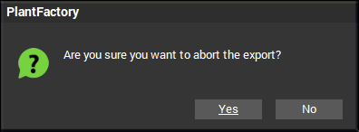
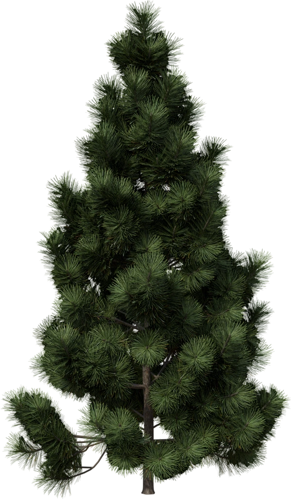
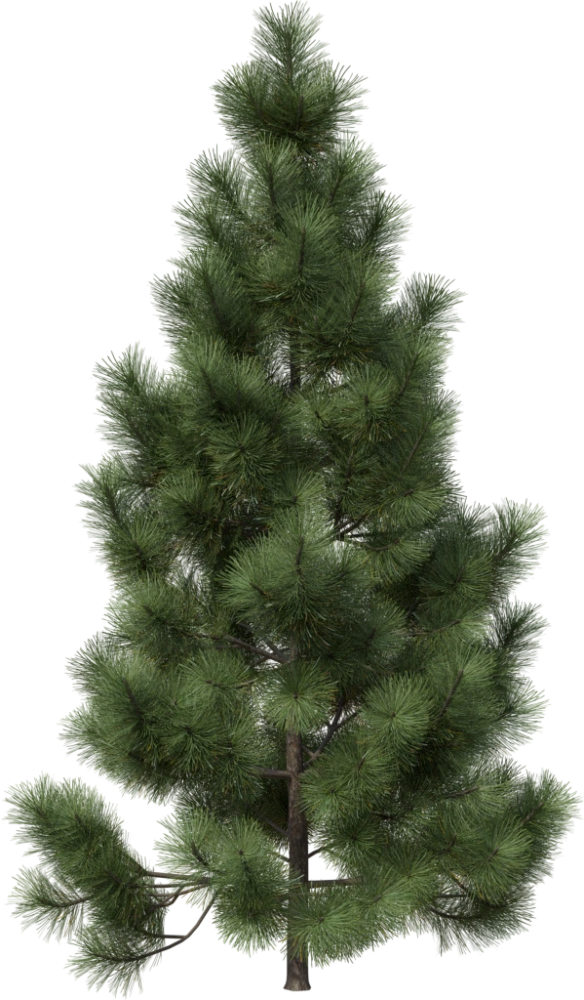
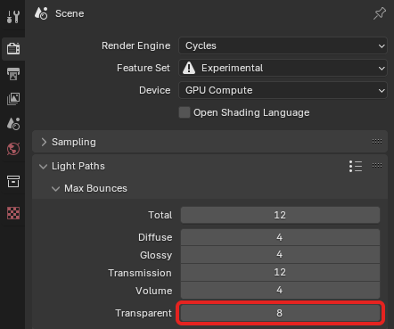
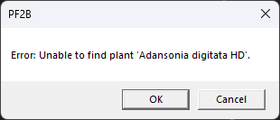
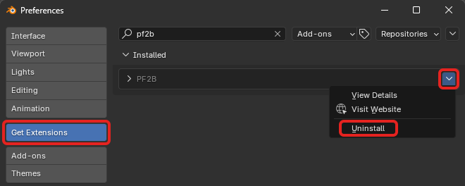

---
tags:
  - Support
---
# Frequently Asked Questions

### What is PlantFactory?
:   PlantFactory is a powerful 3D vegetation modeling software originally developed by e-on software (now part of Bentley Systems). It allows users to create highly detailed, procedural plant models using an intuitive node-based workflow. The software also includes a vast library of pre-made plants, offering a wide range of species with adjustable parameters for easy customization. Read more about it [here](https://www.bentley.com/software/e-on-software-free-downloads/){ target="_blank" }.

---

### Can I use the plants commercially?

:   Yes, you can use the plants commercially, including in games, client work, and project files. However, while you can modify and resell assets created from scratch in PlantFactory, you cannot resell models derived from PlantCatalog content. For the exact terms and the most up-to-date details, please check the [official PlantFactory FAQ](https://www.bentley.com/software/e-on-software-free-downloads/#faq){ target="_blank" }.

    All plants exported with PF2B use custom shaders, which you are free to use in your projects, but you may not sell the shaders themselves.

---

### What operating systems does PF2B support?

:   PF2B is only supported on **Windows**. It requires the Windows version of PlantFactory and is not compatible with macOS or Linux.

---

### Which versions of PlantFactory are supported?

:   PF2B only supports **PlantFactory 2024**. Older versions are not compatible with the add-on.

---

### What is the PF2B cache?

:   The PF2B cache consists of thumbnails and JSON files that store information about the plants and presets, such as plant height, polygon count, and other details. It is used to display the plants and presets inside the gallery, allowing you to browse them easily within the addon.

    The cache that is shipped with PF2B includes a total of **23,678 thumbnails** (491 plant thumbnails and 23,187 preset thumbnails) and is approximately **309 MB** in size. It covers all plants and presets from both the **PlantCatalog** and **PlantFactory** libraries.

    For more details on setting up the cache, see the [First Time Use & Importing Cache](../getting_started.md#first-time-use-importing-cache) section. Additional configuration options can be found in the [Preferences](../preferences/plant_library.md#library-cache) page.

---

### What does the number in parentheses mean in preset names?

:   It indicates the plant's **maturity**, representing its current age as a percentage of its maximum potential age. A value of **0** means the plant is very young, while **100** means it has reached full maturity.

---

### Why is my Plant Gallery View so small when using the "Browse Via Blender" mode?

:   Check that your `3D View` is large enough, as the gallery size depends on it. If you have the view split (for example, with the `Shader Editor`), it may cause the gallery to appear smaller.

---

### What Normal Map format does PlantFactory use?

:   PlantFactory uses the **OpenGL** normal map format, which is the same as the one used in Blender, so no conversion is required.

---

### PlantFactory starts, but nothing happens, and no plant is imported into Blender

:   { .img-box align=right  }
:   Check that the **"Preview"** window under **"Display"** in PlantFactory is enabled, as shown in the screenshot here:

    

---

### I receive a "Are you sure you want to abort the export" popup during import

:    { .img-box align=right }
:   This is usually caused by PlantFactory not having enough time to load the geometry of the plant before the export is attempted. Try adjusting the [Geometry Load Buffer](../preferences/misc.md#import) under preferences to resolve this issue. As an alternative workaround, in cases where this persists, hold down the "Escape" key for 2-3 seconds to make the popup disappear.
    

---

### My plant appears too dark and some textures show black backgrounds

:    This issue is often caused by the `Transparency Bounces` setting in Blender being set too low. Increasing its value should help ensure proper light distribution and eliminate the dark areas.

    !!! abstract inline end "Example"
        { .on-glb width=49% data-description="Example of a value being too low, in this case, 4." }
        { .on-glb width=49% data-description="Example of a value being high enough. In this case, it is set to 32, which is more than required for most needs." }

    1. Navigate to the **Render Properties** tab.
    - Scroll down to the **Light Paths** section.
    - Locate the **Transparency Bounces** setting.
    - Increase the value for Transparency Bounces.
    - Re-render your scene to see if the issue is resolved.

    { .img-box  }

---

### What is the difference between a Backlight texture and a Translucency texture?

:   There is no difference, both refer to the same type of texture used to simulate light passing through thin surfaces like leaves.

---

### I want to create my own plants. What should I keep in mind?

:   To ensure materials are set up correctly when importing them with PF2B, name your materials properly inside PlantFactory. Specifically, include a keyword that indicates the type of material they represent. Recognized keywords include `leaf`, `bark`, `flower`, `fruit`, and other relevant terms. This allows the addon to correctly identify and process materials during import.

    For more details, check the '**Automated Setup**' section in [PF2B: Under the Hood](../support/pf2b_under_the_hood.md#automated-setup).

    !!! info2 "Tip"
        Check out the [Community](../support.md#community) section for guides and resources on getting started with creating your own plants.

---

### My plant Materials looks off. What can I do?

#### The translucency looks off

:   This might be caused by a low-quality translucency map that is not normalized and is either too bright or too dark, causing too much or too little translucency for the plant. If this is the case, you can:

    1. If you want to disable the translucency texture altogether, you can do this easily via the [Post Processing panel](../workflow/post_processing.md) by selecting the plant, editing the leaf material, and disabling it there.
    2. Manually go into the material and adjust the texture by, for example, adding a `Color Ramp` or a `Map Range` node between the texture and the shader and adjusting the brightness until the translucency looks correct.

    If you believe the translucency texture setup is incorrect, please [get in touch](../support.md) with me and provide the plant details, and I'll investigate further.

    !!! info2 "Tip"
        You can also disable the translucency texture import by unchecking the `Import Translucency Map` option under the [import settings](../workflow/material_settings.md) to use a static translucency value instead.

#### The normals look off

:   { .img-box align=right }
:   Try clearing **Custom Split Normals** to see if this helps. This can be done easily by selecting the plant and navigating to `Properties Panel > Data > Geometry Data > Clear Custom Split Normals Data`, as shown in the image:

    If the issue persists, please [get in touch](../support.md) with me and provide the plant details, and I'll investigate further.

#### Other Textures Look off / Missing Textures / Wrong Textures

:   This might be caused by inconsistent texture names, as mentioned under [PF2B: Under the Hood](../support/pf2b_under_the_hood.md#automated-setup). Please try to troubleshoot the issue using the [Troubleshoot Guide: Missing or Incorrect Textures](../support/guides.md#missing-or-incorrect-textures) first to pinpoint the problem.

    !!! info2 ""
        If there are textures that are not connected or are incorrectly connected for a specific plant, please [get in touch](../support.md) with me and provide the plant details, such as the name of the plant and the preset used, and I'll investigate further.

---

### Plant Geometry looks incorrect. What can I do?

:   Please [get in touch](../support.md) with me and provide the plant details, and I'll investigate further.

---

### There are missing plants / empty thumbnails shown when browsing plants

:   Please run both the `Re-Index Plants` and `Reload Thumbnails` tools found in [Preferences > Misc](../preferences/misc.md#plants-thumbnails).

---

### My custom plants are not showing up when enabling the 'Personal Library'.

:   This is most likely caused by the plants not being cached. Please generate the cache by following the instructions under [Library Cache in Preferences](../preferences/plant_library.md#library-cache).

---

### Why does my my plants show 'No Presets'?

:   This issue is likely caused by a missing or incomplete Preset cache.

    - If this occurs with plants from the PlantCatalog & PlantFactory libraries, you can download and install the cache as described [here](../getting_started.md#first-time-use-importing-cache).
    - If this affects other plants, you can regenerate the cache using the tools available in [Preferences > Plant Library](../preferences/plant_library.md#library-cache).

    **Note:** Not all plants in the *'PlantFactory library'* have presets available.

---

### I receive 'Unable to find plant' error when trying to import

:   { .img-box align=right }
:   This error means PlantFactory is unable to locate the specific `.tpf` file for the plant.
    If the missing plants are from the **PlantCatalog** library, please verify that you have installed all PlantCatalog files as described in the [Getting Started > Installation](../getting_started.md#installation-plantcatalog-plant-library).

    If you have not installed the full PlantCatalog library and do not wish to do so (as it is optional), you can run the [Re-Index Plants](../preferences/misc.md#plants-thumbnails) tool to ensure only available plants are shown in your library.

---

### Do I have to install the entire PlantCatalog library?

:   No, installing the full library is not required. If you only plan to use the [Browse via PlantFactory](../workflow/browse_via_plantfactory.md) mode, you can skip the installation entirely. However, if you plan to use the [Browse via Blender](../workflow/browse_via_blender.md) mode, you can install only the parts of the library you need. See [How can I hide PlantCatalog plants if I don’t want to install the full library?](#how-can-i-hide-plantcatalog-plants-if-i-dont-want-to-install-the-full-library) for more details.

---

### How can I hide PlantCatalog plants if I don’t want to install the full library?

:   If you have not installed the full PlantCatalog library and do not wish to do so (as it is optional), you can run the [Re-Index Plants](../preferences/misc.md#plants-thumbnails) tool to ensure only available plants are shown in your library.

---

### How do I update to a new version?

:   To update to the latest version, follow these steps:

    1. **Download the latest version**:
        - :simple-gumroad: **Gumroad users**: Go to your [library](https://gumroad.com/library?query=PF2B){ target="_blank" } and locate PF2B.
        - :blender_market: **SuperHive (BlenderMarket) users**: Go to your [orders](https://superhivemarket.com/account/orders_search?utf8=%E2%9C%93&orders_search%5Bq%5D=PF2B){ target="_blank" } and locate PF2B.
    - **Remove the old version**:
        { .img-box .on-glb align=right width=37% }
        - Open Blender, go to `Edit > Preferences > Get Extensions`.
        - Search for "PF2B".
        - Locate the arrow (:octicons-chevron-down-12: icon) in the top right corner.
        - Click on `Uninstall`.
    - **Restart Blender** to clear any cached data.
    - **Install the new version**:
        - Follow the default [installation instructions](../getting_started.md#installation).

---

