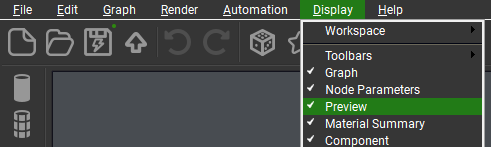

# Frequently Asked Questions

### PlantFactory starts, but nothing happens, and no plant is imported into Blender

:   { .img-box align=right  }
:   Check that the **"Preview"** window under **"Display"** in PlantFactory is enabled, as shown in the screenshot here:

### Why is my Plant Gallery View so small when using the "Browse Via Blender" mode?

:   Check that your `3D View` is large enough, as the gallery size depends on it. If you have the view split (for example, with the `Shader Editor`), it may cause the gallery to appear smaller.

### I receive a "Are you sure you want to abort the export" popup during import

:    { .img-box align=right }
:   This is usually caused by PlantFactory not having enough time to load the geometry of the plant before the export is attempted. Try adjusting the [Geometry Load Buffer](../preferences.md#misc) under preferences to resolve this issue. As an alternative workaround, in cases where this persists, hold down the "Escape" key for 2-3 seconds to make the popup disappear.