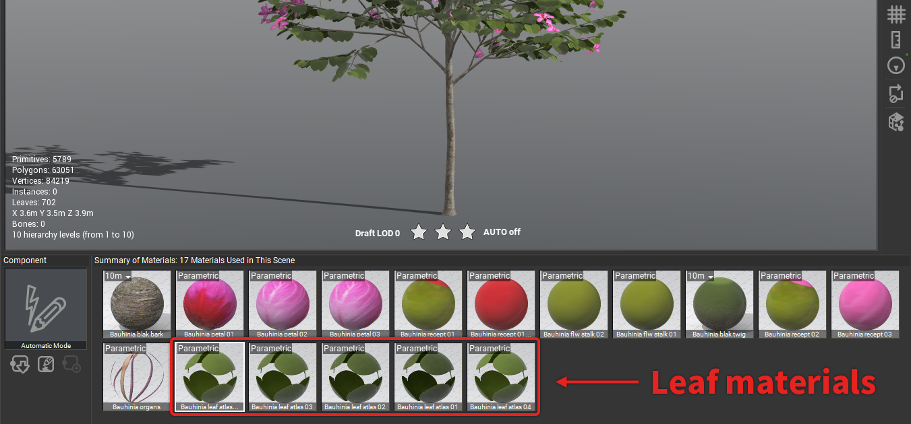
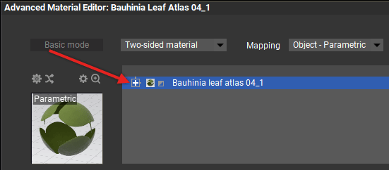
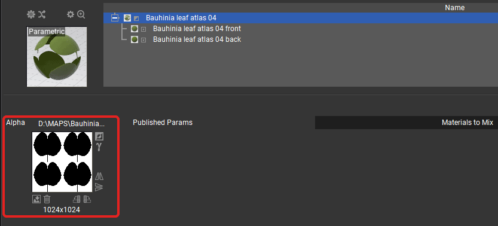
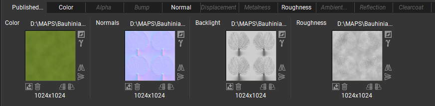
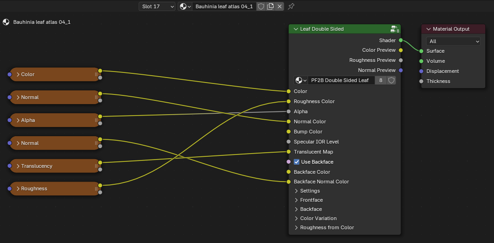
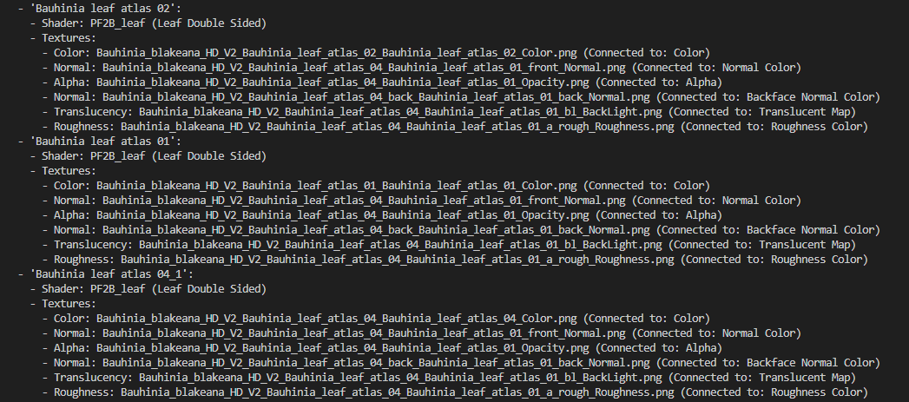

!!! warning "NOTE"
    This page is under construction.

This page contains guides helpful for troubleshooting.

## Missing or incorrect textures

This section will help you to troubleshoot texture issues. See the [PF2B: Under the Hood](../support/pf2b_under_the_hood.md) for more info.

For this demonstration we will use the `Bauhinia blakeana HD V2` plant and we will verify if the Leaf materials are using all of the required textures. This plant has 5 different leaf materials.

---

### Verify textures inside PlantFactory

Lets check the plant inside PlantFactory to see how what the textures are sbeing used.

1. Open the plant inside PlantFactory.
- Locate the materials with the issues. For our demonstration lets look at the **leaf** materials:

    { .img-box .on-glb width=70% }

    This plant has the following leaf materials:

    - `Bauhinia leaf atlas 01`
    - `Bauhinia leaf atlas 02`
    - `Bauhinia leaf atlas 03`
    - `Bauhinia leaf atlas 04`
    - `Bauhinia leaf atlas 04_1`

- Doubleclick on one of the materials to open the material editor.

    Here we have the `Bauhinia leaf atlas 04_1` material opened and we can see this is **Two-sided material**, so we need to expand this selection to see both the front & back sides of the leaf:

    { .img-box .on-glb }

- Verify what textures are being used.

    Since this is a **Two-sided material** we need to look both at the front, back & the material slot itself that contains the alpha texture:

    { .img-box .on-glb  }

    So for this material we have textures for:

    - Alpha
    - **Front**: Color, Normal, Backlight(Translucency) & Roughness.
    - **Back**: Color, Normal & Backlight(Translucency).

#### Optional: Check texture names inside PlantFactory

??? abstract "Check texture names inside PlantFactory"
    !!! warning "Note"
        The exported texture names are often **changed** when exporting which means that the below names that are internally used within PlantFactory do not always correspond to the names of the exported texture files.

    1. To check the name of the texture hover over the texture path:

        { .img-box .on-glb }

    - So for our example the textures are:
        - `Bauhinia leaf atlas 04_1` material:
            - **Alpha Texture**: `Bauhinia_leaf_atlas_01_a.png`
            - **Front**:
                - **Color**: `Bauhinia_leaf_atlas_04.png`
                - **Normal**: `Bauhinia_leaf_atlas_01_front_n.png`
                - **Backlight**: `Bauhinia_leaf_atlas_01_bl.png`
                - **Roughness**: `Bauhinia_leaf_atlas_01_a_rough.png`
            - **Back**:
                - **Color**: `Bauhinia_leaf_atlas_04.png`
                - **Normal**: `Bauhinia_leaf_atlas_01_back_n.png`
                - **Backlight**: `Bauhinia_leaf_atlas_01_bl.png`

        ??? abstract "Rest of the leaf materials"
            - `Bauhinia leaf atlas 01` material:
                - **Alpha**: `Bauhinia_leaf_atlas_01_a.png`
                - **Front**:
                    - **Color**: `Bauhinia_leaf_atlas_01.png`
                    - **Normal**: `Bauhinia_leaf_atlas_01_front_n.png`
                    - **Backlight**: `Bauhinia_leaf_atlas_01_bl.png`
                    - **Roughness**: `Bauhinia_leaf_atlas_01_a_rough.png`
                - **Back**:
                    - **Color**: `Bauhinia_leaf_atlas_01.png`
                    - **Normal**: `Bauhinia_leaf_atlas_01_back_n.png`
                    - **Backlight**: `Bauhinia_leaf_atlas_01_bl.png`
            - `Bauhinia leaf atlas 02` material:
                - **Alpha**: `Bauhinia_leaf_atlas_01_a.png`
                - **Front**:
                    - **Color**: `Bauhinia_leaf_atlas_02.png`
                    - **Normal**: `Bauhinia_leaf_atlas_01_front_n.png`
                    - **Backlight**: `Bauhinia_leaf_atlas_01_bl.png`
                    - **Roughness**: `Bauhinia_leaf_atlas_01_a_rough.png`
                - **Back**:
                    - **Color**: `Bauhinia_leaf_atlas_02.png`
                    - **Normal**: `Bauhinia_leaf_atlas_01_back_n.png`
                    - **Backlight**: `Bauhinia_leaf_atlas_01_bl.png`
            - `Bauhinia leaf atlas 03` material:
                - **Alpha**: `Bauhinia_leaf_atlas_01_a.png`
                - **Front**:
                    - **Color**: `Bauhinia_leaf_atlas_03.png`
                    - **Normal**: `Bauhinia_leaf_atlas_01_front_n.png`
                    - **Backlight**: `Bauhinia_leaf_atlas_01_bl.png`
                    - **Roughness**: `Bauhinia_leaf_atlas_01_a_rough.png`
                - **Back**:
                    - **Color**: `Bauhinia_leaf_atlas_03.png`
                    - **Normal**: `Bauhinia_leaf_atlas_01_back_n.png`
                    - **Backlight**: `Bauhinia_leaf_atlas_01_bl.png`
            - `Bauhinia leaf atlas 04` material:
                - **Alpha**: `Bauhinia_leaf_atlas_01_a.png`
                - **Front**:
                    - **Color**: `Bauhinia_leaf_atlas_04.png`
                    - **Normal**: `Bauhinia_leaf_atlas_01_front_n.png`
                    - **Backlight**: `Bauhinia_leaf_atlas_01_bl.png`
                    - **Roughness**: `Bauhinia_leaf_atlas_01_a_rough.png`
                - **Back**:
                    - **Color**: `Bauhinia_leaf_atlas_04.png`
                    - **Normal**: `Bauhinia_leaf_atlas_01_back_n.png`
                    - **Backlight**: `Bauhinia_leaf_atlas_01_bl.png`

---

### Verify textures inside Blender

1. Now lets go inside Blender to verify if all of these textures are being used.

    If we look at the `Bauhinia leaf atlas 04_1` material:

    { .img-box .on-glb width=50% }

    Textures:

    - **Color**: `Bauhinia_blakeana_HD_V2_Bauhinia_leaf_atlas_04_Bauhinia_leaf_atlas_04_Color.png`  (Connected to: Color)
    - **Normal**: `Bauhinia_blakeana_HD_V2_Bauhinia_leaf_atlas_04_Bauhinia_leaf_atlas_01_front_Normal.png`  (Connected to: Normal Color)
    - **Alpha**: `Bauhinia_blakeana_HD_V2_Bauhinia_leaf_atlas_04_Bauhinia_leaf_atlas_01_Opacity.png`  (Connected to: Alpha)
    - **Normal**: `Bauhinia_blakeana_HD_V2_Bauhinia_leaf_atlas_04_back_Bauhinia_leaf_atlas_01_back_Normal.png`  (Connected to: Backface Normal Color)
    - **Translucency**: `Bauhinia_blakeana_HD_V2_Bauhinia_leaf_atlas_04_Bauhinia_leaf_atlas_01_bl_BackLight.png`  (Connected to: Translucent Map)
    - **Roughness**: `Bauhinia_blakeana_HD_V2_Bauhinia_leaf_atlas_04_Bauhinia_leaf_atlas_01_a_rough_Roughness.png`  (Connected to: Roughness Color)

    ??? abstract "Rest of the leaf materials"
        - `Bauhinia leaf atlas 01` material:
            - **Color**: `Bauhinia_blakeana_HD_V2_Bauhinia_leaf_atlas_01_Bauhinia_leaf_atlas_01_Color.png`  (Connected to: Color)
            - **Normal**: `Bauhinia_blakeana_HD_V2_Bauhinia_leaf_atlas_04_Bauhinia_leaf_atlas_01_front_Normal.png`  (Connected to: Normal Color)
            - **Alpha**: `Bauhinia_blakeana_HD_V2_Bauhinia_leaf_atlas_04_Bauhinia_leaf_atlas_01_Opacity.png`  (Connected to: Alpha)
            - **Normal**: `Bauhinia_blakeana_HD_V2_Bauhinia_leaf_atlas_04_back_Bauhinia_leaf_atlas_01_back_Normal.png`  (Connected to: Backface Normal Color)
            - **Translucency**: `Bauhinia_blakeana_HD_V2_Bauhinia_leaf_atlas_04_Bauhinia_leaf_atlas_01_bl_BackLight.png`  (Connected to: Translucent Map)
            - **Roughness**: `Bauhinia_blakeana_HD_V2_Bauhinia_leaf_atlas_04_Bauhinia_leaf_atlas_01_a_rough_Roughness.png`  (Connected to: Roughness Color)
        - `Bauhinia leaf atlas 02` material:
            - **Color**: `Bauhinia_blakeana_HD_V2_Bauhinia_leaf_atlas_02_Bauhinia_leaf_atlas_02_Color.png`  (Connected to: Color)
            - **Normal**: `Bauhinia_blakeana_HD_V2_Bauhinia_leaf_atlas_04_Bauhinia_leaf_atlas_01_front_Normal.png`  (Connected to: Normal Color)
            - **Alpha**: `Bauhinia_blakeana_HD_V2_Bauhinia_leaf_atlas_04_Bauhinia_leaf_atlas_01_Opacity.png`  (Connected to: Alpha)
            - **Normal**: `Bauhinia_blakeana_HD_V2_Bauhinia_leaf_atlas_04_back_Bauhinia_leaf_atlas_01_back_Normal.png`  (Connected to: Backface Normal Color)
            - **Translucency**: `Bauhinia_blakeana_HD_V2_Bauhinia_leaf_atlas_04_Bauhinia_leaf_atlas_01_bl_BackLight.png`  (Connected to: Translucent Map)
            - **Roughness**: `Bauhinia_blakeana_HD_V2_Bauhinia_leaf_atlas_04_Bauhinia_leaf_atlas_01_a_rough_Roughness.png`  (Connected to: Roughness Color)
        - `Bauhinia leaf atlas 03` material:
            - **Color**: `Bauhinia_blakeana_HD_V2_Bauhinia_leaf_atlas_03_Bauhinia_leaf_atlas_03_Color.png`  (Connected to: Color)
            - **Normal**: `Bauhinia_blakeana_HD_V2_Bauhinia_leaf_atlas_04_Bauhinia_leaf_atlas_01_front_Normal.png`  (Connected to: Normal Color)
            - **Alpha**: `Bauhinia_blakeana_HD_V2_Bauhinia_leaf_atlas_04_Bauhinia_leaf_atlas_01_Opacity.png`  (Connected to: Alpha)
            - **Normal**: `Bauhinia_blakeana_HD_V2_Bauhinia_leaf_atlas_04_back_Bauhinia_leaf_atlas_01_back_Normal.png`  (Connected to: Backface Normal Color)
            - **Translucency**: `Bauhinia_blakeana_HD_V2_Bauhinia_leaf_atlas_04_Bauhinia_leaf_atlas_01_bl_BackLight.png`  (Connected to: Translucent Map)
            - **Roughness**: `Bauhinia_blakeana_HD_V2_Bauhinia_leaf_atlas_04_Bauhinia_leaf_atlas_01_a_rough_Roughness.png`  (Connected to: Roughness Color)
        - `Bauhinia leaf atlas 04` material:
            - **Color**: `Bauhinia_blakeana_HD_V2_Bauhinia_leaf_atlas_04_Bauhinia_leaf_atlas_04_Color.png`  (Connected to: Color)
            - **Normal**: `Bauhinia_blakeana_HD_V2_Bauhinia_leaf_atlas_04_Bauhinia_leaf_atlas_01_front_Normal.png`  (Connected to: Normal Color)
            - **Alpha**: `Bauhinia_blakeana_HD_V2_Bauhinia_leaf_atlas_04_Bauhinia_leaf_atlas_01_Opacity.png`  (Connected to: Alpha)
            - **Normal**: `Bauhinia_blakeana_HD_V2_Bauhinia_leaf_atlas_04_back_Bauhinia_leaf_atlas_01_back_Normal.png`  (Connected to: Backface Normal Color)
            - **Translucency**: `Bauhinia_blakeana_HD_V2_Bauhinia_leaf_atlas_04_Bauhinia_leaf_atlas_01_bl_BackLight.png`  (Connected to: Translucent Map)
            - **Roughness**: `Bauhinia_blakeana_HD_V2_Bauhinia_leaf_atlas_04_Bauhinia_leaf_atlas_01_a_rough_Roughness.png`  (Connected to: Roughness Color)

    ??? abstract "How to get a list of all textures used by materials"
        If you want to see a overview of all textures used by each material as shown above:

        1. Enable the [debug to console](../preferences/misc.md) option in the preferences you will have this extra button visible in the [post processing](../workflow/post_processing.md) panel:

            { .img-box }

        - Select the plant you want to retrieve texture info for in the `3D View` and click on "Debug Textures".
        - Check the console (`Window > Toggle System Console`) and you should see something like:

        { .img-box .on-glb }

    !!! info2 "Verdict"
        In this case it looks like everything is connected correctly so we don't need to do anything.

        - Notes:
            - As you might have noticed the '**color texture**' is only connected to the '**frontface color**' socket and not the '**backface color**' = This is not an issue as the PF2B shaders has logic to handle this and uses the front-color for the back texture if nothing is connected to the backface color. See more details about the shader logic [here](../workflow/material_settings.md#shaders).

      **if** there are any missing textures here in your case you can also follow the next step [Check Exported textures](#check-exported-textures) to try to locate these.

### Check Exported textures

If you need to verify what textures exist after the import (meaning checking what PlantFactory actually outputs) follow these steps:

1. Prepare to do a new import of the plant with the issue.
- Enable [custom export path](../workflow/import_settings.md) in the '**Import Settings**'. With this option enabled we can see the exported textures from PlantFactory.
- Import the plant.
- Go to the folder you selected under '**custom export path**.
- Do a manual inspection of the textures and see if there are any discrepancies.

    The exported textures for our `Bauhinia blakeana HD V2` plant (filtered for relevant to our leaf materials):

        Bauhinia_blakeana_HD_V2_Bauhinia_leaf_atlas_01_Bauhinia_leaf_atlas_01_Color.png
        Bauhinia_blakeana_HD_V2_Bauhinia_leaf_atlas_02_Bauhinia_leaf_atlas_02_Color.png
        Bauhinia_blakeana_HD_V2_Bauhinia_leaf_atlas_03_Bauhinia_leaf_atlas_03_Color.png
        Bauhinia_blakeana_HD_V2_Bauhinia_leaf_atlas_04_back_Bauhinia_leaf_atlas_01_back_Normal.png
        Bauhinia_blakeana_HD_V2_Bauhinia_leaf_atlas_04_Bauhinia_leaf_atlas_01_a_rough_Roughness.png
        Bauhinia_blakeana_HD_V2_Bauhinia_leaf_atlas_04_Bauhinia_leaf_atlas_01_bl_BackLight.png
        Bauhinia_blakeana_HD_V2_Bauhinia_leaf_atlas_04_Bauhinia_leaf_atlas_01_front_Normal.png
        Bauhinia_blakeana_HD_V2_Bauhinia_leaf_atlas_04_Bauhinia_leaf_atlas_01_Opacity.png
        Bauhinia_blakeana_HD_V2_Bauhinia_leaf_atlas_04_Bauhinia_leaf_atlas_04_Color.png

    ??? abstract "Rest of the textures"
            Bauhinia_blakeana_HD_V2_Bauhinia_blak_bark_Bauhinia_black_bark_01_AmbientOcclusion.png
            Bauhinia_blakeana_HD_V2_Bauhinia_blak_bark_Bauhinia_black_bark_01_Color.png
            Bauhinia_blakeana_HD_V2_Bauhinia_blak_bark_Bauhinia_black_bark_01_Normal.png
            Bauhinia_blakeana_HD_V2_Bauhinia_blak_twig_Bauhinia_black_twig_AmbientOcclusion.png
            Bauhinia_blakeana_HD_V2_Bauhinia_blak_twig_Bauhinia_black_twig_Color.png
            Bauhinia_blakeana_HD_V2_Bauhinia_blak_twig_Bauhinia_black_twig_n_Bump.png
            Bauhinia_blakeana_HD_V2_Bauhinia_blak_twig_Bauhinia_black_twig_rough_Roughness.png
            Bauhinia_blakeana_HD_V2_Bauhinia_flw_stalk_01_Bauhinia_black_flw_stalk_01_Color.png
            Bauhinia_blakeana_HD_V2_Bauhinia_flw_stalk_02_Bauhinia_black_flw_stalk_02_Color.png
            Bauhinia_blakeana_HD_V2_Bauhinia_organs_Bauhinia_black_organs_01_AmbientOcclusion.png
            Bauhinia_blakeana_HD_V2_Bauhinia_organs_Bauhinia_black_organs_01_Color.png
            Bauhinia_blakeana_HD_V2_Bauhinia_organs_Bauhinia_black_organs_01_Normal.png
            Bauhinia_blakeana_HD_V2_Bauhinia_organs_Bauhinia_black_organs_01_Opacity.png
            Bauhinia_blakeana_HD_V2_Bauhinia_petal_01_back_Bauhinia_black_pet_01_back_Normal.png
            Bauhinia_blakeana_HD_V2_Bauhinia_petal_01_back_Bauhinia_black_pet_1_back_Color.png
            Bauhinia_blakeana_HD_V2_Bauhinia_petal_01_Bauhinia_black_pet_01_Normal.png
            Bauhinia_blakeana_HD_V2_Bauhinia_petal_01_Bauhinia_black_pet_01_Opacity.png
            Bauhinia_blakeana_HD_V2_Bauhinia_petal_01_Bauhinia_black_pet_1_Color.png
            Bauhinia_blakeana_HD_V2_Bauhinia_petal_02_Bauhinia_black_pet_02_Normal.png
            Bauhinia_blakeana_HD_V2_Bauhinia_petal_02_Bauhinia_black_pet_02_Opacity.png
            Bauhinia_blakeana_HD_V2_Bauhinia_petal_02_Bauhinia_black_pet_2_Color.png
            Bauhinia_blakeana_HD_V2_Bauhinia_petal_03_Bauhinia_black_pet_03_Normal.png
            Bauhinia_blakeana_HD_V2_Bauhinia_recept_01_Bauhinia_black_recept_01_Color.png
            Bauhinia_blakeana_HD_V2_Bauhinia_recept_01_head_Bauhinia_black_recept_01_head_Color.png
            Bauhinia_blakeana_HD_V2_Bauhinia_recept_02_Bauhinia_black_recept_02_Color.png
            Bauhinia_blakeana_HD_V2_Bauhinia_recept_03_Bauhinia_black_recept_03_Color.png
            Bauhinia_blakeana_HD_V2_Bauhinia_recept_03_Bauhinia_black_recept_03_Normal.png

    **What info can gether from this**:

        - Only the the color texture is unique for each material and the

---

### What info can gether from all of the above?

So for the `Bauhinia blakeana HD V2` plant and its 5 leaf textures:

    Bauhinia leaf atlas 01
    Bauhinia leaf atlas 02
    Bauhinia leaf atlas 03
    Bauhinia leaf atlas 04
    Bauhinia leaf atlas 04_1

- There are 4 **unique** color textures.
    - So each of the materials has one unique color texture except **4_1** which uses the same texture as **4**.
- The rest of the textures are **not unique** and are shared among all of the leaf materials. So for example the same roughness texture is used for all 5 leaf materials and so on for all the rest of the textures as well.
- Same **color texture** is used both for the front and back.
- Roughness exists for front but not back. This seems to be case for all materials as well, so the built in shader only has a input for front roughness
- Front & back normals exist.
- Backlight(Translucency) texture exists. While inside PlantFactory this is mapped to both sides we don't need to do this inside blender as we can just use this to drive the translucency with one copy of the texture.
- The naming scheme is not optimal:
    - Each material has a unique ID: **01**, **02**, **03**, **04**, **04_1** but all textures do not follow the naming scheme (as mentioned above) as they are shared. From an effeciency standpoint this makes sense to name them like this, but this can make it harder for the addon to understand what is connected where (as not all of this info is exported from PlantFactory as mentioned under [PF2B: Under the Hood](../support/pf2b_under_the_hood.md#automated-setup).).
    - For example the material `Bauhinia leaf atlas 04_1` has ID '**04_1**' while only the color texture somewhat follows this naming with '**04**' and the rest are identified as '**01**'.

From this we can already see a discrepancy in the naming scheme. The material itself has "04" as its ID while only the color texture follows this naming while the rest are identified as "01" which is not optimal. The rest of the leaf materials for this plant also follow the same pattern where the Color texture is unique for each material and the rest of the textures are shared (see below info box for details)

If there are textures that are not connected for a specific plant please [get in touch](../support.md) with me and provide the plant details, and I'll investigate further to see if

to see if this is something you can easily fix yourself otherwise