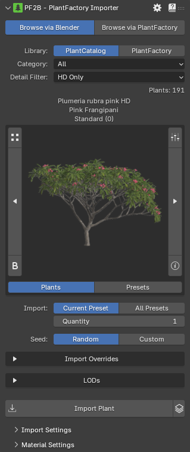

# Overview

## Importing

PF2B offers two modes for importing plants from **PlantFactory** into Blender, each tailored for different workflows. You can either work directly with PlantFactory in the background or manage imports entirely from within Blender. Here’s how each mode works:

### [Mode 1: Browse via Blender](browse_via_blender)

{ .img-box align=left width=30% }

This mode is tailored for users who focus on a Blender-centric workflow and do not require PlantFactory running continuously in the background. PF2B caches all plant assets and presets, allowing users to browse and import vegetation directly into Blender as needed.
<!-- This mode is useful for users who prefer a Blender-centric workflow but occasionally need to add PlantFactory vegetation to their scenes. -->

- **Workflow**: In Blender, browse through the available plants & presets via the built in thumbnail gallery. When you click **Import** in this mode, PF2B will launch PlantFactory in the background, import the selected plant(s), and then close PlantFactory automatically once the import completes.

### [Mode 2: Browse via PlantFactory](browse_via_plantfactory)

{ .img-box align=left width=30% }

In this mode, PF2B connects Blender to a running instance of PlantFactory, enabling you to work on plant designs in PlantFactory and seamlessly import them into Blender for testing or use without needing to close PlantFactory
<!-- This mode is ideal for scenarios where you’re actively working on plant designs in PlantFactory and want to test or use them in Blender without closing PlantFactory. -->

- **Workflow**: As you edit or create a plant in PlantFactory, PF2B will allow you to import the current plant directly into Blender whenever you’re ready. Simply click the **Import** button within Blender to bring in the active plant from PlantFactory.

## After the Import

### [Post Processing](post_processing)

After importing your plants, you can use the ´Post Processing´ panel to edit the visuals of your plants.