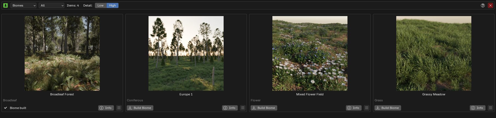
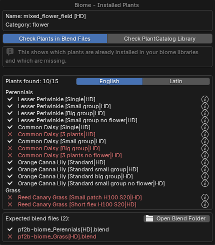
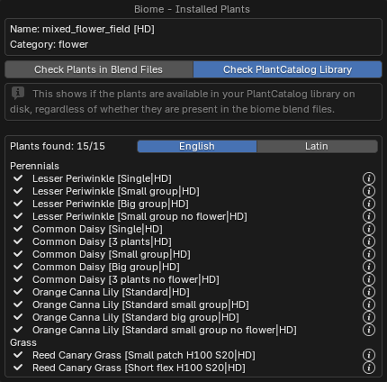

!!! warning ""
    The Biomes & Collections features are not yet released and will be available in version 1.1.7. Coming soon!

!!! info2 "Biomes?"
    Biomes are **curated plant ecosystems** ready to scatter in Blender using [Geo-Scatter](https://www.geoscatter.com/download.html#geo-scatter) or [Biome-Reader](https://www.geoscatter.com/download.html#biome-reader).

    👉 For an overview of how Biomes compare to Collections, see: [Biomes & Collections Overview](biomes_and_collections.md).

## Where to find Biomes

{ .img-box align=left }

Click the :blender_icon_bold: icon in the main interface to open the **Biomes & Collections browser**, where you can preview and manage available biomes.

## Browse Biomes

At the top of the browser, you can select a **category** of biomes.

You also have the **Detail** selection, which lets you choose either **Low** or **High** detail level. Low Detail biomes should primarily use LD plants, while High Detail biomes should primarily use HD plants. Some variation is allowed, but this serves as a general guideline.

If a biome is already built and available in your library, the **Build Biome** button will be replaced by a **Biome Built** label.

{ .img-box .on-glb }

<h5>Available Actions</h5>

- **Build Biome**: See [Building a Biome](#building-a-biome).
- **INFO**: Displays information about the biome. See [Info Popup](#info-popup).
- :material-menu: **Menu**:
    - **Add plants to queue**: Adds these plants to your [queue](browse_via_blender.md#queue). This will erase all current items in your queue.
    - **Check Installed Plants**: Checks which plants you already have imported in your library. See [Installed Plants Popup](#installed-plants-popup).
    - **Open Biome Folder**: Available once the biome is built. Opens the specific biome folder located at: `C:\Users\%userprofile%\AppData\Roaming\Blender Foundation\Blender\data\scatter library\_biomes_\PF2B`

### Info Popup

The **Info Popup** provides details about the selected biome.
It shows the plants included in the biome, and you can click the :octicons-question-24: **info button** next to a plant to view more details about it.

{ .img-box align=left }

!!! inline end info2 "Plant Details"
    Opens a popup with extra information about the plant.

    { .img-box .on-glb data-description="Plant Info Popup"}

    Read more about this popup [here](browse_via_blender.md#plant-info-popup)

### Installed Plants Popup

Similar to the regular **Info Popup**, but this one checks whether the actual plants are present in your library. There are two options:

=== "Check Plants in Blend Files"
    Verifies which plants from the biome are already imported and stored in your biome `.blend` library files.

    { .img-box align=left }

    !!! warning ""
        Note: This check only looks at the root folder defined in `PF2B Preferences > Plant Library > Blend Storage`. If you have moved your blend files elsewhere or into subdirectories, they may appear in red in this popup. However, they will still work in the biome as long as the blend files are inside your Asset Library, where Geo-Scatter or Biome-Reader can find them.

=== "Check PlantCatalog Library"
    Checks whether the plants in the biome are installed in your [PlantCatalog library](../plants.md#plantcatalog-library) on disk, regardless of whether they are in the biome `.blend` files.

    { .img-box align=left  }

    !!! info2 ""
        If a plant is missing, run [Re-Index Plants](../preferences/misc.md#plants-thumbnails) under `PF2B Preferences > Misc`.

## Building a Biome

!!! warning "Before You Start"
    When building biomes, you must start from a **new/empty scene**. The scene is used as a temporary location for the imported plants, so do not run **Build Biome** in a project with existing work you want to keep.

When you click **Build Biome**, PF2B will:

1. **Export plants** from PlantFactory based on the biome definition.
2. **Store the exported models in** `.blend` files within your Asset Library.
3. **Prepare biome-specific files** required by Geo-Scatter or Biome-Reader.

Once the process is complete, the biome becomes available in the scattering plugin of your choice. You can then scatter it in your Blender scene to generate rich, natural environments:

=== "Geo-Scatter"
    { .img-box }

=== "Biome-Reader"
    { .img-box }

!!! info2 "Where the Biomes are Stored"
    Your `.blend` files are organized in the Asset Library location defined in `Preferences > Plant Library > Biomes & Collections > Blend Storage`.

    After importing the biomes you want, you should see something like this:

    === "One imported Biome"
        { .img-box }

    === "Multiple Biome & Collection imports"
        { .img-box }

    …and inside your Asset Browser, where everything is categorized, tagged, and presented with clear thumbnails:

    { .img-box .on-glb }

## Using Biomes

<!-- 

    <iframe id="videoPlayer" width="560" height="315" src="https://www.youtube.com/embed/TGN_FiNH3aw?rel=0" frameborder="0" allowfullscreen></iframe>

 -->

> 🎥 The video above gives a quick overview of Biome functionality.
> 👉 For detailed step-by-step instructions on using Geo-Scatter or Biome-Reader, please check [www.geoscatter.com](https://www.geoscatter.com/index.html)

### Using LODs with Geo-Scatter

!!! warning ""
    This section applies **only to Geo-Scatter**. Biome-Reader does not support LODs.

If you need more performance in the viewport, you can use the **Level of Detail** functionality introduced in Geo-Scatter 5.6. You'll find it under `Viewport > Level of Detail`.

<h5>Setup Steps</h5>

1. **Import LODs in PF2B**
    - Navigate to the [LOD Importer](utilities.md#lod-importer) utility in PF2B.
    - Choose between:
        - `All Plants in Scene` (import LODs for every plant)
        - `Selected Plants` (import only for the plants you select in the **Geo-Scatter Import** collection via the Outliner).
    - Enable the **Use Biome Naming** checkbox. This ensures plants are renamed using the standard format `PlantName [Preset|DetailLevel]LOD`, so that Geo-Scatter can correctly identify them for the **Auto Setup LODs** function.
    - Check the LOD tickboxes for the levels you want to bring in.
    - Click **Import**.

- **Enable in Geo-Scatter**
    - In the Geo-Scatter panel, **first select the layer** you want to optimize.
    - With that layer selected, open `Viewport > Level of Detail` for the layer and click **Auto Setup** to link the imported LODs.

- **Fine-Tune**
    - Adjust the **Transition** settings to your preference for smoother LOD switching.

Once configured, you’ll notice a more responsive viewport.

!!! info2 "Note"
    The LOD feature mainly benefits **viewport performance** and rarely improves render times.

    For best results, set the **Visibility State** as shown below so that LODs are active only in the viewport and not during rendering: 