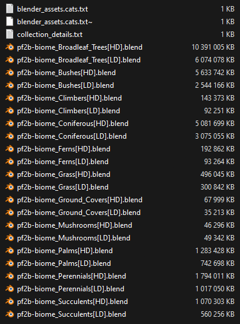
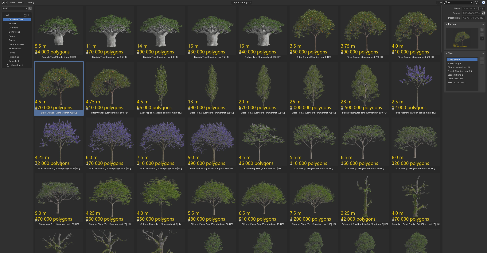

# Biomes & Collections

PF2B offers two ways to work with grouped plants: **Biomes** and **Collections**.
Both systems help you quickly bring plants from PlantFactory into Blender, but they serve slightly different purposes.
See [Setting up Biomes & Collections](../getting_started.md#setting-up-biomes-collections) for setup and configuration instructions.

## Shared Library

Both systems write to the same `.blend` asset files, giving you a **unified library**.

- Plants imported with **Collections** are instantly available to **Biomes** and can also be accessed directly in the **Asset Browser**.
- Plants imported by **Biomes** are similarly available in the **Asset Browser** for direct use outside of biomes.

??? info2 "Storage Location and Organization"
    Your `.blend` files are organized in the Asset Library location defined in `Preferences > Plant Library > Biomes & Collections > Blend Storage`.

    Imported plants are automatically categorized in the Asset Library, and a `blender_assets.cats.txt` file is generated in the root folder. Example:

    === "One imported Biome"
        { .img-box }

    === "Multiple Biome & Collection imports"
        { .img-box }

    …and inside your Asset Browser, where everything is categorized, tagged, and presented with clear thumbnails:

    { .img-box .on-glb }

    !!! info2 ""
        The `blender_assets.cats.txt` catalog file contains two main categories:

        - **PF2B** - Managed by the addon. Do not edit manually as changes will be overwritten when updating the catalog.
        - **PF2B_Custom** - For your own categories and any additional plants you want to store in this library. Safe to edit and customize.

## [Biomes](biomes.md)

In PF2B, a **biome** is a ready-made collection of plants designed to quickly build natural environments. Biomes are more than just plant lists, they are structured setups designed to work exclusively with third-party scattering add-ons developed by **bd3d**:

- **[Geo-Scatter](https://superhivemarket.com/products/scatter?ref=2183)** (commercial; see [documentation](https://www.geoscatter.com/))
- **[Biome-Reader](https://bd3d.gumroad.com/l/biome-reader)** (free)

These plugins handle the actual scattering of plants in your scene, making it easy to generate meadows, forests, wetlands, and other natural landscapes.

!!! info2 "Choosing a Scattering Plugin"
    **Biome-Reader** is a free, simplified version best suited for hobbyists and beginners. **Geo-Scatter** is the full professional toolset with advanced controls, optimizations, and support.

    Since **Biome-Reader** is free, you can start using PF2B biomes immediately, it works perfectly for exploring and scattering your first biomes.

    !!! tip "Special Offer"
        **Upgrade to Geo-Scatter** for full professional control. PF2B includes a **10% discount coupon**, available directly inside the addon.

## [Collections](collections.md)

Collections are **plant groups for bulk importing** into your Blender Asset Library. They let you quickly populate categories of plants for use in the Asset Browser, without waiting for on-demand imports. For this functionality, no external third-party add-ons are required.

## When to Use

| Feature      | Best For | What You Get |
|--------------|----------|---------------|
| **Biomes**   | Ready-made scattering setups | Curated ecosystems integrated with Geo-Scatter or Biome-Reader |
| **Collections** | Bulk asset import | Direct access to plants in Blender’s Asset Browser |

## Additional Information

### Import Behavior

- The Biomes and Collections importer is **smart**: it checks your existing Asset Library and avoids importing duplicates.
- You can use menu options to **review the status of plants** in each category at any time.

!!! info2 ""
    The number of available Biomes & Collections will continue to grow over time as new ones are added.