# Browse via Blender

{ .img-box align=left }

##### General Settings

- **Library**:
    - PlantCatalog
    - PlantFactory
    - Personal: visible if enabled in the preferences.
- **Category**: Shows plant categories for the selected library.
- **Detail Filter**: Filter plant catalog items by detail level (Only available for the [PlantCatalog library](../plants.md#plantcatalog-library)).
    - **All**: Show all detail levels.
    - **FG Only**: Show full geometry only.
    - **HD Only**: Show high detail only.
    - **LD Only**: Show low detail only.
    - **RT Only**: Show real-time detail only.
- **Plant Browser**:
     Above the thumbnail, the plant name is displayed (`Plumeria rubra pink HD`) along with its English name (`Pink Frangipani`), and below it, the preset name (`Standard (0)`).
    - :blender_icon_snap_vertex:: Opens the plant gallery, see [gallery view](#gallery-view) below.
    - :blender_icon_preset:: Opens the preset gallery, see [gallery view](#gallery-view) below.
    - :octicons-triangle-left-24:: Navigates to the previous plant or preset.
    - :octicons-triangle-right-24:: Navigates to the next plant or preset
    - :blender_icon_bold:: Opens the Biomes & Collections browser. Hold **Shift** while clicking to open the Biome Manager interface from **Geo-Scatter** or **Biome-Reader**. Read more about Biomes & Collections [here](biomes_and_collections.md).
    - :octicons-info-16:: Opens a popup displaying information about the plant. Read more in the [Plant Info Popup](#plant-info-popup) section.
    <!-- 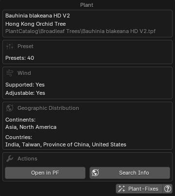{ .img-box .on-glb align=right width=27% data-description="Plant Info Popup"} -->
    - **Browse Mode**: Plants or Presets.
    <!-- { .img-box align=left } -->

- **Import**:
    - **Current Preset**
    - **All Presets**: Import all available preset variations for the selected plant. When enabled, the number of presets will be displayed below.
    - **Quantity**
- **Seed**:
    - **Random**
    - **Custom**
- **Import Overrides** These settings allow you to manually define the Age/Maturity, Health and Season of imported plants. See the [Import Overrides](#import-overrides) section below for details.
- :blender_icon_import: **Import Plant**: Starts importing the selected plant(s).

    !!! info2 ""
        While an import is in progress, this message is shown:

        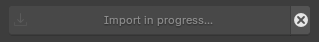{ .img-box }

        - :octicons-x-circle-fill-12: **Reset Import**: soft-resets the import if it gets stuck, re-enabling the *Import Plant* button. It does **not** stop any PlantFactory process running in the background, you must cancel that manually.

- :octicons-stack-24:: **Use import Queue**, see the [Queue](#queue) section for details.

### Import Overrides

These settings allow you to manually define the **Age/Maturity**, **Health**, and **Season** of imported plants. Each property has its own **checkbox** and **slider**. To activate an override for a specific property, tick the checkbox next to it and adjust the slider to your desired value.

{ .img-box align=left }

When an override is enabled, it will replace the plant's default preset value for that property during import. If left unticked, the original preset value will be used instead.

- **Settings**:
    - **Maturity**: Controls the plant's maturity, representing its current age as a ratio of its maximum potential age. A value of 0 represents a young plant, while 100 indicates the plant has reached its maximum age.
    - **Health**: Controls the plant's health from 0 to 100. A value of 0 represents a dying plant, while 100 indicates a thriving, fully healthy plant.
    - **Season**: Select the day of the year (1-365) to determine the season based on northern hemisphere meteorological standards.

The override settings are stored in the [Plant Details](./post_processing.md#plant-details) section after import, in case you need to reference them later.

!!! abstract "Override Examples"
    Here is the **Ficus carica (Common Fig Tree)** plant exported with different override settings, all using the same seed for consistency. These are just examples, since you have fine-grained control over the override values, you can generate any variation in between.

    **Maturity:**
    { .on-glb data-description="Import Override: Maturity" }

    **Health:**
    { .on-glb data-description="Import Override: Health" }

    **Season:**
    { .on-glb data-description="Import Override: Season" }

!!! info2 "Note"
    When using these overrides, values such as plant height and polygon count shown in the preset descriptions may not be accurate, as the override settings affect how the plant is generated.

### LODs

When enabled, you can choose which Levels of Detail to import.

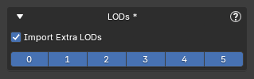{ .img-box align=left }
LOD 0 is the default, highest-detail geometry, while higher LOD numbers use progressively simpler geometry for performance optimization. You can enable or disable any combination of LODs, allowing you to import only the versions you need.

!!! info2 "Notes"
    - The available LODs depend on how the plant was set up in PlantFactory. Most plants provide LODs 0-3, but some may have fewer or more. Selecting a higher LOD does not guarantee it exists; only the plant's defined LODs will be imported.
    - When the 'Extra LODs' feature is enabled, PlantFactory generates all available LODs internally, which requires additional processing time, regardless of which ones you select. PF2B will then only import the LODs you've chosen, but the processing time is the same no matter which or how many LODs you select.

<h5>Examples</h5>

Example of LODs with the `Adansonia digitata (Baobap Tree)` plant using the `Standard mat 25` preset, exported in all three available detail levels: HD (High Detail), LD (Low Detail), and RT (Realtime, which also uses billboards):

=== "Wireframe"
    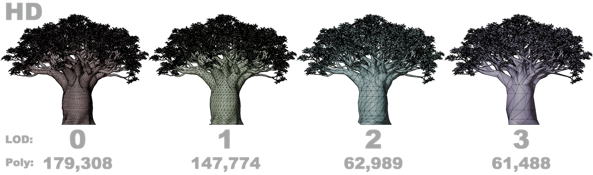{ .on-glb }

    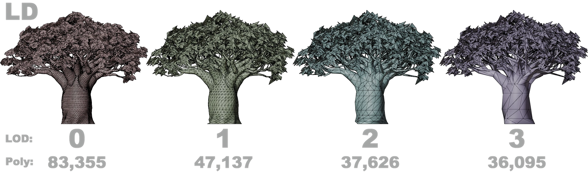{ .on-glb }

    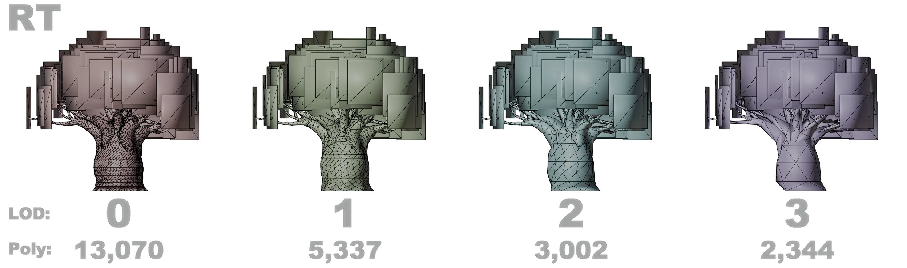{ .on-glb }

=== "Rendered"
    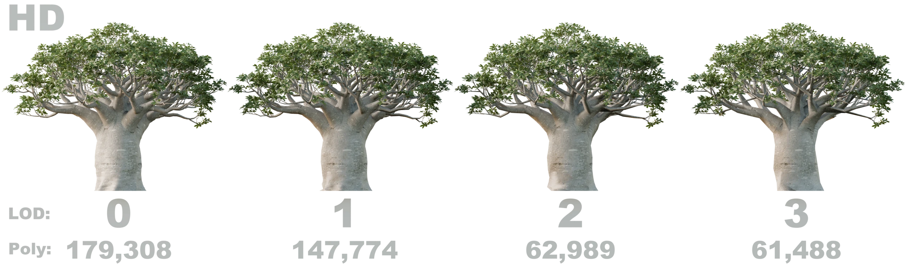{ .on-glb }

    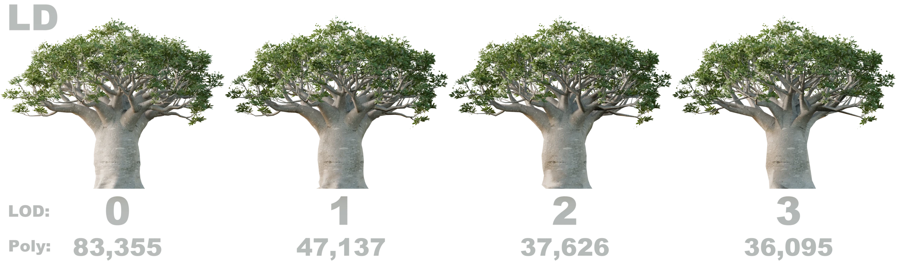{ .on-glb }

    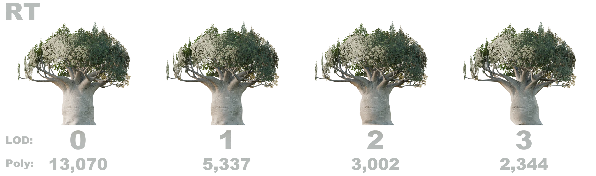{ .on-glb }

!!! info2 ""
    Note that polygon counts can vary greatly depending on the plant and preset. In this example, the `Standard mat 25` preset is used, where the "mat 25" indicates the plant’s **maturity**, representing its age as a percentage of its maximum potential. A value of **0** means the plant is very young, while **100** represents full maturity. For this tree, maturity has a huge impact on both height and polygon count: at 0% maturity it is roughly 5.5 m tall, while at full maturity it reaches about 16 m. At 25% maturity, as shown here, the plant is around 11 m tall. There are many other presets available for this plant, some of which reach even greater sizes.

### Queue

The queue system lets you add multiple plants to a queue, which you can then import in a single batch, simplifying the process of importing various species and presets.

The queue can be activated by pressing the :octicons-stack-24: icon to the right of the `Import` button. Once activated, the `Import` button changes to `Add to Queue`, and two new options appear below: an `Import All` button and the :material-menu: `Queue Actions` menu.

You can now browse plants and use any of the `Add to Queue` buttons to add them to the queue.

---

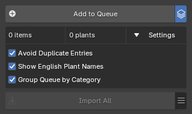{ .img-box align=right }

- :blender_icon_import: **Import All**: Import all plants in the queue.
- :material-menu: **Queue Actions**:
    - **Save Queue**: Save the current plant import queue to an external `.pf2bqueue` file for backup or reuse. The file is small and easy to store.
    - **Load Queue**: Load a plant import queue from an external `.pf2bqueue` file.
    - **Clear Queue**: Remove all plants from the queue.

---

{ .img-box align=left }

Each queue item shows the following buttons:

- :octicons-info-16:: Opens a popup displaying information about the plant. Read more in the [Plant Info Popup](#plant-info-popup) section.
    { .img-box .on-glb align=right width=27% data-description="Plant Info Popup"}
- **Quantity**: The number field lets you specify how many of this plant will be imported.
- :fontawesome-regular-trash-can:: Delete the plant from the queue.

### Gallery View

In this view, you can see all available plants and presets. To exit the gallery view, click the `X` in the top right corner or press `Escape` on your keyboard.

!!! info2 inline "Plants"
    { .img-box .on-glb align=left }

!!! info2 inline "Presets"
    { .img-box .on-glb align=left }

Below is a breakdown of every button and function inside the gallery.

#### Plants

{ .img-box .on-glb }
At the top, you'll find the same library and filtering section as in the main panel, along with these additional settings:

- **Size**: Adjusts the thumbnail size of the plants and presets in the gallery.
    - Example of zoom set to a lower number: 
        { .img-box .on-glb  width=35% }
- **Search**: Lets you perform a free-text search to filter items by Latin name, English name, or continent (Africa, Asia, Europe, North America, South America, Oceania).

 

{ .img-box align=left }

If we look at an individual plant inside the gallery we have the following buttons below the thumbnail:

- **Presets**: Opens the presets gallery for this plant.
- **Select**: Selects the plant and closes down the plant gallery.
- :octicons-info-16:: Opens a popup displaying information about the plant. Read more in the [Plant Info Popup](#plant-info-popup) section.
    { .img-box }

#### Presets

{ .img-box .on-glb }
Here you will also find the Size & Search fields and if you are browsing the [PlantCatalog library](../plants.md#plantcatalog-library) there are additional filters available:

- **Min Height** & **Max Height**: Lets you filter presets based on the plant height.
- **Min Polygons** & **Max Polygons**: Lets you filter presets based on the plant polygon count.
- **Reset Filters**
- **Use import Queue**: Enables the queue functionality and adds an additional 'Add to Queue' button to each preset. For more information about the queue system, please see the [Queue](#queue) section.

 

If we look at an individual presets inside the gallery we are presented with depending on if you have the `Use import Queue` active:

=== "Default"
    { .img-box align=left  }

    - **Select**: Selects the plant and closes down the plant gallery.
    - :octicons-info-16:: Opens a popup displaying information about the plant. Read more in the [Plant Info Popup](#plant-info-popup) section.
        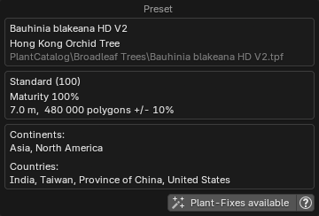{ .img-box  }

=== "With 'Queue' button"
    { .img-box align=left  }

    - **Add to Queue**: Adds the preset to the queue. For more information about the queue system, please see the [Queue](#queue) section.
    - **Select**: Selects the plant and closes down the plant gallery.
    - :octicons-info-16:: Opens a popup displaying information about the plant. Read more in the [Plant Info Popup](#plant-info-popup) section.
        { .img-box  }

### Plant Info Popup

The Plant Info popup, accessible via the :octicons-info-16: button, appears in multiple places in the interface. Its appearance may vary depending on location, as some of the displayed content is context-specific. See the examples in the screenshots below.

Common information shown includes:

- Plant names
- Preset details
- Global distribution (continents and countries, with data from [GBIF.org](https://www.gbif.org/))
- Function buttons

=== "Plant"
    { .img-box }

=== "Preset"
    { .img-box }

=== "Preset with Image"
    { .img-box }

- **Function buttons**:
    - **Plant-Fixes available**: This button will appear if there are [Plant-Fixes](../support/pf2b_under_the_hood.md#plant-fixes-system) available for the plant. When clicked, it will display all the fixes applied during the import of this plant.
    - **Open**: Opens this plant in the Plant Browser. Useful if you want to import additional instances of the same plant type into the scene.
    - **Search Plant Info**: lets you search for information about a plant species online. Clicking it presents the following options:
        - **[Wikipedia](https://www.wikipedia.org/)**
        - **[Wikimedia Species](https://species.wikimedia.org/)**
        - **[POWO](https://powo.science.kew.org/)**: Plants of the World Online, provided by the Royal Botanic Gardens, Kew.
        - **[GBIF](https://www.gbif.org/)**: Global Biodiversity Information Facility, providing free and open access to biodiversity data.
        - **[DuckDuckGo](https://duckduckgo.com/)**
        - **[Google](https://www.google.com/)**