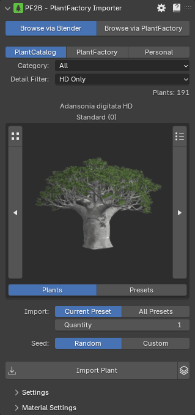

# Browse via Blender

{ .img-box align=left }

- **Library**:
    - PlantCatalog
    - PlantFactory
    - Personal: visible if enabled in the preferences.
- **Category**:
- **Detail Filter**: Filter plant catalog items by detail level (Only available for the `PlantCatalog` library).
    - **All**: Show all detail levels.
    - **FG Only**: Show full geometry only.
    - **HD Only**: Show high detail only.
    - **LD Only**: Show low detail only.
    - **RT Only**: Show real-time detail only.

<!-- - **Batch Import Options**:
  - **Randomized Imports**: As with the first mode, you can import multiple unique variations of a plant by applying random seeds.
  - **Preset Variants**: You can also import all preset variations for a selected plant if available. -->
