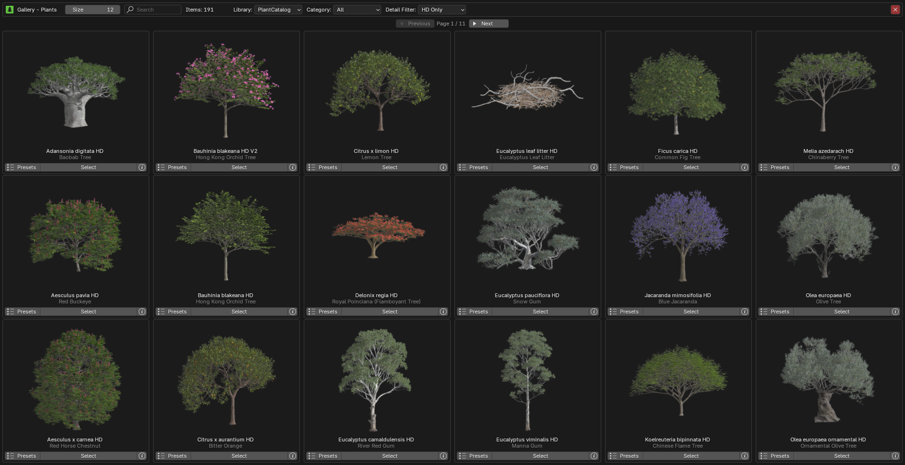
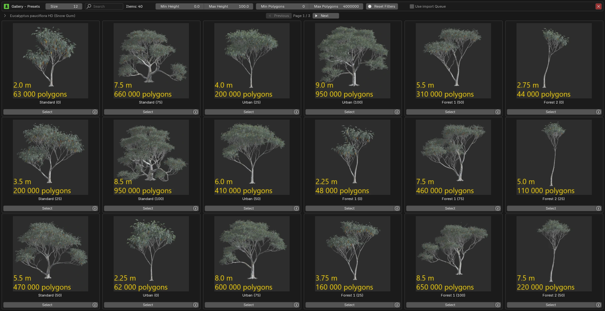

# Browse via Blender

{ .img-box align=left }

##### General Settings

- **Library**:
    - PlantCatalog
    - PlantFactory
    - Personal: visible if enabled in the preferences.
- **Category**: Shows plant categories for the selected library.
- **Detail Filter**: Filter plant catalog items by detail level (Only available for the [PlantCatalog library](../plants.md#plantcatalog-library)).
    - **All**: Show all detail levels.
    - **FG Only**: Show full geometry only.
    - **HD Only**: Show high detail only.
    - **LD Only**: Show low detail only.
    - **RT Only**: Show real-time detail only.
- **Plant Browser**:
     Above the thumbnail, the plant name is displayed (`Plumeria rubra pink HD`) along with its English name (`Pink Frangipani`). Below the thumbnail, the preset name is shown (`Standard (0)`), which you can **click** to see a dropdown list of all available presets (only active when **Browse Mode** is set to "Presets").
    - :blender_icon_snap_vertex:: Opens the plant gallery, see [gallery view](#gallery-view) below.
    - :blender_icon_preset:: Opens the preset gallery, see [gallery view](#gallery-view) below.
    - :octicons-triangle-left-24:: Navigates to the previous plant or preset.
    - :octicons-triangle-right-24:: Navigates to the next plant or preset
    - :blender_icon_bold:: Opens the **[Biomes & Collections](biomes_and_collections.md)** browser. Hold **Shift** while clicking to open the Biome Manager interface from **Geo-Scatter** or **Biome-Reader**.
    - :octicons-info-16:: Opens a [Plant Info Popup](#plant-info-popup) to display information about the plant.

    - **Browse Mode**: Plants or Presets.

- **Import**:
    - **Current Preset**
    - **All Presets**: Import all available preset variations for the selected plant. When enabled, the number of presets will be displayed below.
    - **Quantity**
- **Seed**:
    - **Random**: Generates a new random seed each time, producing a unique plant on every import.
    - **Custom**
- **Import Overrides** These settings allow you to manually define parameters such as Age/Maturity, Health and Season of imported plants. See the [Import Overrides](#import-overrides) section below for details.
- **LODs**: Choose which Levels of Detail to import. See the [LODs](#lods) section below for details.
- **Wind**: Wind settings. See the [Wind](#wind) section below for details.
- :blender_icon_import: **Import Plant**: Starts importing the selected plant(s).

    !!! info2 ""
        While an import is in progress, this message is shown:

        { .img-box }

        - :octicons-x-circle-fill-12: **Reset Import**: soft-resets the import if it gets stuck, re-enabling the *Import Plant* button. It does **not** stop any PlantFactory process running in the background, you must cancel that manually.

    !!! info2 ""
        If an import fails, you will be prompted with the following message. From here, you can choose to resume the import process.

        { .img-box }

- :octicons-stack-24:: **Use import Queue**, see the [Queue](#queue) section for details.

### Import Overrides

These settings allow you to manually define various parameters that influence how plants are generated and appear when imported. Each property has its own **checkbox** and **slider**. To activate an override for a specific property, tick the checkbox next to it and adjust the slider to your desired value.

{ .img-box align=left }

When an override is enabled, it will replace the plant's default preset value for that property during import. If left unticked, the original preset value will be used instead.

- **Settings**:
    - **Maturity**: Controls the plant's maturity, representing its current age as a ratio of its maximum potential age. A value of 0 represents a young plant, while 100 indicates the plant has reached its maximum age.
    - **Health**: Controls the plant's health from 0 to 100. A value of 0 represents a dying plant, while 100 indicates a thriving, fully healthy plant.
    - **Season**: Select the day of the year (1-365) to determine the season based on northern hemisphere meteorological standards.
    - **Mesh Resolution**: Adjusts the `Global Mesh Resolution` setting in PlantFactory, which controls the overall geometry quality. Most plants use 0.4 by default, but you can lower it for lighter meshes or increase it for higher detail, especially useful for '**hero**' assets like close-up trees where trunk detail matters.
    - **Plant Specific**: The plant-specific overrides correspond to individual nodes that exist within the plant's original PlantFactory graph.

- **Actions**:
    - **Preview in PlantFactory**: Opens the selected plant in PlantFactory using the current override values.

The override settings are stored in the [Plant Details](./post_processing.md#plant-details) section after import, in case you need to reference them later.

!!! abstract "Override Examples"
    Here is the **Ficus carica (Common Fig Tree)** plant exported with different override settings, all using the same seed for consistency. These are just examples, since you have fine-grained control over the override values, you can generate any variation in between.

    **Maturity:**
    { .on-glb data-description="Import Override: Maturity" }

    **Health:**
    { .on-glb data-description="Import Override: Health" }

    **Season:**
    { .on-glb data-description="Import Override: Season" }

    **Mesh Resolution:** 
    This example demonstrates a simple tree trunk to highlight how adjusting the **Mesh Resolution** affects the level of detail in the plant model. Increasing the resolution enhances surface detail, which is especially valuable for **hero assets**

    === "Rendered"
        { .on-glb data-description="Import Override: Mesh Resolution" }
    === "Viewport"
        { .on-glb data-description="Import Override: Mesh Resolution as seen in viewport" }

#### Plant Specific {#import-overrides-plant-specific}

The plant-specific overrides correspond to individual nodes that exist within the plant's original PlantFactory graph. These nodes control various aspects of the plant's structure and appearance, such as branching, trunk shape, or foliage density.

The displayed default values for these overrides are placeholders (set to 0.5) because the actual node defaults cannot be retrieved through the available API. Therefore, the shown values should not be interpreted as the true defaults used by the plant. Because these node names come directly from the source plant definition, they may not always be self-explanatory or clearly indicate their effect. If a node's purpose is unclear, hover over it to view its tooltip for additional context.

!!! info2 "Tip"
    To better understand what each node does and view its real default values, you can use the '**Preview in PlantFactory**' button to open the plant for inspection. Within PlantFactory, the `Search Node` feature can also be used to locate and review each node in the graph.

The image below shows an example of plant-specific override nodes available for a particular plant.

{ .img-box align=left }

- :material-menu: **Actions menu**:
    - **Select**:
        - :material-checkbox-marked-outline: **Enable All**: Enable all override toggles.
        - :material-checkbox-blank-outline: **Disable All**: Disable all override toggles.
        - :octicons-arrow-both-16: **Invert**: Invert override toggles.
    - :dice-game-icon: **Randomize Selected**: Randomizes enabled plant-specific override values.

!!! info2 "Notes"
    - When using overrides, values such as plant height and polygon count shown in the preset descriptions may not be accurate, as the override settings affect how the plant is generated.
    - In some cases, certain override sliders may not affect the plant as expected. This occurs when the corresponding nodes are not connected or used within that particular plant's graph. However, for most plants, the available overrides will function normally.

### LODs

When enabled, you can choose which Levels of Detail to import.

{ .img-box align=left }
LOD 0 is the default, highest-detail geometry, while higher LOD numbers use progressively simpler geometry for performance optimization. You can enable or disable any combination of LODs, allowing you to import only the versions you need.

!!! info2 "Notes"
    - The available LODs depend on how the plant was set up in PlantFactory. Most plants provide LODs 0-3, but some may have fewer or more. Selecting a higher LOD does not guarantee it exists; only the plant's defined LODs will be imported.
    - When the 'Extra LODs' feature is enabled, PlantFactory generates all available LODs internally, which requires additional processing time, regardless of which ones you select. PF2B will then only import the LODs you've chosen, but the processing time is the same no matter which or how many LODs you select.

<h5>Examples</h5>

Example of LODs with the `Adansonia digitata (Baobap Tree)` plant using the `Standard mat 25` preset, exported in all three available detail levels: HD (High Detail), LD (Low Detail), and RT (Realtime, which also uses billboards):

=== "Wireframe"
    { .on-glb }

    { .on-glb }

    { .on-glb }

=== "Rendered"
    { .on-glb }

    { .on-glb }

    { .on-glb }

!!! info2 ""
    Note that polygon counts can vary greatly depending on the plant and preset. In this example, the `Standard mat 25` preset is used, where the "mat 25" indicates the plant's **maturity**, representing its age as a percentage of its maximum potential. A value of **0** means the plant is very young, while **100** represents full maturity. For this tree, maturity has a huge impact on both height and polygon count: at 0% maturity it is roughly 5.5 m tall, while at full maturity it reaches about 16 m. At 25% maturity, as shown here, the plant is around 11 m tall. There are many other presets available for this plant, some of which reach even greater sizes.

### Wind

<video width="100%" loop autoplay muted controls>
    <source src="../../videos/wind.mp4" type="video/mp4">
    Your browser does not support the video tag.
</video>

The wind system imports animated wind motion from **PlantFactory**, adding realistic movement to plants inside Blender. During import, an armature with baked keyframes is generated to simulate the plant's wind animation over time.

Most plants include wind data, but some have fixed wind parameters that cannot be adjusted directly due to API limitations. For plants that support adjustable wind, you can fine-tune the **intensity** and **atmosphere** to achieve the desired motion strength and variation.

- **Wind Intensity** – Controls how strong the wind effect is. Some plants support direct adjustment, while others use a fixed value.
- **Atmosphere** – Defines general wind behavior such as overall strength and turbulence. This can indirectly influence plants with non-adjustable intensity.

If a plant's wind cannot be adjusted, try changing the **atmosphere** to modify the overall movement. You can check whether a plant supports adjustable wind in the **[Plant Info](#plant-info-popup)** popup by clicking the **Info** button in the interface.

{ .img-box align=left }

<h5>Settings</h5>
- **Baking Mode**:
    - **Static Bones**: Bones but no animation.
    - **Animated Bones**: Bones and animation.
- **Duration**: Set the start and end time of the wind animation (in seconds).
- **Use Scene Framerate**: Disable this to specify a custom framerate.
- **Cyclic animation**: Force the baked animation to be cyclic.
- **Wind Intensity**:
    - **Use default Intensity**: When enabled, the wind intensity defined as default inside PlantFactory for this plant will be used.
    - **Custom intensity**: Available when **Use default intensity** is disabled.
    - **Atmosphere**: Loads a atmosphere inside PlantFactory with specific `Atmospheric Breeze` settings. These settings can be found inside PlantFactory under `Wind > Atmosphereic Breeze Settings`.
        - **Default**
        - **Medium Wind**
        - **Storm**
- Misc:
    - **Show Armature as Bounds**: When enabled, imported plant armatures will be displayed as bounding boxes instead of showing bone shapes in the `3D Viewport`.

!!! warning ""
    Importing wind animations can be a time-consuming process, especially for high-detail plants, as it involves generating and baking keyframe animation for many bones.

    Once the PlantFactory application has launched and begun the import process, it may appear as though nothing is happening. The application remains responsive, but data is being processed in the background. This is normal.

### Queue

The queue system lets you add multiple plants to a queue, which you can then import in a single batch, simplifying the process of importing various species and presets.

The queue can be activated by pressing the :octicons-stack-24: icon to the right of the `Import` button. Once activated, the `Import` button changes to `Add to Queue`, and two new options appear below: an `Import All` button and the :material-menu: `Queue Actions` menu.

You can now browse plants and use any of the `Add to Queue` buttons to add them to the queue.

---

{ .img-box align=right }

- **Settings**:
    - **Avoid Duplicate Entries**: Do not add plants to the queue if the same plant + preset already exists.
    - **Show English Plant Names**: Display plant names in the queue using English common names instead of Latin if available.
    - **Group Queue by Category**: Display queue items grouped by plant type.
- :blender_icon_import: **Import All**: Import all plants in the queue.
- :material-menu: **Queue Actions**:
    - **Save Queue**: Save the current plant import queue to an external `.pf2bqueue` file for backup or reuse. The file is small and easy to store.
    - **Add Selected to Queue**: Add all selected plants in the scene to the queue. Does not clear existing items from your queue.
    - **Load Queue**: Load a plant import queue from an external `.pf2bqueue` file.
    - :fontawesome-regular-trash-can: **Clear Queue**: Remove all plants from the queue.

---

{ .img-box align=left }

Each queue item shows the following buttons:

- :octicons-info-16:: Opens a popup displaying information about the plant. Read more in the [Plant Info Popup](#plant-info-popup) section.
    { .img-box .on-glb align=right width=27% data-description="Plant Info Popup"}
- **Quantity**: The number field lets you specify how many of this plant will be imported.
- :fontawesome-regular-trash-can:: Delete the plant from the queue.

### Gallery View

In this view, you can see all available plants and presets. To exit the gallery view, click the `X` in the top right corner or press `Escape` on your keyboard.

!!! info2 inline "Plants"
    { .img-box .on-glb align=left }

!!! info2 inline "Presets"
    { .img-box .on-glb align=left }

Below is a breakdown of every button and function inside the gallery.

#### Plants

{ .img-box .on-glb }
At the top, you'll find the same library and filtering section as in the main panel, along with these additional settings:

- **Size**: Adjusts the thumbnail size of the plants and presets in the gallery.
    - Example of zoom set to a lower number: 
        { .img-box .on-glb  width=35% }
- **Search**: Lets you perform a free-text search to filter items by Latin name, English name, or continent (Africa, Asia, Europe, North America, South America, Oceania).

 

{ .img-box align=left }

If we look at an individual plant inside the gallery we have the following buttons below the thumbnail:

- **Presets**: Opens the presets gallery for this plant.
- **Select**: Selects the plant and closes down the plant gallery.
- :octicons-info-16:: Opens a popup displaying information about the plant. Read more in the [Plant Info Popup](#plant-info-popup) section.
    { .img-box }

#### Presets

{ .img-box .on-glb }
Here you will also find the Size & Search fields and if you are browsing the [PlantCatalog library](../plants.md#plantcatalog-library) there are additional filters available:

- **Min Height** & **Max Height**: Lets you filter presets based on the plant height.
- **Min Polygons** & **Max Polygons**: Lets you filter presets based on the plant polygon count.
- **Reset Filters**
- **Use import Queue**: Enables the queue functionality and adds an additional 'Add to Queue' button to each preset. For more information about the queue system, please see the [Queue](#queue) section.

 

If we look at an individual presets inside the gallery we are presented with depending on if you have the `Use import Queue` active:

=== "Default"
    { .img-box align=left  }

    - **Select**: Selects the plant and closes down the plant gallery.
    - :octicons-info-16:: Opens a popup displaying information about the plant. Read more in the [Plant Info Popup](#plant-info-popup) section.
        { .img-box  }

=== "With 'Queue' button"
    { .img-box align=left  }

    - **Add to Queue**: Adds the preset to the queue. For more information about the queue system, please see the [Queue](#queue) section.
    - **Select**: Selects the plant and closes down the plant gallery.
    - :octicons-info-16:: Opens a popup displaying information about the plant. Read more in the [Plant Info Popup](#plant-info-popup) section.
        { .img-box  }

### Plant Info Popup

The Plant Info popup, accessible via the :octicons-info-16: button, appears in multiple places in the interface. Its appearance may vary depending on location, as some of the displayed content is context-specific. See the examples in the screenshots below.

Common information shown includes:

- Plant names
- Preset details
- Wind details
- Geographic distribution (continents and countries, with data from [GBIF.org](https://www.gbif.org/))
- Action buttons

=== "Plant"
    { .img-box }

=== "Preset"
    { .img-box }

=== "Preset with Image"
    { .img-box }

- **Actions**:
    - **Open in Plant Browser**: Opens this plant in the Plant Browser. Useful if you want to import additional instances of the same plant type into the scene.
    - **Open in PF**: This allows you to open a specific plant directly in PlantFactory for inspection. Note that this does not use the PF2B Bridge and runs as a standalone session, meaning the plant cannot be imported back into Blender through this action.
    - **Search Info**: lets you search for information about a plant species online. Clicking it presents the following options:
        - **[Wikipedia](https://www.wikipedia.org/)**
        - **[Wikimedia Species](https://species.wikimedia.org/)**
        - **[POWO](https://powo.science.kew.org/)**: Plants of the World Online, provided by the Royal Botanic Gardens, Kew.
        - **[GBIF](https://www.gbif.org/)**: Global Biodiversity Information Facility, providing free and open access to biodiversity data.
        - **[DuckDuckGo](https://duckduckgo.com/)**
        - **[Google](https://www.google.com/)**

- **Other buttons**:
    - **Plant-Fixes available**: This button will appear if there are [Plant-Fixes](../support/pf2b_under_the_hood.md#plant-fixes-system) available for the plant. When clicked, it will display all the fixes applied during the import of this plant.