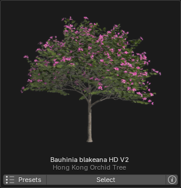

# Browse via Blender

{ .img-box align=left }

##### General Settings

- **Library**:
    - PlantCatalog
    - PlantFactory
    - Personal: visible if enabled in the preferences.
- **Category**: Shows plant categories for the selected library.
- **Detail Filter**: Filter plant catalog items by detail level (Only available for the `PlantCatalog` library).
    - **All**: Show all detail levels.
    - **FG Only**: Show full geometry only.
    - **HD Only**: Show high detail only.
    - **LD Only**: Show low detail only.
    - **RT Only**: Show real-time detail only.
- **Plant Browser**:
     Above the thumbnail, the plant name is displayed (`Ficus carica HD`) along with its English name (`Common Fig Tree`), and below it, the preset name (`Standard (0)`).
    - :blender_icon_snap_vertex:: Opens the plant gallery, see [gallery view](#gallery-view) below.
    - :blender_icon_preset:: Opens the preset gallery, see [gallery view](#gallery-view) below.
    - :octicons-triangle-left-24:: Navigates to the previous plant or preset.
    - :octicons-triangle-right-24:: Navigates to the next plant or preset
    - **Browse Mode**: Plants or Presets.
    <!-- { .img-box align=left } -->

- **Import**:
    - **Current Preset**
    - **All Presets**: Import all available preset variations for the selected plant. When enabled, the number of presets will be displayed below.
    - **Quantity**
- **Seed**:
    - **Random**
    - **Custom**
- :blender_icon_import: **Import Plant**: Starts importing the selected plant(s).
- :octicons-stack-24:: **Use import Queue**, see the next section for details.

### Queue

The queue system lets you add multiple plants to a queue, which you can then import in a single batch, simplifying the process of importing various species and presets.

{ .img-box align=left }

- :octicons-info-16:: Opens a popup that displays information about the plant. { .img-box .on-glb align=right width=27% data-description="Info popup"}
    - **Open**: Open this plant in the Plant Browser.
    - **Plant-Fixes available**: This button will appear if there are [Plant-Fixes](../support/pf2b_under_the_hood.md#plant-fixes-system) available for the plant. When clicked, it will display all the fixes applied during the import of this plant.
    - **Search on Wikipedia**: lets you search for the plant species on Wikipedia; hold down Shift while clicking to search on DuckDuckGo instead.
- **Quantity**: The number field lets you specify how many of this plant will be imported.
- :fontawesome-regular-trash-can:: Delete the plant from the queue.
- **Clear Queue**: Removes all plants from the queue.

### Gallery View

In this view, you can see all available plants and presets. To exit the gallery view, click the `X` in the top right corner or press `Escape` on your keyboard.

!!! info2 inline "Plants"
    { .img-box .on-glb align=left }

!!! info2 inline "Presets"
    { .img-box .on-glb align=left }

Below is a breakdown of every button and function inside the gallery.

#### Plants

{ .img-box .on-glb }
At the top, you'll find the same library and filtering section as in the main panel, along with these additional settings:

- **Size**: Adjusts the thumbnail size of the plants and presets in the gallery.
    - Example of zoom set to a lower number: 
        { .img-box .on-glb  width=35% }
- **Search**: Lets you perform a free-text search to filter items.

 

{ .img-box align=left }

If we look at an individual plant inside the gallery we have the following buttons below the thumbnail:

- **Presets**: Opens the presets gallery for this plant.
- **Select**: Selects the plant and closes down the plant gallery.
- **:octicons-info-16:**: Opens a popup that displays information about the plant. { .img-box }
    - **Plant-Fixes available**: This button will appear if there are [Plant-Fixes](../support/pf2b_under_the_hood.md#plant-fixes-system) available for the plant. When clicked, it will display all the fixes applied during the import of this plant.
    - **Search on Wikipedia**: lets you search for the plant species on Wikipedia; hold down Shift while clicking to search on DuckDuckGo instead.

#### Presets

{ .img-box .on-glb }
Here you will also find the Size & Search fields and if you are browsing the `PlantCatalog library` there are additional filters available:

- **Min Height** & **Max Height**: Lets you filter presets based on the plant height.
- **Min Polygons** & **Max Polygons**: Lets you filter presets based on the plant polygon count.
- **Reset Filters**
- **Use import Queue**: Enables the queue functionality and adds an additional 'Add to Queue' button to each preset. For more information about the queue system, please see the [Queue](#queue) section.

 

If we look at an individual presets inside the gallery we are presented with depending on if you have the `Use import Queue` active:

=== "Default"
    { .img-box align=left  }

    - **Select**: Selects the plant and closes down the plant gallery.
    - **:octicons-info-16:**: Opens a popup that displays information about the plant. { .img-box  }
        - **Plant-Fixes available**: This button will appear if there are [Plant-Fixes](../support/pf2b_under_the_hood.md#plant-fixes-system) available for the plant. When clicked, it will display all the fixes applied during the import of this plant.

=== "With 'Queue' button"
    { .img-box align=left  }

    - **Add to Queue**: Adds the preset to the queue. For more information about the queue system, please see the [Queue](#queue) section.
    - **Select**: Selects the plant and closes down the plant gallery.
    - **:octicons-info-16:**: Opens a popup that displays information about the plant. { .img-box  }
        - **Plant-Fixes available**: This button will appear if there are [Plant-Fixes](../support/pf2b_under_the_hood.md#plant-fixes-system) available for the plant. When clicked, it will display all the fixes applied during the import of this plant.