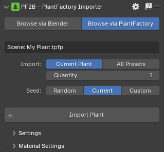

# Browse via PlantFactory

In this mode, PF2B connects Blender to a running instance of PlantFactory, enabling you to work on plant designs in PlantFactory and seamlessly import them into Blender for testing or use without needing to close PlantFactory

{ .img-box align=left }

- Click on the `Start Bridge` button to launch the PF2B Bridge along with PlantFactory and keep it running in the background
<!-- - **Batch Import Options**:
  - **Randomized Imports**: PF2B can generate multiple versions of the same plant, each with a unique random seed, for added variety.
  - **Preset Variants**: If the selected plant has multiple preset variations, you can choose to import all available presets at once. -->

