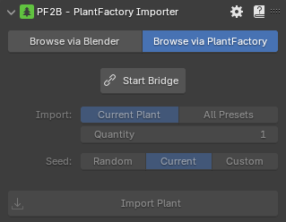
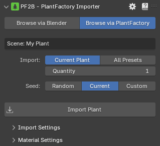
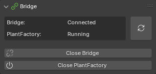
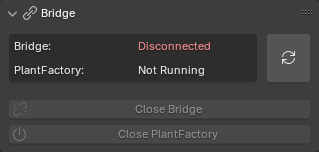
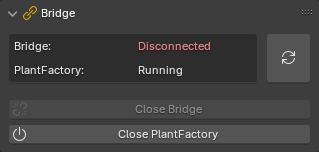

# Browse via PlantFactory

In this mode, PF2B connects Blender to a running instance of PlantFactory, enabling you to work on plant designs in PlantFactory and seamlessly import them into Blender for testing or use without needing to close PlantFactory.

{ .img-box align=left }

- **Start Bridge**: launch the PF2B Bridge along with PlantFactory that lets you import plants from PlantFactory.

Once the bridge has started, the interface will look like this:

{ .img-box align=left }

##### General Settings

At the top, the scene or plant name is displayed (shown as `My Plant` in the example).

- **Import**:
    - **Current Plant**
    - **All Presets**: Import all available preset variations for the selected plant. When enabled, the number of presets will be displayed below.
    - **Quantity**
- **Seed**:
    - **Random**: Generates a new seed for the import. *NOTE: this updates the seed of your current plant.*
    - **Current**: Keeps the current seed of your plant
    - **Custom**
- :blender_icon_import: **Import Plant**: Starts importing the selected plant.

#### Bridge

Below the main PF2B panel is the Bridge panel, which displays information about the bridge status.

=== "Connected"
    { .img-box }

=== "Disconnected"
    { .img-box }

=== "Disconnected with PF running"
    { .img-box }

- :blender_icon_file_refresh:: Check Bridge status.
- **Close Bridge**: Closes the PF2B Bridge between Blender and PlantFactory. To import plants again, you will need to restart the bridge along with a new instance of PlantFactory.
- **Close PlantFactory**: Force close all PlantFactory instances.