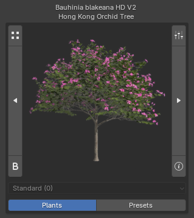

!!! warning ""
    The Biomes & Collections features are not yet released and will be available in version 1.1.7. Coming soon!

!!! info2 "Collections?"
    Collections are **plant groups for batch importing** into your Blender Asset Library.

    👉 For an overview of how Collections compare to Biomes, see: [Biomes & Collections Overview](biomes_and_collections.md).

## Where to find Collections

{ .img-box align=left }

Click the :blender_icon_bold: icon in the main interface to open the **Biomes & Collections browser**.

Once the browser is open, use the menu in the top-left corner to switch between browsing **Biomes** and **Collections**.

{ .img-box }

## Browse Collections

At the top, you can select a **category**. Currently, there are two categories: **Base Asset Library** and **Extended Asset Library**, as shown in the screenshots below. Additional categories may be added in the future.

You also have the **Detail** selection, which determines the detail level of plants to be imported. Selecting **Low** imports only the LD variants of plants, while **High** imports only the HD variants. You can import whichever variants you need on a per-collection basis, and it is possible to import both LD and HD variants for a single collection if required.

<h5>Available Actions</h5>

- **Add to Asset Library**: See [Importing Collections](#importing-collections).
- **INFO**: Displays information about the Collection. See [Info Popup](#info-popup).
- :material-menu: **Menu**:
    - **Add plants to queue**: Adds these plants to your [queue](browse_via_blender.md#queue). This will erase all current items in your queue.
    - **Check Installed Plants**: Checks which plants you already have imported in your library. See [Installed Plants Popup](#installed-plants-popup).

=== "Base Asset Library"
    { .img-box .on-glb }

=== "Extended Asset Library"
    { .img-box .on-glb }

### Info Popup

The **Info Popup** provides details about the selected collection.

At the bottom, it also shows the plants included in the collection when clicked (hidden by default, as collections can contain many plants).  Once maximized, you can click the :octicons-question-24: **info button** next to a plant to view more details about it.

{ .img-box align=left }

!!! inline end info2 "Plant Details"
    Opens a popup with extra information about the plant.

    { .img-box .on-glb data-description="Plant Info Popup"}

    Read more about this popup [here](browse_via_blender.md#plant-info-popup)

### Installed Plants Popup

Here you can check whether the actual plants are present in your library. There are two options:

=== "Check Plants in Blend Files"
    Verifies which plants from the collection are already imported and stored in your `.blend` library files.

    { .img-box align=left }

    !!! warning ""
        Note: This check only looks at the root folder defined in `PF2B Preferences > Plant Library > Blend Storage`. If you have moved your blend files elsewhere or into subdirectories, they may appear in red in this popup. However, they will still work in the biome as long as the blend files are inside your Asset Library, where Geo-Scatter or Biome-Reader can find them.

=== "Check PlantCatalog Library"
    Checks whether the plants in the biome are installed in your [PlantCatalog library](../plants.md#plantcatalog-library) on disk, regardless of whether they are in the biome `.blend` files.

    { .img-box align=left }

    !!! info2 ""
        If a plant is missing, run [Re-Index Plants](../preferences/misc.md#plants-thumbnails) under `PF2B Preferences > Misc`.

## Importing Collections

!!! warning "Before You Start"
    When importing collections, you must start from a **new/empty scene**. The scene is used as a temporary location for the imported plants, so do not run this in a project with existing work you want to keep.

Importing collections is straightforward. Simply click the **"Add to Asset Library"** button, and all plants in the collection except those already in your library will be automatically imported from PlantFactory and organized into the Asset Library location you configured in `Preferences > Plant Library > Biomes & Collections > Blend Storage`.

After importing the collections you want, you should see something like this. This example shows the full `Base Asset Library` category of collections, including both LD and HD variants:

{ .img-box }

…and inside your Asset Browser, where everything is categorized, tagged, and presented with clear thumbnails:

{ .img-box .on-glb }

!!! info2 ""
    Need to store additional plants in the Biome Library that aren't available as Collections? Check out the [Plant Storer](utilities.md#plant-storer) utility.