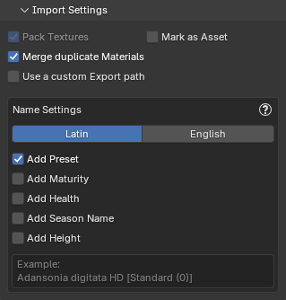

These settings are shared between both Import modes.

{ .img-box}

- **Pack Textures**: Packs the textures of the imported plants into the current Blend file ensuring that your plants retain their appearance without the need for external texture files. **Cannot be disabled**.
- **Mark as Asset**: Marks imported plants as Assets, making them easily accessible in Blender's Asset Browser for future use.
- **Add preset to the plant name**: Adds the preset name to the plant name. For example: `Boletus edulis HD [Standard Mat 75]`.
- **Use a custom Export path**: Set a custom export path if you need to access the files exported from PlantFactory. If this setting is not enabled, the exported files will be removed from their temporary location once they are imported into Blender.