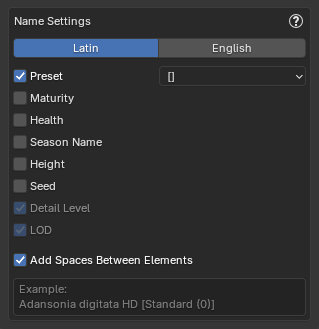

These settings are shared between both Import modes.

{ .img-box align=left }

##### General Settings

- **Pack Textures**: Packs the textures of the imported plants into the current Blend file ensuring that your plants retain their appearance without the need for external texture files. **Cannot be disabled**.
- **Mark as Asset**: Marks imported plants as assets, making them easily accessible in Blender's Asset Browser for future use.
    - When enabled, the asset will automatically have tags and metadata added for better organization and searchability within the Blender Asset Library. These include:
        - Plant name (Latin & English, if available), Preset Description, Preset Name, Maturity, Health, Season, Height
    !!! inline abstract "Asset Tags Example"
        { .img-box .on-glb }

    

- **Merge duplicate Materials**: When enabled, this option ensures that imported plants reuse existing materials in the scene if names match (e.g. Leaf, Bark). This prevents Blender from generating duplicates like Leaf.001, helping maintain a cleaner and more organized material list across multiple imports.
- **Use a custom Export path**: Set a custom export path if you need to access the files exported from PlantFactory. If this setting is not enabled, the exported files will be removed from their temporary location once they are imported into Blender.

### Name Settings

Configure how plant objects are named in Blender after import. For many settings, you'll be presented with a dropdown to choose how the selected detail should be formatted in the name. You can enable multiple options to suit your needs, but keep in mind that Blender object names are limited to 63 characters and will be truncated if they exceed this length.

The animated GIF below shows an example of adding the "Maturity" parameter and how it affects the final object name.

=== "Browse via Blender"
    { .img-box align=left }

    - **Language**: Choose whether to use the plants Latin name or English name. For example: `Quercus rubra` or `Northern Red Oak`.
    - **Add Preset**: Adds the preset name the name. For example: `Boletus edulis HD [Standard Mat 75]`.
    - **Add Maturity**
    - **Add Health**
    - **Add Season Name**
    - **Add Height**

=== "Browse via PlantFactory"
    { .img-box align=left }

    - **Add Maturity**
    - **Add Health**
    - **Add Season Name**
    - **Add Height**