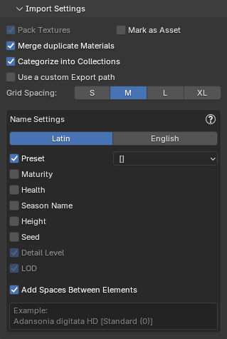

These settings are shared between both Import modes.

{ .img-box align=left }

##### General Settings

- **Pack Textures**: Packs the textures of the imported plants into the current Blend file ensuring that your plants retain their appearance without the need for external texture files. **Cannot be disabled**.
- **Mark as Asset**: Marks imported plants as assets, making them easily accessible in Blender's Asset Browser for future use.
    - When enabled, the asset will automatically have tags and metadata added for better organization and searchability within the Blender Asset Library. These include:
        - Plant name (Latin & English, if available), Preset Description, Preset Name, Maturity, Health, Season, Height, Seed, Detail Level, LOD.
    !!! inline abstract "Asset Tags Example"
        { .img-box .on-glb }

    <div style="clear:both"></div>

- **Merge duplicate Materials**: When enabled, this option ensures that imported plants reuse existing materials in the scene if names match (e.g. `Leaf`, `Bark`). This prevents Blender from generating duplicates like `Leaf.001`, helping maintain a cleaner and more organized material list across multiple imports.
- **Categorize into Collections**: Automatically place imported plants into sub-collections (e.g. Broadleaf Trees, Bushes, Grass) for easier scene organization.

    !!! inline abstract "Categories Example"
        { .img-box .on-glb }

    <div style="clear:both"></div>

- **Use a custom Export path**: Set a custom export path if you need to access the files exported from PlantFactory. If this setting is not enabled, the exported files will be removed from their temporary location once they are imported into Blender.
- **Grid Spacing**: Controls the spacing multiplier between plants in the import grid when importing multiple plants at once.
    - **S** = 0.75× spacing
    - **M** = 1.0× (default)
    - **L** = 1.5× spacing
    - **XL** = 3.0× spacing

    *When importing more than 10 plants, new rows are automatically created. If **Import Extra LODs** is enabled, each LOD will be placed on its own row.*


### Name Settings

Configure how plant objects are named in Blender after import. Each setting includes a dropdown that lets you choose how the selected detail should be formatted in the name. You can enable multiple options to suit your needs, but keep in mind that Blender object names are limited to 63 characters and will be truncated if they exceed this length.

All settings also include a **Wrapper** option, which controls how parameters are enclosed or separated in the name.

- Available wrappers:
    - `[]` → Square brackets
    - `()` → Parentheses
    - `<>` → Angle brackets
    <!-- - `|` → Prefix with a pipe --> <!-- 1.1.7 update -->
    - `-` → Prefix with a dash
    - `_` → Prefix with an underscore
    - `None` → No wrapper

<!-- - **Group Wrappers**:
    Instead of wrapping each parameter individually, you can wrap several together inside one group.
    Example:
    ```
    Baobab Tree [Standard mat 0 | Seed 761869182 | HD]
    ```
    Here, the **preset**, **seed**, and **detail level** are grouped within one set of square brackets, separated by a divider. --> <!-- 1.1.7 update -->

<!-- - Some Examples:
    - With square brackets: `Boletus edulis HD [Standard Mat 75]`
    - With dash: `Boletus edulis HD - Standard Mat 75`
    - With none: `Boletus edulis HD Standard Mat 75` -->

The animated GIF below shows an example of adding the "Maturity" parameter and how it affects the final object name.

=== "Browse via Blender"
    { .img-box align=left }

    - **Language**: Choose whether to use the plants Latin name or English name. For example: `Quercus rubra` or `Northern Red Oak`.
    - **Add Preset**: Adds the preset name the name. For example: `Boletus edulis HD [Standard Mat 75]`.
    - **Add Maturity**
    - **Add Health**
    - **Add Season Name**
    - **Add Height**
    - **Add Seed**
    - **Detail Level**: Appends the detail level (`FG, HD, LD, RT`) to the plant name.  *Note: Only applies when using English plant names and plants from the PlantCatalog library.*
    - **Add LOD**: Only available when using the [Import Extra LODs](browse_via_blender.md#lods) feature.
        <!-- - **Skip LOD0 Label** option: when enabled, the base LOD0 plant will not include `LOD0` in its name, but higher LODs (`LOD1`, `LOD2`, etc.) will. --> <!-- 1.1.7 update -->
    - **Add Spaces Between Elements**: Insert spaces between elements in the plant name. For example, `Boletus edulis HD[Standard Mat 75][Spring]` will become `Boletus edulis HD [Standard Mat 75] [Spring]`.


=== "Browse via PlantFactory"
    { .img-box align=left }

    - **Add Maturity**
    - **Add Health**
    - **Add Season Name**
    - **Add Height**

    - **Add Spaces Between Elements**: Insert spaces between elements in the plant name. For example, `Boletus edulis HD[Standard Mat 75][Spring]` will become `Boletus edulis HD [Standard Mat 75] [Spring]`.


<!--
    <h4>Advanced Mode</h4>
    { .img-box align=left }
    For power users, an **Advanced Mode** is available to fully customize how plant names are generated.

    When enabled, you can use **placeholders** like `{EnglishName}`, `{Preset}`, `{LOD}`, `{Height}`, `{HeightUnit}`, and more to control the exact format of the name.

    Example: `{Name} [{Preset} | {Detail}] {Height:.2f}{HeightUnit}` → Produces: `Boletus edulis HD [Standard Mat 75 | HD]  3.79m`

    - **Preset templates** are available from a dropdown for quick starting points.
    - A built-in **help panel** lists all available placeholders and examples.

    info2 "Formatting Help"
    You can use the following placeholders inside your naming template.
    They will be replaced with plant-specific values during import.

    <h4>Available placeholders:</h4>

    - `{EnglishName}` → English plant name
    - `{LatinName}` → Latin plant name
    - `{Preset}` → Preset name
    - `{PresetNumber}` → Preset number
    - `{PresetDescription}` → Preset description
    - `{Maturity}` → Maturity
    - `{Health}` → Health
    - `{Season}` → Season name
    - `{Height}` → Plant height
    - `{HeightUnit}` → Height unit (`m`/`cm`/`mm` depending on scene scale)
    - `{Seed}` → Seed
    - `{Detail}` → Detail level
    - `{LOD}` → LOD level


    <h4>Height formatting examples:</h4>

    - `{Height}` → full value (e.g. `12.345678`)
    - `{Height:.0f}` → no decimals (e.g. `12`)
    - `{Height:.1f}` → 1 decimal (e.g. `12.3`)
    - `{Height:.2f}` → 2 decimals (e.g. `12.35`)
    - `{Height:.3f}` → 3 decimals (e.g. `12.346`)


    <h4>Advanced text formatting examples</h4>

    - `{Preset:.5}` → truncate to first 5 characters --> <!-- 1.1.7 update -->

<!-- TIP:
To modify a plant’s name after import, use the [Plant Renamer Utility](utilities.md#plant-renamer). --> <!-- 1.1.7 update -->