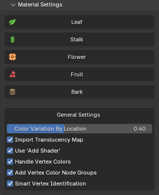{ .img-box align=right }

These settings allows you to configure the default settings that are used when importing the plants. Just click on any of the tabs to maximize them to see the settings as seen below.

### Settings

=== "Leaf"
    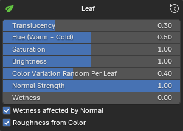{ .img-box align=left }

    - **Translucency**
    - **Hue**
    - **Saturation**
    - **Brightness**
    - **Color Variation Random Per Leaf**: Applies subtle hue variations to each leaf using random colors per geometry island, enhancing natural diversity.
    - **Normal Strength:** This controls the Normal or Bump Strength. If no Normal is present, it uses Bump. If no Bump is present, it derives Bump from the Color texture.
    - **Wetness**: The Wetness parameter simulates the effect of moisture on the leaf surface by reducing roughness. As wetness increases, the leaf's surface becomes smoother and glossier, mimicking the appearance of a wet leaf.
    - **Wetness affected by Normal**: Determines whether the wetness effect is influenced by the surface orientation. When enabled, the shader adjusts the roughness based on the surface's normal, applying the effect primarily to top-facing surfaces (along the positive Z-axis). When disabled, the wetness effect is applied uniformly across all surfaces regardless of their orientation.
    - **Roughness from Color**: Generates a Roughness map from the Color texture, breaking uniform roughness. Since most PlantFactory assets do not include dedicated Roughness maps and have a static value set, this feature provides an effective solution.

=== "Stalk"
    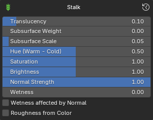{ .img-box align=left }

    - **Translucency**
    - **Subsurface Weight**
    - **Subsurface Scale**
    - **Hue**
    - **Saturation**
    - **Brightness**
    - **Normal Strength:** This controls the Normal or Bump Strength. If no Normal is present, it uses Bump. If no Bump is present, it derives Bump from the Color texture.
    - **Wetness**: The Wetness parameter simulates the effect of moisture on the stalk surface by reducing roughness. As wetness increases, the stalk's surface becomes smoother and glossier.
    - Wetness affected by Normal
    - **Roughness from Color**: Generates a Roughness map from the Color texture, breaking uniform roughness. Since most PlantFactory assets do not include dedicated Roughness maps and have a static value set, this feature provides an effective solution.

=== "Flower"
    { .img-box align=left }

    - **Translucency**
    - **Hue**
    - **Saturation**
    - **Brightness**
    - **Color Variation Random Per Flower**: Applies subtle hue variations to each flower using random colors per geometry island, enhancing natural diversity.
    - Normal Strength
    - **Wetness**: The Wetness parameter simulates the effect of moisture on the stalk surface by reducing roughness. As wetness increases, the stalk's surface becomes smoother and glossier.
    - Wetness affected by Normal
    - **Roughness from Color**: Generates a Roughness map from the Color texture, breaking uniform roughness. Since most PlantFactory assets do not include dedicated Roughness maps and have a static value set, this feature provides an effective solution.

=== "Fruit"
    { .img-box align=left }

    - **Translucency**
    - **Subsurface Weight**
    - **Subsurface Scale**
    - **Hue**
    - **Saturation**
    - **Brightness**
    - **Color Variation Random Per Fruit**: Applies subtle hue variations to each fruit using random colors per geometry island, enhancing natural diversity.
    - **Normal Strength:** This controls the Normal or Bump Strength. If no Normal is present, it uses Bump. If no Bump is present, it derives Bump from the Color texture.
    - **Wetness**: The Wetness parameter simulates the effect of moisture on the flower surface by reducing roughness. As wetness increases, the flower's surface becomes smoother and glossier. This wetness effect is applied on top of any other roughness adjustments made to the material.
    - Wetness affected by Normal
    - **Roughness from Color**: Generates a Roughness map from the Color texture, breaking uniform roughness. Since most PlantFactory assets do not include dedicated Roughness maps and have a static value set, this feature provides an effective solution.

=== "Bark"
    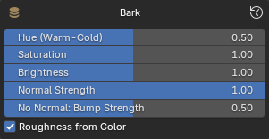{ .img-box align=left }

    - **Hue**
    - **Saturation**
    - **Brightness**
    - **Normal Strength**: This controls the Normal Strength. If no Normal is present, it uses Bump. If no Bump is present, it derives Bump from the Color texture.
    - **No Normal: Bump Strength**: This controls the Bump Strength if no Normal map is present.
    - **Roughness from Color**: Generates a Roughness map from the Color texture, breaking uniform roughness. Since most PlantFactory assets do not include dedicated Roughness maps and have a static value set, this feature provides an effective solution.

=== "General Settings"
    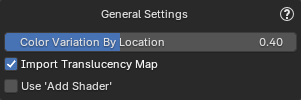{ .img-box align=left }

    These settings affect all material types.

    - **Color Variation By Location**: Introduces subtle hue variations based on plant location to reduce uniformity and enhance realism when multiple plants of the same species are nearby.
    - **Import Translucency Map**: Uses the translucency texture(if found) instead of a static translucency value. Note: if the output looks odd see [The translucency for my plant looks off](../support/faq.md#the-translucency-looks-off) in the FAQ.
    - **User 'Add Shader'**: Use a Add Shader node to combine translucency with the main shader, instead of using a standard Mix Shader. This approach can provide more artistic control by directly adding light contributions from both shaders. However, it may sacrifice physical accuracy and break energy conservation, potentially resulting in unrealistic brightness or lighting behavior. This affects Leafs, Stalks and Flowers.
    - **Handle Vertex Colors**: Automatically adds a 'Color Attribute' node to the materials of plants with a 'Vertex Color Set' setup in PlantFactory.

        !!! abstract inline end "Example"
            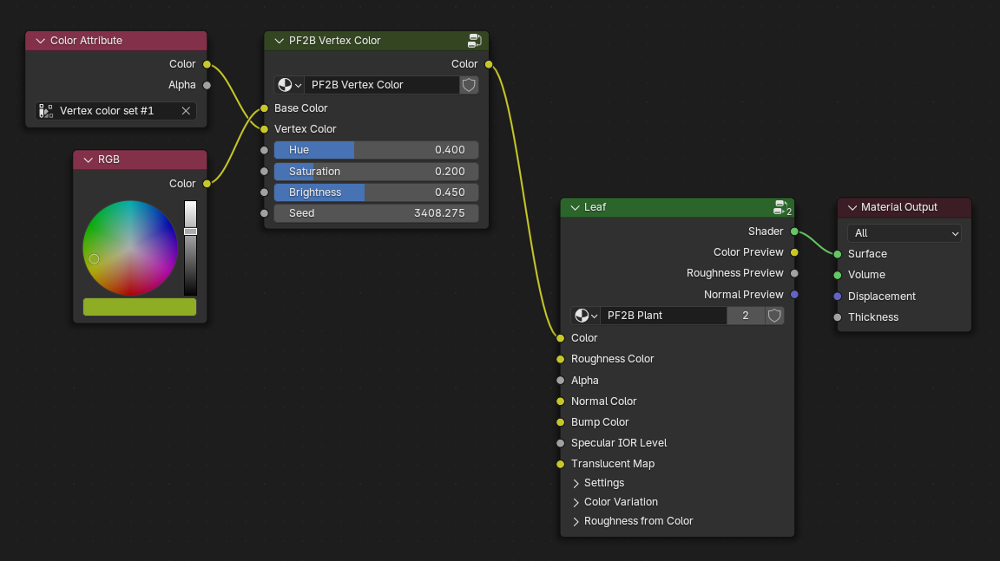{ .img-box .on-glb data-description="Example vertex color node setup" }
        - **Add Vertex Color Node Groups**: Adds node groups to assist with color randomization based on Vertex Colors.
        - **Smart Vertex Identification**: Enable smarter vertex color identification by detecting meaningful (non-uniform) vertex colors. When disabled, a simpler algorithm checks for any use of vertex colors, which may include single-color meshes.

!!! info2  "Tips"
    - You can reset the settings to default by clicking on :blender_icon_recover_last: in the top right corner.
    -  Remember that you can always edit these settings for the plants after import by going to the [Post Processing](post_processing.md) panel.

!!! info2 "Note"
    As you might have noticed, the roughness slider is not available here. This is because the value is imported from PlantFactory and should not be set manually during import. However, you can modify it after import via the [Post Processing](post_processing.md) panel if needed.

    Keep in mind that this static roughness value will be overridden if a roughness texture is used or if the "Roughness from Color" option is enabled.

## Settings Explained with Examples

### Color Variation Random Per Leaf/Flower/Fruit

!!! info2 ""
    Applies subtle hue variations to each **Leaf/Flower/Fruit** using random colors per geometry island, enhancing natural diversity.

As seen here, it is first set to the maximum value of **1.0**, where clear color variations appear on the leaf. In the next example, it is set to **0**, ensuring no color variation is applied and only the raw color from the leaf texture is used for the color.

[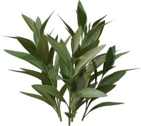](../images/plants/material/color-variation-by-island_1.webp){ .glightbox data-description="Color variation set to 1.0" }
[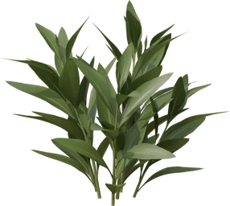](../images/plants/material/color-variation-by-island_0.webp){ .glightbox data-description="Color variation set to 0.0" }

This setting is available for **leaf**, **flower**, and **fruit** materials. The default value is set approximately in the middle to provide subtle variation, but it's worth experimenting to find the best setting for your case.

---

### Wetness

!!! info2 ""
    The Wetness parameter simulates the effect of moisture on the stalk surface by reducing roughness. As wetness increases, the surface becomes smoother and glossier.

The first example shows the wetness parameter set to **1.0** for a fully wet leaf, while the second example has it set to the minimum for a dry leaf. This setting is available for **leaf**, **stalk**, **flower**, and **fruit** materials.

!!! warning ""
    Please note that the wetness is set at a high value just to demonstrate the effect and may not represent the ideal setting for every situation. It's worth experimenting to find the best setting for your case.

=== "Wetness 1.0"
    <video width="100%" loop muted controls>
        <source src="../../videos/material-example_wetness_1.mp4" type="video/mp4">
        Your browser does not support the video tag.
    </video>

=== "Wetness 0.0"
    <video width="100%" loop muted controls>
        <source src="../../videos/material-example_wetness_0.mp4" type="video/mp4">
        Your browser does not support the video tag.
    </video>

---

### Wetness affected by Normal

!!! info2 ""
    Determines whether the wetness effect is influenced by the surface orientation. When enabled, the shader adjusts the roughness based on the surface's normal, applying the effect primarily to top-facing surfaces (along the positive Z-axis). When disabled, the wetness effect is applied uniformly across all surfaces regardless of their orientation.

In these videos, you’ll see examples of how the roughness of a leaf is influenced by its orientation when the `Wetness Affected by Normal` setting is enabled. As in real life, a more vertical leaf accumulates less water on its surface. By default, this setting is enabled for leaves, but it's worth experimenting to find the best setting for your case.

=== "Roughness Preview"
    This video focuses solely on the roughness texture of the leaf to showcase how it changes with varying wetness levels. The brighter areas of the leaf indicate a rougher texture, while the darker areas represent higher wetness, resulting in a smoother, glossier appearance.

    <video width="100%" loop muted controls>
        <source src="../../videos/material-example_wetness-affected-by-normal_roughness.mp4" type="video/mp4">
        Your browser does not support the video tag.
    </video>

=== "Full Shader Preview"
    This video demonstrates the leaf with its complete texture, illustrating how wetness subtly affects its appearance. While the effect may be difficult to discern in the video, it contributes to the overall realism when applied to a full plant with multiple leaves.

    !!! warning ""
        Please note that the wetness is set at a high value just to demonstrate the effect and may not represent the ideal setting for every situation.

    <video width="100%" loop muted controls>
        <source src="../../videos/material-example_wetness-affected-by-normal.mp4" type="video/mp4">
        Your browser does not support the video tag.
    </video>

---

### Roughness from Color

!!! info2 ""
    Generates a Roughness map from the Color texture, breaking the uniform roughness. Since not all PlantFactory assets do not include dedicated Roughness maps and have a static value set, this feature provides an effective solution.

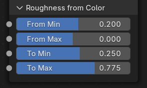{ .img-box align=right }

**Adjusting Roughness**

To adjust the roughness of a specific material:

1. Open the material in the `Shader Editor`.
2. Locate the Shader, and find the `Roughness from Color` section at the bottom.
3. Make adjustments until the material looks right to you or fits your use case, as there are no strict rules.

**Previewing Roughness**

If it's hard to see the effects of the roughness adjustments:

- Temporarily connect to the "Roughness Preview" output, as described in the [shader previews](#previews) section. In this view, you will see a raw output of the roughness channel, where pure white color indicates full roughness (resulting in a matte finish), while darker shades indicate less roughness.

**Example**

<video width="42%" loop muted controls style="float:left; margin: 0 1em 1em 0;">
    <source src="../../videos/material-example_roughness-from-color.mp4" type="video/mp4">
    Your browser does not support the video tag.
</video>

Here is a demonstration showcasing the preview of roughness and how to adjust the values. It's straightforward to modify the settings to achieve the desired look, whether you want a fully inverted roughness map to make certain areas of the material glossy or to emphasize details like the veins in the leaf.

---

### Color Variation By Location

!!! info2 ""
    Introduces subtle hue variations based on the location of the plant, enhancing realism and reducing uniformity, especially when multiple plants of the same species are nearby.

Below is a video demonstrating the effect as a plant moves, showcasing changes in hue and brightness. While these changes may be subtle in the video, they significantly enhance the visual diversity of closely situated plants.

<video loop muted controls>
    <source src="../../videos/material-example_color-variation-by-location.mp4" type="video/mp4">
    Your browser does not support the video tag.
</video>

---

### Use 'add shader'

!!! info2 ""
    Use a Add Shader node to combine translucency with the main shader, instead of using a standard Mix Shader. This approach can provide more artistic control by directly adding light contributions from both shaders. However, it may sacrifice physical accuracy and break energy conservation, potentially resulting in unrealistic brightness or lighting behavior.

Below is a gallery showcasing comparisons between the **Mix Shader** and **Add Shader**. Notice how, in the front-facing examples, the **Mix Shader** absorbs more light as translucency increases, creating a more realistic effect, while the **Add Shader** does the opposite, making the surface appear brighter.

By default, **PF2B** uses a **Mix Shader** with translucency set to **0.3**, striking a good balance for realism. However, feel free to experiment, depending on your lighting conditions, using an **Add Shader** may provide more visually striking results that better suit your use case.

=== "Mix Shader"
    [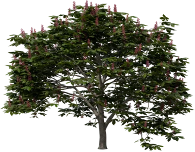](../images/plants/material/shaders/overview/mix-shader_translucency0.3.webp){ .glightbox data-description="mix-shader translucency 0.3" }

=== "Add Shader"
    [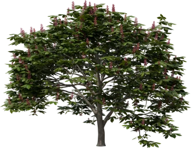](../images/plants/material/shaders/overview/add-shader_translucency0.3.webp){ .glightbox data-description="add-shader translucency 0.3" }

<h5>Front Angle</h5>

=== "Mix Shader"
    | Translucency 0.0 | Translucency 0.3 | Translucency 0.5 |
    |-----------------|-----------------|-----------------|
    | { .glightbox  data-description="mix-shader translucency 0.0" } | [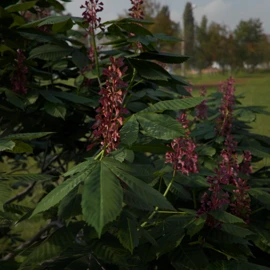](../images/plants/material/shaders/front/mix-shader_translucency0.3.webp){ .glightbox data-description="mix-shader translucency 0.3" } | [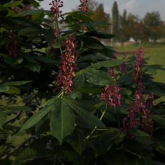](../images/plants/material/shaders/front/mix-shader_translucency0.5.webp){ .glightbox data-description="mix-shader translucency 0.5" } |

=== "Add Shader"
    | Translucency 0.0 | Translucency 0.3 | Translucency 0.5 |
    |-----------------|-----------------|-----------------|
    | [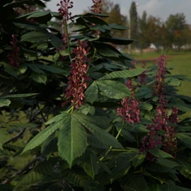](../images/plants/material/shaders/front/add-shader_translucency0.0.webp){ .glightbox data-description="add-shader translucency 0.0" } | { .glightbox data-description="add-shader translucency 0.3" } | { .glightbox data-description="add-shader translucency 0.5" } |

=== "Mix Shader (no-bg)"
    | Translucency 0.0 | Translucency 0.3 | Translucency 0.5 |
    |-----------------|-----------------|-----------------|
    | [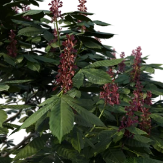](../images/plants/material/shaders/front/mix-shader_translucency0.0_no-bg.webp){ .glightbox data-description="mix-shader translucency 0.0 (no background)" } | [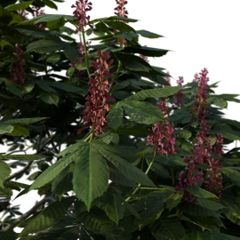](../images/plants/material/shaders/front/mix-shader_translucency0.3_no-bg.webp){ .glightbox data-description="mix-shader translucency 0.3 (no background)" } | [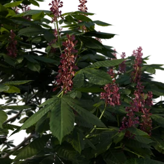](../images/plants/material/shaders/front/mix-shader_translucency0.5_no-bg.webp){ .glightbox data-description="mix-shader translucency 0.5 (no background)" } |

=== "Add Shader (no-bg)"
    | Translucency 0.0 | Translucency 0.3 | Translucency 0.5 |
    |-----------------|-----------------|-----------------|
    | [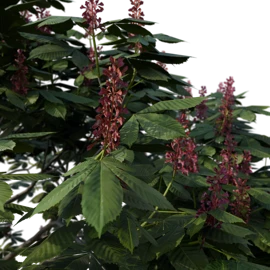](../images/plants/material/shaders/front/add-shader_translucency0.0_no-bg.webp){ .glightbox data-description="add-shader translucency 0.0 (no background)" } | [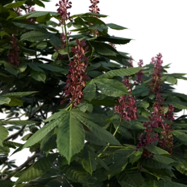](../images/plants/material/shaders/front/add-shader_translucency0.3_no-bg.webp){ .glightbox data-description="add-shader translucency 0.3 (no background)" } | [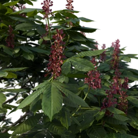](../images/plants/material/shaders/front/add-shader_translucency0.5_no-bg.webp){ .glightbox data-description="add-shader translucency 0.5 (no background)" } |

<!-- /compact class -->

<h5>Back Angle</h5>

=== "Mix Shader"
    | Translucency 0.0 | Translucency 0.3 | Translucency 0.5 |
    |-----------------|-----------------|-----------------|
    | [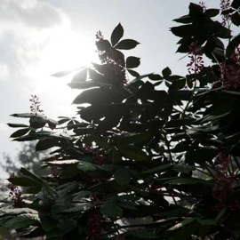](../images/plants/material/shaders/back/mix-shader_translucency0.0.webp){ .glightbox data-description="mix-shader translucency 0.0" } | { .glightbox data-description="mix-shader translucency 0.3" } | { .glightbox data-description="mix-shader translucency 0.5" } |

=== "Add Shader"
    | Translucency 0.0 | Translucency 0.3 | Translucency 0.5 |
    |-----------------|-----------------|-----------------|
    | [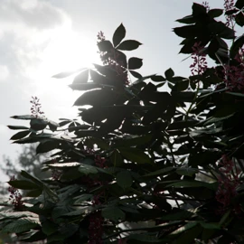](../images/plants/material/shaders/back/add-shader_translucency0.0.webp){ .glightbox data-description="add-shader translucency 0.0" } | [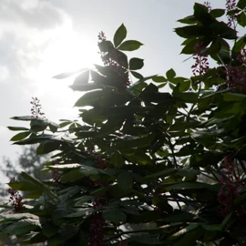](../images/plants/material/shaders/back/add-shader_translucency0.3.webp){ .glightbox data-description="add-shader translucency 0.3" } | [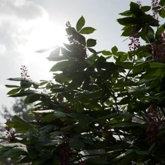](../images/plants/material/shaders/back/add-shader_translucency0.5.webp){ .glightbox data-description="add-shader translucency 0.5" } |

=== "Mix Shader (no-bg)"
    | Translucency 0.0 | Translucency 0.3 | Translucency 0.5 |
    |-----------------|-----------------|-----------------|
    | [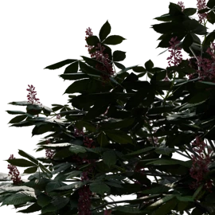](../images/plants/material/shaders/back/mix-shader_translucency0.0_no-bg.webp){ .glightbox data-description="mix-shader translucency 0.0 (no background)" } | [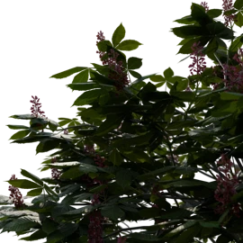](../images/plants/material/shaders/back/mix-shader_translucency0.3_no-bg.webp){ .glightbox data-description="mix-shader translucency 0.3 (no background)" } | { .glightbox data-description="mix-shader translucency 0.5 (no background)" } |

=== "Add Shader (no-bg)"
    | Translucency 0.0 | Translucency 0.3 | Translucency 0.5 |
    |-----------------|-----------------|-----------------|
    | { .glightbox data-description="add-shader translucency 0.0 (no background)" } | [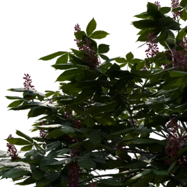](../images/plants/material/shaders/back/add-shader_translucency0.3_no-bg.webp){ .glightbox data-description="add-shader translucency 0.3 (no background)" } | [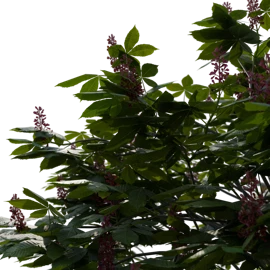](../images/plants/material/shaders/back/add-shader_translucency0.5_no-bg.webp){ .glightbox data-description="add-shader translucency 0.5 (no background)" } |

<!-- /compact class -->

## Shaders

The materials use carefully crafted custom Node Groups that are highly customizable.

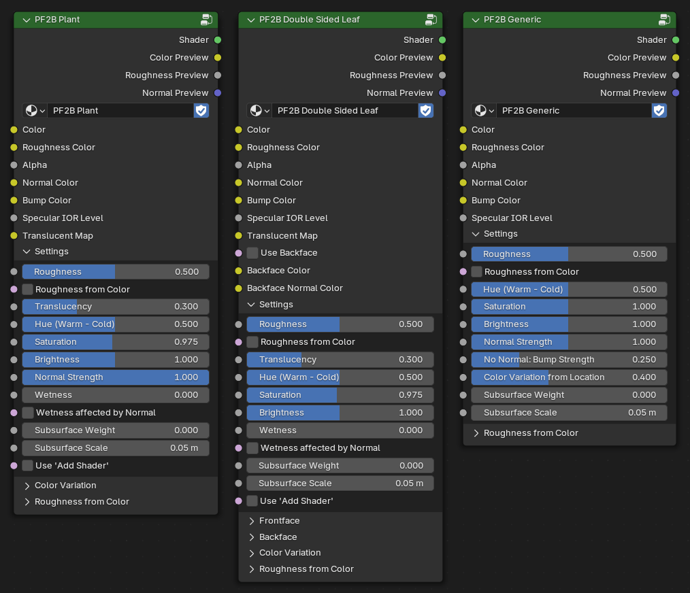{ .img-box .on-glb width=50% }

#### Logic

The shader nodes has logic built in to handle various different scenarios with various configurations or missing textures automatically.

??? abstract "Logic Examples"
    - Roughness handling:
        - If `Roughness texture` is connected it will be used.
        - If no `Roughness texture` is connected:
            - A dynamic roughness map is created from the color texture if the '**Roughness from Color**' option is enabled.
            - A static roughness is used from the 'Roughness' slider value if the '**Roughness from Color**' option is not enabled.
    - Translucency handling:
        - If `Translucency texture` is connected it will be used.
        - If no `Translucency texture` is connected the static value from the 'Translucency' slider will be used.
    - Normal handling:
        - If a `Normal texture` is connected it will be used.
        - If no `Normal texture` is connected it will use:
            - `Bump texture` if connected.
            - If no `Bump texture` if connected it will derive a bump map from the color texture.

    - Double sided leaf shader:
        - If nothing is connected into "Backface Color" it will use the frontface "Color" texture on the backside.

        - Roughness handling:
            - The `Roughness texture` input is used for both the front & backface and follows the same logic above with either dynamic/static value will be used if no roughness texture is connected.

#### Previews

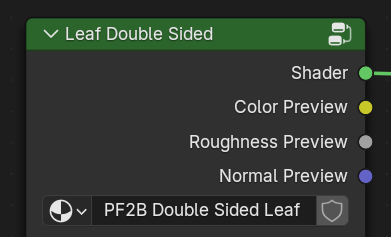{ .img-box align=right}

Each shader features multiple outputs designed to help you efficiently build and preview your materials. At the top of each shader, you'll find dedicated outputs for Color, Roughness, and Normals, allowing you to view each channel separately.
!!! info2 ""
    Preview these channels by holding **Shift + Ctrl** and left-clicking on the desired output. Note that this functionality requires the built-in '[Node Wrangler](https://docs.blender.org/manual/en/latest/addons/node/node_wrangler.html)' addon to be enabled.