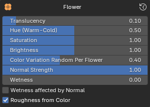
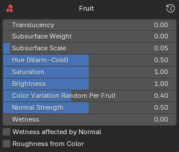

{ .img-box align=right }

These settings allows you to configure the default settings that are used when importing the plants. Just click on any of the tabs to maximize them to see the settings as seen below.

=== "Leaf"
    { .img-box align=left }

    - Translucency
    - Hue
    - Saturation
    - Brightness
    - Color Variation Random Per Leaf
    - Normal Strength
    - Wetness
    - Wetness affected by Normal
    - Roughness from Color

=== "Stalk"
    { .img-box align=left }

    - Translucency
    - Subsurface Weight
    - Subsurface Scale
    - Hue
    - Saturation
    - Brightness
    - Normal Strength
    - Wetness
    - Wetness affected by Normal
    - Roughness from Color

=== "Flower"
    { .img-box align=left }

    - Translucency
    - Hue
    - Saturation
    - Brightness
    - Color Variation Random Per Flower
    - Normal Strength
    - Wetness
    - Wetness affected by Normal
    - Roughness from Color

=== "Fruit"
    { .img-box align=left }

    - Translucency
    - Subsurface Weight
    - Subsurface Scale
    - Hue
    - Saturation
    - Brightness
    - Color Variation Random Per Fruit
    - Normal Strength
    - Wetness
    - Wetness affected by Normal
    - Roughness from Color

=== "Bark"
    { .img-box align=left }

    - Hue
    - Saturation
    - Brightness
    - Normal Strength
    - Wetness
    - Wetness affected by Normal
    - Roughness from Color

=== "General Settings"
    These settings affect all material types.

    - Color Variation By Location:
    - Import Translucency Map
    - User 'Add Shader'
    - Handle Vertex Colors
        - Add Vertex Color Node Groups
        - Smart Vertex Identification

!!! info2  "Tip"
    - You can reset the settings to default by clicking on :blender_icon_recover_last: in the top right corner.
    -  Remember that you can always edit these settings for the plants after import by going to the [Post Processing](post_processing.md) panel.

PF2B will automatically attempt to set up additional textures from PlantFactory that are not included in the `.fbx` file (the exchange format between PlantFactory and Blender) but are found in the textures folder. This includes:

- Back Textures (Base Color & Normal)
- Translucency Textures

<!--
!!! warning  "Disclaimer"
    **NOTE that PF2B does not quarantee a 100% support for all plants.**

    PF2B is mainly focused on supporting the "PlantCatalog" library and your custom plants.

    While importing plants will work for 99% of cases there might be issues with the material & texture setup in some cases. PF2B tries to connect all found textures but unfortunately some plants might not follow correct naming standards that causes PF2B to miss them.

    So with that said the `PlantCatalog` library (which is the bulk of the Assets if you have downloaded all plants distributed by Bentley) works great overall and I would estimate around 95% of these plants should work without any manual intervention.

    The `PlantFactory` library (that are the original plants that come built in) has a much lower

    NOTE that this is dependent that the textures are named correctly inside PlantFactory and should include correct keywords for identification.

    - Back Textures: the word "back" as well as the corresponding type such as "color" or "normal" for back textures or "Translucency"
    - Translucency Textures

    PF2B tries to connect all found textures but unfortunately some plants might not follow correct naming standards that causes PF2B to miss these back textures. If you think your plant has some missing textures you can use the [Use a custom Export path](material_settings.md) to export your plants to a custom location for inspection.
 -->

## Shaders

The materials use carefully crafted custom Node Groups that are highly customizable.

{ .img-box align=left .on-glb  }