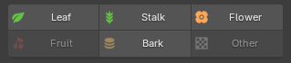
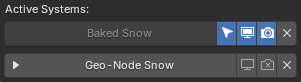
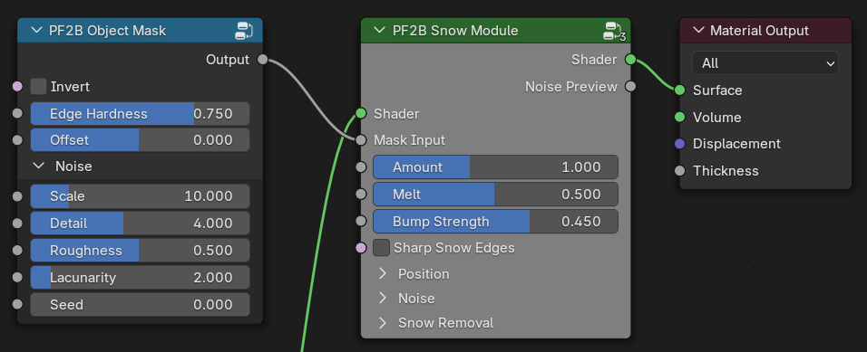

{ .img-box  align=right }

This panel allows you to adjust the visual appearance of already imported plants by modifying their materials or by applying additional effects, such as snow.

## Material Editing

{ .img-box  align=right }

This section provides a faster and more centralized way to adjust specific material settings compared to editing materials individually. Instead of modifying each material slot manually, changes are applied to all material slots that share the same material type.

For example, an imported plant may contain multiple leaf materials. Editing the `Leaf` material settings in the `Post Processing` panel will update all of those leaf materials simultaneously.

Materials are grouped into the following categories: `Leaf`, `Stalk`, `Flower`, `Fruit`, `Bark`, and `Other`. The `Other` category acts as a fallback for materials that do not match any of the predefined types. Only material types that are present on the selected plant can be edited. As shown in the screenshot, unavailable categories such as `Fruit` and `Other` are displayed as disabled.

### Demonstration {#material-editing-demonstration}

<video loop muted controls>
    <source src="../../videos/postprocessing_material.mp4" type="video/mp4">
    Your browser does not support the video tag.
</video>

### Instructions {#material-editing-instructions}

Select a plant in the `3D Viewport`, and the detected material types will be displayed, as shown below. Clicking on a material type, such as "Leaf," opens a popup where you can edit its material properties. You can also hold Shift when clicking to quickly see which materials use this type.

{ .img-box }

{ .img-box align=left }

The checkboxes to the left of each property allow you to enable or disable updates for that specific value when applying changes. For example, if you only want to update **Translucency**, you can uncheck all other boxes and click **OK** to apply only that change.

For details about all material settings, see [Material Settings](../workflow/material_settings.md#settings) documentation."

!!! warning "Note"
    Changes made with the sliders are not applied in real-time. They are applied to all affected materials at once when you click OK

!!! info2 "Tips"
    - Hold Shift when clicking on the material types to quickly see which materials use this type.

        { .img-box }

    - Clicking on the plant name opens a popup with [plant-details](utilities.md#plant-details) for quickly access.

## Snow

### Overview {#snow-overview}

The **Snow** feature allows you to add winter effects such as snow accumulation and frost to existing assets. PF2B provides multiple approaches, including geometry-based and shader-based solutions, allowing you to balance visual fidelity and performance depending on the use case.

While optimized for PF2B plants, these systems can also be applied to non-PF2B assets.

=== "Geometry Node Snow"
    > **Best for:** Hero assets, foreground objects, close-up shots.

    This approach adds **actual mesh geometry** to simulate snow buildup, providing detailed results but with a higher performance cost.

    In addition to the geometry cost, the **snow material used by this setup** can significantly affect performance. The material’s **Detailed** mode includes:

    - Subsurface scattering
    - Displacement

    **Snow Material Recommendations:**

    - Use **Detailed** mode for hero or foreground assets
    - Use **Simple** mode for background vegetation

    ??? info2 "More details"
        The Geometry Nodes setup used by this option is shown below. It is responsible for generating the snow geometry and controlling how it is distributed across the mesh:

        { .img-box .on-glb data-description="Geometry-Node nodes" }

        The nodes reference a dedicated snow material, which is applied to the generated geometry. This material can be replaced or edited if needed:

        { .img-box }

=== "Snow Shader"
    > **Best for:** Midground and background assets.

    The **Snow Shader Module** is a **shader-based effect** that uses surface orientation (Z-normals) to determine snow placement. It does not add geometry and is therefore much more efficient.

    The snow shader can be applied to bark materials and selectively enabled for:

    - Trunks
    - Branches
    - Twigs

    And as a recomendation only apply to only materials that are visible in the scene, so for example applying it on twigs might not always be useful.

    <!-- so its most useful on materials such as: tree-trunks, branches or other objects, not recomended to be used with leaf as might be computasionally high for that usecase. -->

    ??? info2 "More details"
        This is a Pass-thru Shader module that is inserted between your current main shader and the material output node. The module insertion into your material handled automatically by PF2B, but you can also access this and the other snow related nodes via the right-click menu in the shader editor if you want to add them to other things.

        { .img-box .on-glb data-description="Snow Module example" }

    !!! warning "Eevee Performance"
        On highly detailed meshes, this shader can be slow in Eevee, especially when increasing the **Noise Detail** setting in the Snow Shader Module.
         Always test performance and consider **Geometry Node Snow** as an alternative for hero assets.

=== "Frost Shader"
    > **Best for:** Subtle surface detail, foliage, and large scenes where performance is critical.

    The **Frost Shader Module** is a **lightweight shader effect** that adds a subtle icy or frosted surface appearance. It is designed to **complement** either snow approach, but can also be used on its own.

    Frost can be applied independently to:

    - Leaf materials
    - Bark materials

    While intended for subtle frost, increasing its strength allows it to function as a lightweight snow alternative, particularly for foliage.

    ??? info2 "More details"
        This is a Pass-thru Color module that is inserted between the main Diffuse/Albedo color-texture and your main shader. The module insertion into your material handled automatically by PF2B, but you can also access this and the other snow related nodes via the right-click menu in the shader editor if you want to add them to other things.

        { .img-box .on-glb data-description="Frost Module example" }

#### Usage Guidelines {#snow-usage-guidelines}

!!! info2 ""
    A recommended setup is:

    - **Geometry Node Snow** OR **Snow Shader**
    - Optional **Frost Module** layered on top

    For an ultra-lightweight approach, use **only the Frost Module** with increased strength to suggest snow on leaves.

!!! warning ""
    **Redundant Snow Effects**

    In most cases, applying both **Geometry Node Snow** and the **Snow Shader** to the same object is unnecessary, as both represent primary snow coverage and increase cost with limited visual benefit.
    However, in specific situations, such as hero plants or close-up shots, layering them can be useful to add extra detail or artistic control.

#### Examples {#snow-examples}

Below are several examples demonstrating how different effect stacks can be combined. The effects are highly flexible and can be adjusted to place snow precisely where needed. In some examples, snow appears on areas such as roots; this can be easily masked out if required but has been intentionally left visible for demonstration purposes. Depending on a plant’s structure, certain effect stacks and settings may be better suited to specific plant types than others.

=== "Tree Trunk"
    

    === "Combined"
        

            
        

        Geometry-Node + Bark Snow + Bark Frost

    === "Geometry-Node"
        

            
        

    === "Bark Snow"
        

            
        

    === "Bark Frost"
        

            
        

    === "No Snow"
        

            
        

    

=== "Spruce"
    

    === "Combined"
        

            
        

        Geometry-Node + Leaf Frost

    === "Geometry-Node"
        

            
        

    === "Leaf Frost"
        

            
        

    === "No Snow"
        

            
        

    

=== "Broadleaf Tree"
    

    === "Combined"
        

            
        

        Geometry-Node + Bark Snow + Bark Frost + Leaf Frost

    === "Geometry-Node"
        

            
        

    === "Bark Snow"
        

            
        

    === "Bark Frost"
        

            
        

    === "Leaf Frost"
        

            
        

    === "No Snow"
        

            
        

    

=== "Bush"
    Note: All 360° images are lit using an HDRI setup. In this particular image, the absence of a mesh ground plane makes unobstructed light from below more apparent, resulting in illumination beneath the leaves that does not represent a real-world lighting scenario.

    === "Combined"
        

            
        

        Geometry-Node + Leaf Frost

    === "Geometry-Node"
        

            
        

    === "Leaf Frost"
        

            
        

    === "No Snow"
        

            
        

    

=== "Suzanne"
    

    === "Combined"
        

        
        

        Geometry-Node + Snow Shader

    === "Geometry-Node"
        

            
        

    === "Snow Shader"
        

            
        

    === "No Snow"
        

            
        

    

### Instructions {#snow-instructions}

#### Adding a system {#snow-instructions-adding-a-system}

{ .img-box }

When adding snow you can decide what systems to activate

=== "PF2B Plants"
    { .img-box align=left }

    Some of the systems have additional settings available under the :blender_icon_tool_settings: icon:

    

    === "Geometry Node"
        - **Snow** :blender_icon_tool_settings::
            - **Start Hidden**: Makes the snow system hidden in the viewport when added. Useful for improving viewport performance, as the snow geometry will not be generated until it is shown.
            - **Use Custom Material**: Lets you select a custom material to be used.

    === "Leaf Materials"
        - **Frost**: No settings. Applied to all leaf materials.

    === "Bark Materials"
        - **Snow** :blender_icon_tool_settings::
            - **Add to**: Choose one or more bark components to apply the shader to:
                - **Trunk**
                - **Branches**
                - **Twigs**: *Note: Only recommended if twigs are large enough for snow buildup to be visible; otherwise this may add unnecessary computation*.
            - **Material Settings**: *These set the initial values and can be adjusted later*
                - **Noise Detail**: Controls the level of detail in the snow noise used by the shader. Higher values produce finer detail but increase render time.
                    - **Low**
                    - **Medium**
                    - **High**
                - **Use Hard Edge On Snow**: Increases contrast in the snow mask to create harder, more defined snow edges and breakup. When disabled, snow blends more softly into the underlying material.
        - **Frost** :blender_icon_tool_settings::
            - **Add To**: Applied to all bark materials.
            - **Material Settings**: *These set the initial values and can be adjusted later*
                - **Add Crevice Snow**: Controls how much snow settles into dark, recessed areas of the material, such as cracks and grooves in bark. Higher values push snow into deeper crevices while keeping raised areas cleaner. This slider also slightly softens the overall frost opacity, helping the effect feel more natural on bark and other rough organic surfaces.

    

=== "Non-PF2B Assets"
    { .img-box align=left }

    Some of the systems have additional settings available under the :blender_icon_tool_settings: icon:

    

    === "Geometry Node"
        - **Snow** :blender_icon_tool_settings::
            - **Start Hidden**: Makes the snow system hidden in the viewport when added. Useful for improving viewport performance, as the snow geometry will not be generated until it is shown.
            - **Use Custom Material**: Lets you select a custom material to be used.

    === "Materials - Snow"
        - **Snow** :blender_icon_tool_settings::
            - **Add to**: Lets you decide where to apply the shader. For non-PF2B assets, material types cannot be detected automatically, so snow effects must be assigned manually.
                - **All Materials**
                - **First Slot**
                - **Last Slot**
                - **Name Match / Name Exclude**: Apply snow shader to materials matching (Match) or excluding (Exclude) a name pattern. Both options share these settings:
                    - **Filter**: String to match/exclude from material names.
                    - **Case Sensitive**: Make name filtering case-sensitive.
                    - **Use Regex**: Treat filter string as a regex pattern. Examples:
                        - `^bark`: Starts with bark.
                        - `leaf$`: Ends with leaf.
                        - `bark|wood`: Contains bark OR wood.
            - **Material Settings**: *These set the initial values and can be adjusted later*
                - **Noise Detail**: Controls the level of detail in the snow noise used by the shader. Higher values produce finer detail but increase render time.
                    - **Low**
                    - **Medium**
                    - **High**
                - **Use Hard Edge On Snow**: Increases contrast in the snow mask to create harder, more defined snow edges and breakup. When disabled, snow blends more softly into the underlying material.

    === "Materials - Frost"
        - **Frost** :blender_icon_tool_settings::
            - **Add to**: Lets you decide where to apply the shader. For non-PF2B assets, material types cannot be detected automatically, so snow effects must be assigned manually.
                - **All Materials**
                - **First Slot**
                - **Last Slot**
                - **Name Match / Name Exclude**: Apply frost shader to materials matching (Match) or excluding (Exclude) a name pattern. Both options share these settings:
                    - **Filter**: String to match/exclude from material names.
                    - **Case Sensitive**: Make name filtering case-sensitive.
                    - **Use Regex**: Treat filter string as a regex pattern. Examples:
                        - `^bark`: Starts with bark.
                        - `leaf$`: Ends with leaf.
                        - `bark|wood`: Contains bark OR wood.
            - **Material Settings**: *These set the initial values and can be adjusted later*
                - **Add Crevice Snow**: Controls how much snow settles into dark, recessed areas of the material, such as cracks and grooves in bark. Higher values push snow into deeper crevices while keeping raised areas cleaner. This slider also slightly softens the overall frost opacity, helping the effect feel more natural on bark and other rough organic surfaces. Not recommended for leaf or foliage materials. *This sets the initial setting and can be adjusted later*.

    

Added systems will be visible in the Snow panel. Clicking on each of the active systems presents different options depending on its type. Below are few examples of various snow systems enabled at the same time:

=== "PF2B Plants"
    *Example showing the maximum number of snow systems supported on PF2B plant assets.*
    { .img-box }
=== "Non-PF2B Assets"
    *Example showing the maximum number of snow systems supported on non-PF2B assets.*
    { .img-box }

#### Using Toggle Preview {#snow-instructions-using-toggle-preview}

The [Snow Shader](#snow-shader), [Frost Shader](#frost-shader), and [Shader Masking](#snow-shader-masking) each include a ':blender_icon_node_material: **Toggle Preview**' button. This allows you to preview the specific map you're editing to help adjust snow distribution.

Switch to **Rendered** or **Material Preview** viewport shading mode to see the result. See the example below:

<video loop muted controls>
    <source src="../../videos/snow_toggle-preview-example.mp4" type="video/mp4">
    Your browser does not support the video tag.
</video>

### Types {#snow-types}

#### Geometry-Node Snow

Clicking on the header maximizes the sub-panel and presents you with all of the settings for the geometry-node as well as access to edit the material assigned to it.

- **Panel buttons**:
    - :blender_icon_restrict_view_off:: Hide/Show modifier in the viewport.
    - :blender_icon_restrict_render_off:: Hide/Show modifier during render.
    - :octicons-x-12:: Remove the snow setup from the currently selected object.

{ .img-box align=left }

- **Menu inside the panel** :material-menu::
    - At the top the current version of the GeoNode Snow
    - **Presets**: Submenu with Snow Presets.
    - **User Presets**: Submenu with Snow Presets saved by the user.
    - **Save Preset**: Save the current parameters as a preset. Shows a popup with further options.
    - **Copy**: Copy Snow parameters. Useful when applying the same settings across multiple plants.
    - **Paste**: Paste Snow parameters. Useful when applying the same settings across multiple plants.
    - **Reset**: Reset all geometry-node snow settings. Does not reset the material setting.
    - **Bake**: Bake the snow Geometry Nodes modifier into real geometry. See the [Baking](#baking-geometry-node-snow-baking) section for details.

##### Settings {#geometry-node-snow-settings}

=== "General"
    - **Amount**: Controls the overall amount of snow applied to the object.
    - **Thickness**: Controls the depth of the snow layer.
    - **Thickness Mode**: Determines how snow thickness is distributed across the surface.
        - **Adaptive**: Adjusts snow thickness based on surface orientation. Surfaces facing upward receive thicker snow, while vertical and downward-facing surfaces receive less.
        - **Static**: Applies a uniform snow thickness across all surfaces, regardless of orientation.
    - **Voxel Size**: Controls the overall resolution of the snow shape. Smaller values create more detailed snow, while larger values produce a smoother, chunkier look. Very small values may introduce uneven or lumpy surfaces and often benefit from additional smoothing.
    - **Smoothing**: Smooths the snow shape by softening sharp or uneven areas. Higher values apply more smoothing passes, helping clean up noise and artifacts, especially when using a small Voxel Size.
    - **Material**: Selects the material assigned to the generated snow geometry.
    - **Seed**: Controls the random variation used across the snow system.
    - **Preview Mode**: Displays only the generated snow geometry and temporarily hides the original object mesh. This mode is intended for inspection and optimization. By isolating the snow mesh, it becomes much easier to evaluate mesh density, surface continuity, and the effect of optimization settings such as Smart Merge and Remove Loose Snow. Tip: Enable Wireframe view in the viewport to clearly inspect topology and vertex density while adjusting optimization parameters.

=== "Accumulation"
    Simulates snow falling from above using raycasting to detect exposed surfaces. Snow will mainly appear on surfaces that are exposed from the top, while sheltered or covered areas receive less or no snow. When disabled, snow is applied uniformly without surface detection.

    - **Enable**: Enables or disables this panel and its controls.
    - **Snowfall Spread**: Adds positional variation to the snowfall origin, breaking up uniform accumulation patterns and creating a more natural distribution.
    - **Use Wind**: Adds directional wind that increases snow accumulation on one side of the object based on wind direction.
        - **Wind Direction**: Direction wind blows toward. Snow accumulates on the OPPOSITE side (e.g., North wind = accumulation on South side).
            - **North**
            - **North East**
            - **East**
            - **South East**
            - **South**
            - **South West**
            - **West**
            - **North West**
        - **Coverage Reduction**: Reduces overall snow coverage by probabilistically discarding snow after it lands. Higher values result in sparser accumulation.
        - **Wind Turbulence**: Adds variation to the wind influence, creating more irregular and less directional snow deposition.
        - **Snow Fall Angle**: Controls how slanted the snowfall is when wind is enabled. Lower values produce gently drifting snow, while higher values cause snow to arrive at steeper angles and accumulate more on wind-facing surfaces. Internally, this modifies the raycast direction used for snow placement.
            - **Very Low**
            - **Low**
            - **Medium**
            - **High**
            - **Very High**
            - **Extreme**
    - **Snow Buildup**: Enables layered snow accumulation on upward-facing surfaces. When enabled, additional snow layers are built up on top-facing areas to simulate natural accumulation over time.
        - **Buildup Layers**: Controls how many accumulation layers are added to the snow. Higher values increase snow height and volume by stacking additional buildup layers.
        - **Buildup Layer Height**: Controls the vertical height contribution of each buildup layer.
        - **Buildup Layer Shift**: Adds horizontal variation between buildup layers to break uniform shapes. Positive values push layers outward, negative values pull them inward, helping avoid overly symmetrical or artificial snow profiles.
        - **Buildup Erosion**: Controls how much the edges of the snow buildup are eroded. Higher values break up sharp edges and reduce buildup near boundaries for a more weathered appearance.
        - **Buildup Erosion Scale**: Controls the scale of the noise used to erode the snow buildup. Lower values create broad erosion patterns, while higher values produce finer, more detailed breakup.
    - **Visualize Snow Direction**: Displays a viewport guide indicating the direction from which snow is falling, shown as a wireframe indicator with arrows above the object, and does not affect the final geometry or materials.

=== "Distribution"
    - **Melt**: Gradually reduces snow coverage based on exposure, simulating a general loss of snow.
    - **Melt Outer Threshold**: Controls how quickly snow is reduced near exposed edges or outer regions. Higher values increase the affected area.
    - **Prefer Top Surfaces**: Biases snow toward upward-facing surfaces. Higher values concentrate snow on tops of objects while reducing coverage on undersides and steep faces.
    - **Surface Offset**: Moves the snow slightly away from the surface. Use this if the snow appears embedded inside leaves or geometry, helping it sit more naturally on top.
    - **Remove Loose Snow**: Removes small, disconnected snow mesh islands. This setting cleans up isolated or floating pieces of snow that are not meaningfully connected to the main snow surface. Increasing the value removes progressively larger mesh islands.

=== "Surface Variation"
    Adds breakup and irregularity to the snow surface.

    - **Enable**: Enables or disables this panel and its controls.
    - **Surface Variation Strength**: Controls the intensity of breakup and irregularity applied to the snow surface. Higher values exaggerate bumps, ridges, and unevenness, while lower values keep the snow smoother.
    - **Noise Scale**: Scale of the base noise octave.
    - **Min Thickness**: Attempts to preserve a minimum snow thickness.
    - **Expansion**: Controls how much the noise displaces the snow surface.

=== "Masking"
    Explicitly removes snow using an object or height-based masking. This panel provides direct artistic control over where snow is cleared.

    - **Enable**: Enables or disables this panel and its controls.
    - **Masking Mode**: Defines which masking methods are used to remove snow.
        - **Mask & Z-Threshold**: Combines object-based masking with height-based removal. Snow is cleared both where the mask object influences the surface and where the Z-threshold condition is met.
        - **Mask Only**: Removes snow exclusively based on the mask object’s position and influence. The Z height is ignored. Use this mode when you want precise, object-driven control.
        - **Z-Threshold Only**: Removes snow based solely on height, independent of any mask object. Snow is cleared from the base upward according to the threshold value.
    - **Mask Object**: Object used to control where snow is removed. The selected object defines a spatial influence that clears snow within its range. An Empty is recommended for easy positioning and adjustment.
    - **Threshold**: Controls height-based snow removal along the Z axis. Snow is removed progressively from the base upward as this value increases. Lower values limit removal to lower areas, while higher values clear snow higher up the surface.
    - **Use Noise**: Adds natural variation to the snow removal. This breaks up hard edges and creates a more organic, uneven transition.
        - **Noise Scale**: Scale of the base noise octave.
        - **Noise Roughness**: Blend factor between an octave and its previous one. A value of zero corresponds to zero detail.

=== "Optimization"
    These controls optimize the snow system for performance by reducing mesh complexity and viewport shading cost.

    - **Enable**: Enables or disables this panel and its controls.
    - **Adaptivity**: Reduces polygon density in flatter areas of the snow. Higher values create a lighter, simpler mesh, while lower values preserve more detail.
    - **Smart Cleanup**: Enables an automatic optimization that reduces unnecessary geometry in areas where snow sits flush against underlying surfaces. The system targets regions that contribute minimally to the visible result, then processes these areas to reduce mesh density while preserving exposed and silhouette-critical details. This optimization significantly improves performance while maintaining visual quality in important areas.
        - **Smart Cleanup Mode**: Selects the method used to reduce geometry in targeted areas.
            - **Merge**: Combines nearby vertices within the cleanup threshold using a 'Merge by Distance' operation. This method maintains the snow as a continuous, unified mesh. Best for maintaining mesh continuity and when you need the snow to remain as a single, watertight object.
            - **Dissolve**: Removes geometry entirely from the targeted cleanup areas, cutting away hidden portions of the snow mesh. This method can achieve more aggressive optimization but results in a mesh with open edges where geometry has been removed. Best for maximum performance when mesh continuity at the bottom is not required.
        - **Smart Cleanup Threshold**: Controls how much of the snow surface is considered eligible for Smart Cleanup optimization. This parameter adjusts the size and sensitivity of targeted areas using a combination of surface orientation (Z-axis normals) and curvature to identify regions that are flatter, less visible, or more tightly pressed against underlying geometry. Higher values expand the affected area, allowing more of the snow to be simplified. Lower values restrict processing to only the most suitable regions. This setting affects both Merge and Dissolve modes. Tune this setting in tandem with Cleanup Distance while visually inspecting the snow.
        - **Smart Cleanup Merge Distance**: (Merge mode only) Controls how aggressively nearby vertices are merged during the Smart Merge process. This value defines the maximum distance within which vertices can be merged together. Larger values result in stronger simplification and fewer vertices, while smaller values preserve more detail. This setting should be adjusted together with 'Smart Cleanuo Threshold'. Use visual inspection of the snow surface to find a balance between performance and visual fidelity.
        - **Smart Cleanup Logic**: Selects the method used to analyze surface curvature and determine which areas of the snow mesh are optimized. Both modes aim to optimize snow geometry intelligently; the difference lies in how precisely curvature is evaluated. The Simple mode prioritizes compatibility and performance, while the Advanced mode prioritizes accuracy and visual quality. This option is only available in Blender 5.0 or newer.
    - **Global Merge**: Performs a final vertex merge across the entire snow mesh to reduce overall geometry. This happens after all targeted optimizations like Smart Merge. It affects the entire mesh uniformly, simplifying geometry while potentially softening fine details. Use this to further reduce polygon count after other optimizations have run.
        - **Global Merge Distance**: Controls the distance threshold for the global merge. Vertices closer than this value are merged together. Higher values simplify the mesh more aggressively, reducing geometry density but potentially softening details or introducing minor artifacts.
    - **Extra Viewport Optimization**: Applies additional viewport-only optimizations to the snow system to improve performance without affecting renders.
        - **Viewport Mode**: Selects a viewport-only optimization preset that controls how snow materials and geometry are simplified for performance.
            - **Material Only**: Applies viewport-only optimizations to the default PF2B snow material by forcing Simple mode, disabling displacement and subsurface scattering, and reducing noise detail, without modifying geometry.
            - **Geometry Merge**: Applies the default snow material optimizations and performs a medium-strength vertex merge to simplify the snow geometry in the viewport.
            - **Hidden (Snowflake Indicator)**: Hides the snow geometry in the viewport and displays a wireframe snowflake marker to indicate that the object has snow applied.

!!! info2 ""
    Settings available here might change / be updated in future versions as the geometry-node gets updated.

##### Material Settings {#geometry-node-snow-material-settings}

{ .img-box align=right }

This panel shows the material currently assigned to the geometry node and allows you to edit it directly from this panel. Its contents are context-based and depend on the selected material.

##### Masking {#geometry-node-snow-masking}

{ .img-box align=right }

In the **Masking** panel, you can use the :material-plus-circle: button to add a mask directly, so you don’t have to manually create the object. This creates an empty-type object and automatically parents it to the target object, allowing you to move and scale it to remove snow from your asset.

<video width="100%" loop autoplay muted controls>
    <source src="../../videos/snow_geometry-node-mask-example.mp4" type="video/mp4">
    Your browser does not support the video tag.
</video>

Once a mask has been added using this button, the following buttons will also appear:

- :blender_icon_file_refresh: **Refresh Object Data**: Useful for refreshing masks that are not updating in the viewport. Hold **Shift** to perform an extended refresh.
- :blender_icon_restrict_view_off: **Toggle Mask Visibility**: Hide or show the mask object itself in the viewport. This does not affect the masking itself.

##### Baking {#geometry-node-snow-baking}

Bake the Snow Geometry Nodes modifier into real geometry. You can either create a new, separate object containing the baked snow or apply the result directly to the current object.

!!! info2 ""
    Baking can significantly improve performance, especially when moving or transforming snow-covered objects, since the baked snow geometry is static.

=== "New Object"
    If the snow is baked to a new object, a new system will appear for the baked snow while the original Geometry Nodes system will be hidden. You can re-enable the original system at any time if further edits are required.

    { .img-box }

=== "Current Object"
    If the snow is baked into the original object, the Geometry Nodes modifier is applied permanently. The snow system can no longer be edited and will appear as shown below:

    { .img-box }

---

#### Snow Shader

The Snow Shader provides the same functionality for all supported assets, but its interface adapts based on the asset type:

- **PF2B Plants**: The shader automatically targets bark materials and is labeled as "Bark Snow".
- **Non-PF2B Assets**: The shader is labeled simply as "Snow Shader," and you must manually apply it to appropriate materials.

=== "PF2B Asset"
    { .img-box }
=== "Non-PF2B Asset"
    { .img-box }

- **Panel buttons**:
    - :blender_icon_node_material: **Toggle Preview**: Preview the noise map to help adjust snow distribution. Switch to **Rendered** or **Material Preview** view modes to see the result. See [Using Toggle Preview](#snow-instructions-using-toggle-preview) for details.
    - :material-eye: **Enable/Disable**: Fully enable or disable the snow effect in both the viewport and final render.
    - :octicons-x-12: **Remove**: Remove the snow setup from the currently selected object.

Clicking the module header expands the sub-panel and reveals the **Edit Material** and **[Add Mask](#snow-shader-masking)** buttons.

Example of editing the frost module for leaf materials:

{ .img-box align=left }

!!! abstract inline end "Snow node-group"
    { .img-box .on-glb data-description="Shader Snow: Node-group." }

##### Masking {#snow-shader-masking}

Add a new mask to control snow placement.

The mask's position, rotation, and scale are controlled directly by transforming the mask object in the viewport (as shown in the video above). Editing the mask's internal behavior is done via the Edit control.

<video width="100%" loop autoplay muted controls>
    <source src="../../videos/snow_shader-mask-example.mp4" type="video/mp4">
    Your browser does not support the video tag.
</video>

Once a mask is enabled, the following controls become available:

{ .img-box }

- :blender_icon_mod_mask: **Edit**: Edit the mask node group. This controls how the mask is generated, not its position or scale in the scene.
- :blender_icon_node_material: **Toggle Preview**: Preview the mask map generated by the mask. Switch to **Rendered** or **Material Preview** view modes to see the result. See [Using Toggle Preview](#snow-instructions-using-toggle-preview) for details.
- :blender_icon_restrict_view_off: **Toggle Mask Object Visibility**: Show or hide the mask object in the viewport. This does not affect the mask’s influence.
- :material-eye: **Enable/Disable**: Fully enable or disable the mask’s effect in both the viewport and final render.
- :octicons-x-12: **Remove**: Remove the mask from the currently selected object.

Editing the mask opens a dedicated popup that controls the mask's underlying node-group inside the material:

{ .img-box align=left }

!!! abstract inline end "Mask node-group"
    { .img-box .on-glb data-description="Shader Snow: Mask node-group seen to the left." }

!!! info2 "Tip"
    You can invert the mask to reverse its influence, so snow is applied inside the masked area instead of being excluded by it.

---

#### Frost Shader

The Frost Shader provides the same functionality for all supported assets, but its interface adapts based on the asset type:

- **PF2B Plants**: The shader can target bark materials, leaf materials, or both, and is labeled accordingly as "Bark Frost" or "Leaf Frost".
- **Non-PF2B Assets**: The shader is labeled simply as "Frost Shader," and you must manually apply it to appropriate materials.

=== "PF2B Asset"
    { .img-box }
=== "Non-PF2B Asset"
    { .img-box }

Clicking on the panel header will show a popup to edit the shader module directly on all materials on the selected plant (in the same way as described in the [Material Editing](#material-editing) section previously).

- **Panel buttons**:
    - :blender_icon_node_material: **Toggle Preview**: Preview the noise map to help adjust frost distribution. Switch to **Rendered** or **Material Preview** view modes to see the result. See [Using Toggle Preview](#snow-instructions-using-toggle-preview) for details.
    - :material-eye: **Enable/Disable**: Fully enable or disable the Frost effect in both the viewport and final render.
    - :octicons-x-12: **Remove**: Remove the snow setup from the currently selected object.

Example of editing the frost module for leaf materials:

{ .img-box }