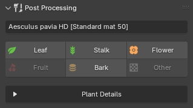

This panel allows you to edit the visuals of your already imported plants. It provides a faster way to modify specific material settings compared to manually editing each material, as it targets all material slots with a specific type of material. For example, an imported plant may have five different leaf materials assigned to it, and editing via the `Post Processing` panel will update all of them simultaneously.

## Instructions

Select a plant in the `3D Viewport`, and the detected material types will be displayed, as shown below. Clicking on a material type, such as "Leaf," opens a popup where you can edit its material properties.

The checkboxes to the left of each property allow you to enable or disable updates for that specific value when applying changes. For example, if you only want to update **Translucency**, you can uncheck all other boxes and click **OK** to apply only that change.

{ .img-box align=left }

{ .img-box align=left }

#### Plant Details

The Plant Details section displays information about the imported plant.

- **Open**: Opens this plant in the Plant Browser. Useful if you want to import additional instances of the same plant type into the scene.

