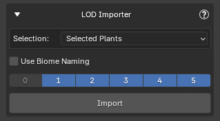
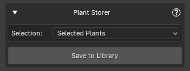
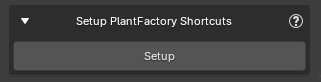
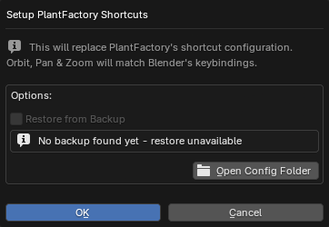

There are several utilities, accessible from the **Utilities** panel, that can be useful after import in certain situations.

## Plant Details

Displays information about the selected plant.

{ .img-box align=left }

- **Open in Plant Browser**: Opens this plant in the Plant Browser. Useful if you want to import additional instances of the same plant type into the scene.

!!! info2 "Tip"
    You can also access this utility from [Post Processing](./post_processing.md). Clicking the plant name at the top will display it in a popup.

## LOD Importer

{ .img-box align=right }

This utility lets you import [Levels of Detail (LODs)](browse_via_blender.md#lods) for PF2B plants that are already in your scene.

Select your plants, choose which LODs you want, and click Import. The utility will retrieve the matching LODs for each plant based on its specific seed, ensuring consistency with your existing plants.

<h5>Options</h5>

- **Selection**
    - **Selected Plants**
    - **All Plants in Scene**
- **Use Biome Naming**: When enabled, plants are renamed following the standard format: `PlantName [Preset|DetailLevel]LOD`. This ensures that Geo-Scatter's 'Auto Setup LODs' can correctly identify and assign the LODs when using these LODs within a Biome with Geo-Scatter's 'Level of Detail' feature (introduced in Geo-Scatter 5.6).

!!! info2 "Naming"
    By default, LOD imports use the same naming rules as your main plant imports (see [Import Settings > Name Settings](import_settings.md#name-settings)).

    Enabling **Use Biome Naming** overrides these rules, applying the strict `PlantName [Preset|DetailLevel]LOD` format.

## Plant Storer

{ .img-box align=right }

The **Plant Storer** utility lets you save selected plants from your scene into the structured biome `.blend` files. This allows you to access them directly from your Asset Library.

These plants are stored in the same way as those imported via the [Collections](collections.md) browser, and the storage path can be adjusted in the [Biome & Collections Preferences](../preferences/plant_library.md#blend-storage). Plant Storer is a complementary utility to Collections: while Collections are ready-made groups that might not suit everyone's needs, Plant Storer gives you full control over which plants to save, letting you populate your Asset Library with exactly the plants you want rather than relying on large predefined sets.

- The utility automatically avoids adding duplicate plants.
- Each plant is marked as an asset and includes metadata to make it easier to find in the Asset Browser.
- Plants stored using this utility are also available for the [Biomes](biomes.md) function, so any biomes that use these plants can access them directly from the library.

<h5>Options</h5>

- **Selection**
    - **Selected Plants**
    - **All Plants in Scene**

!!! info2 "Example of Stored Plants"
    The plants are stored in structured `.blend` files and can also be accessed in your Asset Browser, where everything is categorized, tagged, and presented with clear thumbnails.

    { .img-box }

    { .img-box .on-glb }

### Notes

- Only plants from the [PlantCatalog Library](../plants.md#plantcatalog-library) can be stored.
- Plants that are **not LOD0** (base plants), that use **Import Overrides**, **Snow**, or that use **Wind** cannot be stored.
- When stored, the plant names are automatically set to: `PlantName [Preset|DetailLevel]`.

    !!! info2 ""
        If you want to store these types (or other custom plant types), you can do so in your own separate `.blend` files. These must be **manually stored** and can be placed in the same location as the biome files, but please **keep the original blend files starting with `pf2b-biome` intact**.

## Plant Renamer

{ .img-box align=right }

Renames selected plant objects in the scene after import. The naming follows the same settings used during import but is applied retroactively. You can choose to select all plants in the scene or manually select the plants you want to rename.

<h5>Options</h5>

- **Selection**
    - **Selected Plants**
    - **All Plants in Scene**

!!! info2 ""
    For more information on how the renaming works, see [Import Settings > Name Settings](import_settings.md#name-settings).

## Reset Asset Thumbnails

{ .img-box align=right }

Restores missing or modified asset previews to their original images.

This utility allows you to restore the original thumbnails (asset previews) for any plant assets imported through the PF2B addon. If a thumbnail was accidentally deleted, modified, or lost, you can use this tool to revert it back to the default preview without reimporting the plant. This is particularly useful for maintaining a clean and consistent look in the Blender Asset Browser, ensuring that all assets display the correct preview images.

<h5>Options</h5>

- **Selection**
    - **Selected Plants**
    - **All Plants in Scene**

{ .img-box }

!!! info2 ""
    If an asset has snow applied, a snowflake icon is added to the top-left corner of its thumbnail to indicate that snow is present.

## Setup PlantFactory Shortcuts

{ .img-box align=right }

This utility replaces PlantFactory's default shortcut configuration with a custom version that matches Blender's navigation controls. Orbit, Pan, and Zoom will behave the same way as in Blender, creating a more consistent workflow between the two applications.

The configuration file being replaced is `Default.cfg`, located in: `C:\Users\%USERNAME%\AppData\Roaming\e-on software\PlantFactory\Config`

{ .img-box align=right }

A backup of the original configuration file is automatically created the first time this utility is run. You can later restore this backup directly from the same dialog if needed.

