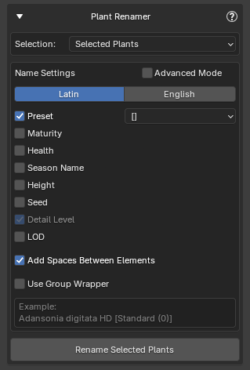
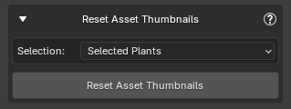
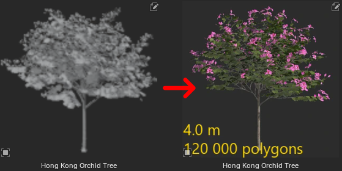

!!! warning ""
    These features are not yet released and will be available in version 1.1.7. Coming soon!

There are several utilities, accessible from the **Utilities** panel, that can be useful after import in certain situations.

## Plant Renamer

{ .img-box align=right }

Renames selected plant objects in the scene after import. The naming follows the same settings used during import but is applied retroactively. You can choose to select all plants in the scene or manually select the plants you want to rename.

For more information on how the renaming works, see [Import Settings > Name Settings](import_settings.md#name-settings).

## Reset Asset Thumbnails

{ .img-box align=right }

Restores missing or modified asset previews to their original images.

This function allows you to restore the original thumbnails (asset previews) for any plant assets imported through the PF2B addon. If a thumbnail was accidentally deleted, modified, or lost, you can use this tool to revert it back to the default preview without reimporting the plant. This is particularly useful for maintaining a clean and consistent look in the Blender Asset Browser, ensuring that all assets display the correct preview images.

{ .img-box }