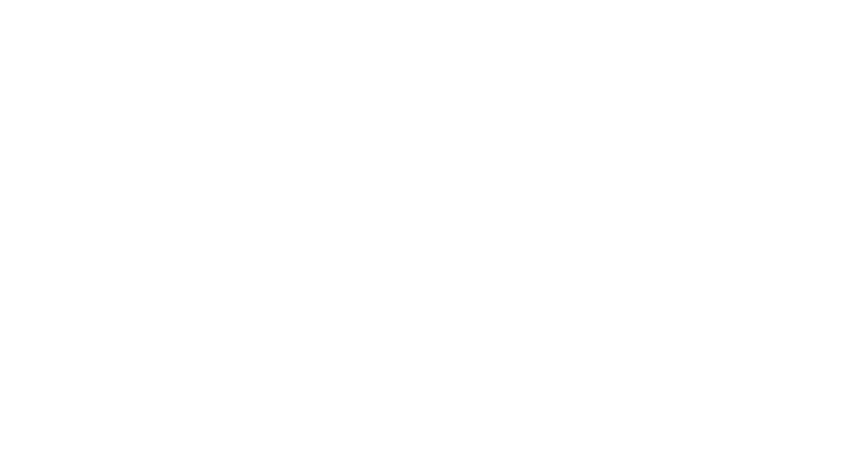
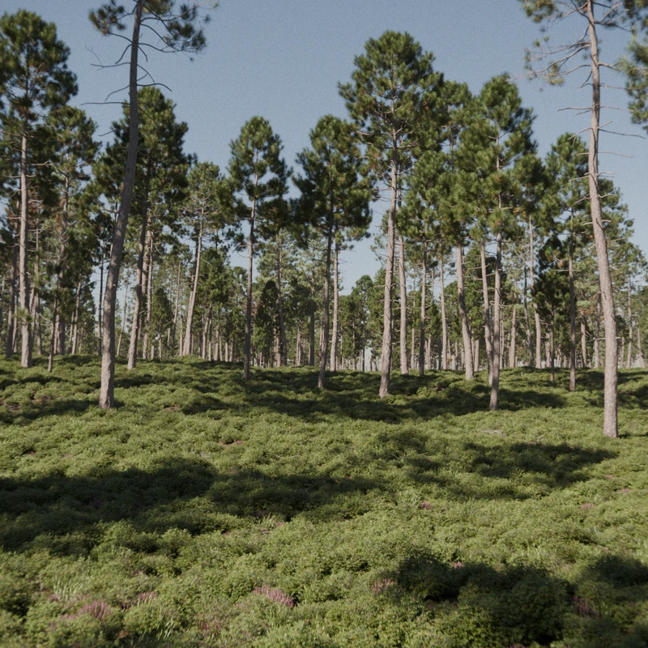

---
hide:
  - navigation
  - toc
  - title
  - footer
---
<meta name="darkreader-lock"> <!-- To fix parallax layer issue with darkreader -->
<link href="https://fonts.googleapis.com/css2?family=Poppins:wght@300;400&display=swap" rel="stylesheet">

	

		

        

        

        <!-- 

            
        
 -->
        

            

                
PF2B

                

                
PlantFactory to Blender

            

        

		

        

        

		

    

**PF2B** is an addon that enables the direct import of plants created in [PlantFactory](https://www.bentley.com/software/e-on-software-free-downloads/){ target="_blank" } by e-on software into Blender.
Since PlantFactory is now freely available as a **perpetual version**, anyone can generate detailed vegetation assets and bring them directly into Blender with PF2B.

# **Who is this for?**

Whether you're a **3D artist** looking for seamless Blender integration, an **environment designer** building large natural scenes, or an **archviz professional** perfecting exterior renders, PF2B streamlines your vegetation workflow.

# **Why use PF2B?**

- **Procedural variety** – Access over **200 plant species** and more than **10,000 unique presets** with infinite procedural variations.
- **Performance ready** – Choose between **low-poly** and **high-poly** options to perfectly match your scene's needs.
- **Instant setup** – PF2B automatically builds materials, fixes missing textures, and applies custom shaders, giving you perfect results right after import.
- **Biome support** – Includes ready-to-use **biomes** compatible with **Geo-Scatter** and **Biome-Reader**, allowing you to build natural landscapes in just a few clicks.

<!-- Bring the power of **PlantFactory** to **Blender** with **PF2B** and take your vegetation workflow to the next level! 🌿 -->

 <!-- top-header end -->

---

<video width="100%" loop autoplay muted style="margin:-1em 0 -1.5em 0">
    <source src="videos/turntable.mp4" type="video/mp4">
</video>

<!-- 
 -->

## One-Click Import

<video width="100%" loop autoplay muted>
    <source src="videos/import-single.mp4" type="video/mp4">
</video>

## Queue Import

Or take advantage of the queue system to efficiently import your plants in batches!
<video width="100%" loop autoplay muted>
    <source src="videos/import-queue.mp4" type="video/mp4">
</video>

> *Note: The import processes shown in the videos have been sped up for demonstration purposes. Actual speed vary depending on your computer's processing power.*

 <!-- section end -->

<!-- 
 -->

## Plant Browser

Easily explore over 20,000 plant presets with a custom-built browser. Powerful search and filtering tools make it simple to find and preview the perfect vegetation for any scene.

<video width="100%" loop autoplay muted>
    <source src="videos/gallery.mp4" type="video/mp4">
</video>

 

PF2B also integrates with Blender's native Asset Browser as a supplementary workflow for fast reuse. Using the built-in **Biomes**, **Collections**, and **Plant Storer** tools, you build your own shared plant library once by importing the plants you need.

{ .img-box }

After that, all imported plants are instantly available in the Blender Asset Browser across all projects, with no waiting and no re-importing. This provides a fast alternative to the regular PF2B browser.

 <!-- section end -->

<!-- 
 -->

## Adjust

Effortlessly adjust your plants to fit any scene. The Adjust tools let you refine the visual appearance of already imported plants by editing their materials and applying additional effects, all from a centralized panel without manual material editing.

<video width="100%" loop autoplay muted>
    <source src="videos/postprocessing.mp4" type="video/mp4">
</video>

!!! info2 "Go Further: Edit Your Plants in PlantFactory"
    Take customization further by editing your plants directly in **PlantFactory**. Adjust parameters, growth, and materials, or create entirely new variations with full procedural control. Whether you need detailed hero assets or optimized low-poly vegetation, **PlantFactory** gives you the flexibility to refine your plants to fit any project.

### Add Snow

 
Choose from multiple snow systems for different visual styles and performance needs, or combine them for richer results.

<video width="100%" loop autoplay muted>
    <source src="videos/snow_turntable.mp4" type="video/mp4">
</video>

Fully customizable and easy to integrate into your scene
<video width="100%" loop autoplay muted>
    <source src="videos/snow_example.mp4" type="video/mp4">
</video>

!!! info2 "Tip"
    You can also use these snow systems on non-PF2B plants, making them compatible with any of your own assets.

 <!-- section end -->

## :material-leaf:{style="color:var(--main-section-color-plants);"}   Plants & Presets

### Free Libraries

- The **PlantCatalog** library includes **194** unique plant species across **11** categories, offering a total of **10,377** presets. When factoring in multiple detail levels, this expands to **450** plants and **23,193** presets, providing you with an incredible range of options for your projects!

- The regular **PlantFactory** library features **41** plant species with **22** unique presets, primarily in Low Poly detail level.

=== "Plant Species"
    A selection of available plant species:
    { style="display:block; margin:auto;" }

=== "Example Presets"
    Each plant species comes with numerous presets, allowing for customization and versatility. Below is an example showcasing all **115 presets** for the 'Quercus robur forest HD' plant:
    { style="display:block; margin:auto;" }

 <!-- section end -->

## Biomes

PF2B includes a growing library of ready-made **biomes**, designed to work seamlessly with both **Geo-Scatter** and **Biome-Reader**.

These biomes let you transform empty terrain into rich, natural environments in just a few clicks, with realistic plant variety, natural density, and balanced ecosystem compositions.

<video width="100%" loop autoplay muted>
    <source src="videos/biome.mp4" type="video/mp4">
</video>

  

    
  

  

    
  

  

    
  

  

    
  

  

    
  

  

    
  

 <!-- section end -->

---

## ⚠️ Notes Before Purchasing ⚠️

### Requirements

- Blender 4.5 or newer
- PlantFactory 2024
- Operating System: Windows

!!! info2 ""
    PF2B 1.x (compatible with Blender 4.2+) remains available for download but does not include features from version 2.0 onward.

!!! warning ""
    Before purchasing, please ensure you fully understand what this addon does and its requirements. This addon relies on third-party software called **PlantFactory** (approximately 1.6 GB) to function. While PlantFactory is free, setting it up requires some additional steps, which are clearly outlined in the [Getting Started](https://pf2b.roberd.net/getting_started/){ target="_blank" } guide. For full functionality, it is also recommended to install the **PlantCatalog** library (approximately 20 GB), which significantly enhances the range of plants available for use but may take some time to download and install.

---

## Documentation

Comprehensive documentation can be found at [pf2b.roberd.net](https://pf2b.roberd.net/){ target="_blank" }. Start with the [Getting Started](https://pf2b.roberd.net/getting_started/){ target="_blank" } section for setup instructions, then explore detailed settings and troubleshooting information.

<!--
??? info "Changelog"
    
-->

---

## Other Add-ons by Me

### BatchGenie {style="margin-bottom:0.1em;"}
An add-on designed to simplify and automate common asset-related tasks in Blender.

    

 <!-- section end -->

---

*PF2B is a third-party addon and is not an official product of Bentley Systems, E-on Software, or PlantFactory. It is not affiliated with or endorsed by these companies.*{style="color:var(--md-default-fg-color--light)"}

