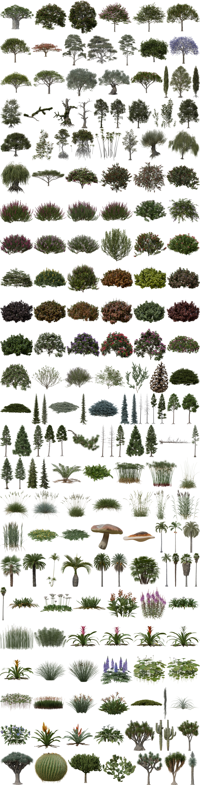
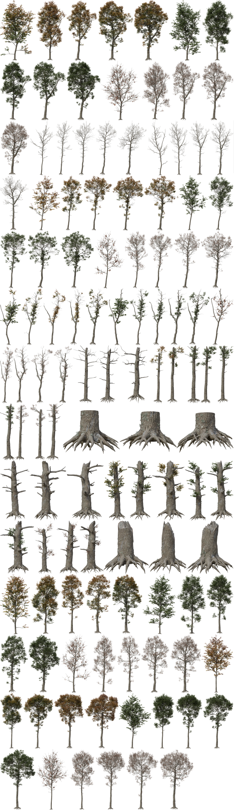

---
hide:
  - navigation
  - toc
  - title
  - footer
---
#

**PF2B** (PlantFactory to Blender) is an addon that enables the direct import of plants created in [PlantFactory](https://www.bentley.com/software/e-on-software-free-downloads/){ target="_blank" } by e-on software into Blender. PF2B automates the setup process, allowing you to transfer detailed vegetation assets to Blender with minimal manual configuration.

# **Who is this for?**

- **3D artists** looking to add high-quality, procedurally generated plants to their Blender scenes.
- **Environment designers** who need a quick and efficient way to populate landscapes with rich vegetation.
- **Archviz professionals** who want realistic vegetation to enhance exterior renders.

# **Why use PF2B?**

- **Procedural variety** – Access over **200 plant species** and more than **10,000 unique presets** with infinite procedural variations.
- **Optimized for performance** – Choose between **low-poly** and **high-poly** plant versions based on your project's needs.
- **Instant setup** – No need to manually assign materials or textures.
- **No additional cost for PlantFactory** – [PlantFactory](https://www.bentley.com/software/e-on-software-free-downloads/){ target="_blank" } is now freely available as a **perpetual version**, so you can generate and use plants freely.

Bring the power of **PlantFactory** to **Blender** with **PF2B** and take your vegetation workflow to the next level! 🌿

# 🎉 Limited Time Offer: Save 40%! 🎉

For a limited time, you can get **PF2B** at a special introductory price of just **$8**, a significant discount off the regular price of **$14**! This offer is valid until **April 12th**, after which the price will increase. Don't miss out, secure your copy today and take your Blender scenes to the next level with realistic plants!

 <!-- section end -->

## One-click to Import

<video width="100%" loop autoplay muted>
    <source src="videos/import-single.mp4" type="video/mp4">
    Your browser does not support the video tag.
</video>

## Queue import

Or take advantage of the queue system to efficiently import your plants in batches!
<video width="100%" loop autoplay muted>
    <source src="videos/import-queue.mp4" type="video/mp4">
    Your browser does not support the video tag.
</video>

> *Note: The import processes shown in the videos have been sped up for demonstration purposes. Actual speed vary depending on your computer's processing power.*

 <!-- section end -->

## Plant Browser

Custom-built Plant Browser, allowing you to effortlessly navigate through the 20,000+ plant presets. The browser includes robust search and filtering functions to help you quickly preview different species and variations, simplifying the process of finding the perfect vegetation for your scene.

<video width="100%" loop autoplay muted>
    <source src="videos/gallery.mp4" type="video/mp4">
    Your browser does not support the video tag.
</video>

 <!-- section end -->

## Adjust

Effortlessly Adjust Your Plants to Fit Any Scene!
<video width="100%" loop autoplay muted>
    <source src="videos/postprocessing.mp4" type="video/mp4">
    Your browser does not support the video tag.
</video>

!!! info2 "Go Further: Edit Your Plants Directly in PlantFactory"
    If you want to take customization to the next level, you can always edit your plants directly inside **PlantFactory** to harness the full power of procedural generation. Modify parameters, adjust growth patterns, tweak materials, or even create entirely new variations, giving you complete control over your vegetation. Whether you need highly detailed hero assets or optimized low-poly versions for large environments, **PlantFactory** offers the flexibility to refine your plants exactly as you need.

 <!-- section end -->

## :material-leaf:{style="color:var(--main-accent-color-green);"}   Plants & Presets

With all the free libraries installed, the **PlantCatalog** library includes **194** unique plant species across **11** categories, offering a total of **10,377** presets. When factoring in multiple detail levels, this expands to **450** plants and **23,193** presets, providing you with an incredible range of options for your projects!

Additionally, the regular **PlantFactory** library features **41** plant species with **22** unique presets, primarily in Low Poly detail level.

=== "Plant Species"
    A selection of available plant species:

    

=== "Example Presets"
    Each plant species comes with numerous presets, allowing for customization and versatility. Below is an example showcasing all **115 presets** for the 'Quercus robur forest HD' plant:

    

 <!-- section end -->

---

## Requirements

- Blender 4.2 or newer
- PlantFactory 2024
- Operating System: Windows

---

## Notes Before Purchasing

!!! warning ""
    Before purchasing, please ensure you fully understand what this addon does and its requirements. This addon relies on third-party software called **PlantFactory** (approximately 1.6 GB) to function. While PlantFactory is free, setting it up requires some additional steps, which are clearly outlined in the sections below. For full functionality, it is also recommended to install the **PlantCatalog** library (approximately 20 GB), which significantly enhances the range of plants available for use but may take some time to download and install.

!!! warning ""
    PF2B does **not** guarantee 100% compatibility with all plants. With over 23,000 presets, it is impractical to manually test and verify each one. However, most plants should import correctly without manual intervention.

    If you encounter issues, such as incorrect texture settings or geometry problems, [please reach out](https://pf2b.roberd.net/support/){ target="_blank" }. I will do my best to resolve them by adding plant-specific configurations to the addon.

    **For more details, see the [PF2B: Under the Hood](https://pf2b.roberd.net/support/pf2b_under_the_hood/){ target="_blank" } page.**

---

## Documentation

Extensive documentation is available [here](https://pf2b.roberd.net/){ target="_blank" }. If you have any questions about how this all works or how to set things up, please refer to the '**Getting Started**' section in the documentation. You'll also find detailed information about all the available settings and troubleshooting guides.

---

*PF2B is a third-party addon and is not an official product of Bentley Systems, E-on Software, or PlantFactory. It is not affiliated with or endorsed by these companies.*{style="color:var(--md-default-fg-color--light)"}
